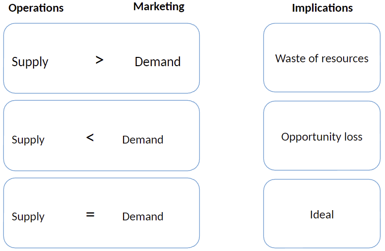
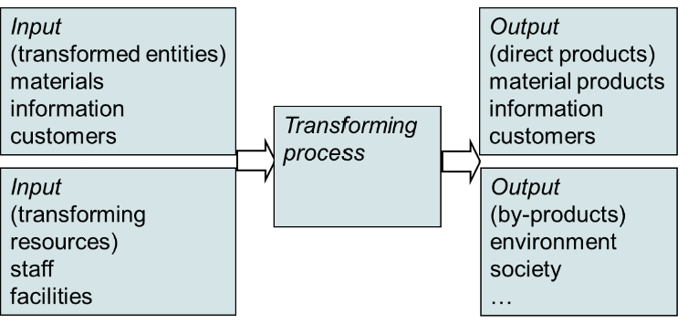
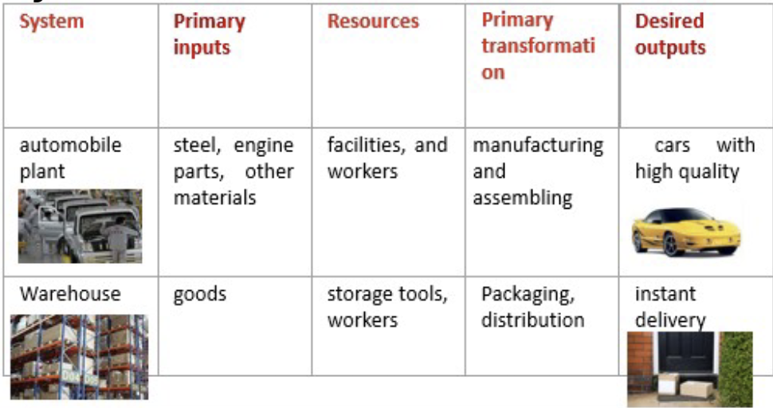

began: 13th Janurary 2025

# MSCI.102 Introduction to Operations Management

| Week | My Notes                                                                  | Lecture Slides                                                      | Noted |
| :--: | ------------------------------------------------------------------------- | ------------------------------------------------------------------- | :---: |
|  11  | [Lecture 1 - Module Introduction](#lecture-1---module-introduction)       | [Introduction to OM](/MSCI.102.slides/a.introduction.pdf)           |  ✅   |
|  11  | [Lecture 2 - Operations As A System](#lecture-2---operations-as-a-system) | [Operations As A System](/MSCI.102.slides/b.operationsAsSystem.pdf) |  ✅   |
|12| [Lecture 3 - Intro to Supply Chain Management](#lecture-3---intro-to-supply-chain-management) | [Introduction To Supply Chain Management](/MSCI.102.slides/c.introToSCM.pdf) ||

## Lecture 1 - Module Introduction

<audio controls>
  <source src="MSCI.102.slides/a.introduction.mp3" type="audio/mpeg">
  Your browser does not support the audio element.
</audio>

Operations is responsible for the the production of goods or delivery of service. It is the 'other' part of the business which is responsible for 60-70% of the costs, assets, and people.

Business operations is one of the 3 core functions; developing the market (marketing), creating products and services (design and development), and producing and delivering to the market (operations). Accounting & finance, and human resources are two 'supporting functions'.

For example, OM solves the problem of how to build arliners from millions of items on time when 2,000 workers are involved in the final assembly, when lead times vary from milliseconds to weeks, when errors happen, people get sick, machines malfunction, and when raw materials to major assemblies come from all over the world. (Scheduling & Control Systems)

### What I Will Be Able To Do

I'll be able to solve problems in OM by using:

- simple mathematical models (inventory ananlysis)
- specific planning methods (project planning & control)
- systems to manage suppliers (supply chain management)
- basic coordination principles (ERP & Lean Management)
- statistics to control variation (quality control)
- practices to focus improvement effort (quality measure)

### Main Themes

Solving logical, rather than social, problems of producing products and delivering services:

- Dealing with complexity, scale & uncertainty
- Achieving improvement, change & competitivness
- Concerning the nature of work rather than the people doing it

### Operations as a SYSTEM

A System is a complex whole where relationships between components define system behaviour. The components in the system are modified by interactions with eachother and with external elements. The components maintain and reproduce their own distinct structures and boundaries. The interactions between components via exchange of materials and information can produce qualitively new characteristics in a system.

## Lecture 2 - Operations As A System

<audio controls>
  <source src="MSCI.102.slides/b.operationsAsSystem.mp3" type="audio/mpeg">
  Your browser does not support the audio element.
</audio>

### Purpose In the Operations System

Systems have autonomous behaviour. They do more than react to stimuli, they pursue goals.

Operations have performance objectives, which typically include cost, quality, speed, dependability, flexibility, and sustainability. Each objective can have different types. For example:

- **Quality**: Top quality vs. consistent quality.
- **Speed**: On-time delivery vs. fast development.
- **Flexibility**: Product customization vs. product variety vs. volume flexibility.
- **Dependability**: Durability vs. reliability.

'Order Winning' operational factors are those that directly and significantly contribute to winning business as they provide a competitive advantage.

### Transformation In The Operations System

- **Materials Processor**: manufacturing, mining, energy
- **Information Processors**: accountancy, media, research
- **Customer Processors**: hotels, hospitals, education, transport

### Adaption In The Operations System

## Lecture 3 - Intro To Supply Chain Management