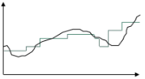
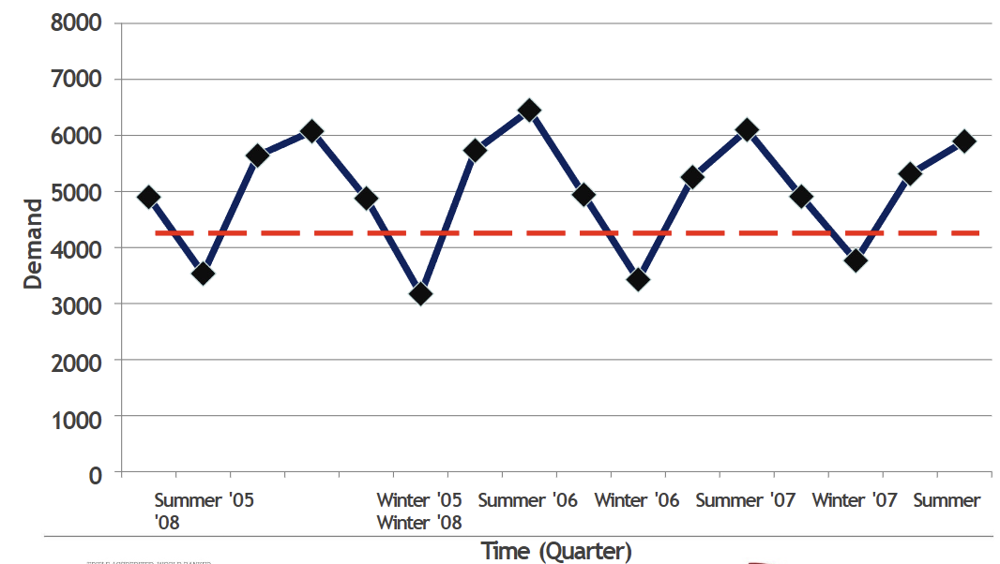

began: 13th Janurary 2025

# MSCI.102 Introduction to Operations Management

| Week | My Notes                                                                                           | Lecture Slides                                                                             | Noted |
| :--: | -------------------------------------------------------------------------------------------------- | ------------------------------------------------------------------------------------------ | :---: |
|  11  | [Lecture 1 - Module Introduction](#lecture-1---module-introduction)                                | [Introduction to OM](/MSCI.102.slides/a.introduction.pdf)                                  |  ✅   |
|  11  | [Lecture 2 - Operations As A System](#lecture-2---operations-as-a-system)                          | [Operations As A System](/MSCI.102.slides/b.operationsAsSystem.pdf)                        |  🟧   |
|  12  | [Lecture 3 - Intro to Supply Chain Management](#lecture-3---intro-to-supply-chain-management)      | [Introduction To Supply Chain Management](/MSCI.102.slides/c.introToSCM.pdf)               |  🟧   |
|  12  | [Lecture 4 - Supply Chain Management Part 2](#lecture-4---supply-chain-management-part-2)          | [SCM Part 2](/MSCI.102.slides/d.SCM2.pdf)                                                  |  ✅   |
|  13  | [Lecture 5 - Inventory Management](#lecture-5---inventory-management)                              | [Inventory Management](/MSCI.102.slides/e.inventoryManagement.pdf)                         |  🟧   |
|  13  | [Lecture 6 - Inventory Management Part 2](#lecture-6---inventory-management-part-2)                | [Inventory Management Prt 2](/MSCI.102.slides/f.IM2.pdf)                                   |  ❌   |
|  14  | [Lecture 7 - Capacity Planning & Analysis](#lecture-7---capacity-planning--analysis)               | [Capacity Planning & Analysis](/MSCI.102.slides/g.capacityPlanningAndAnalysis.pdf)         |  ✅   |
|  14  | [Lecture 8 - Capacity Planning & Analysis Part 2](#lecture-8---capacity-planning--analysis-part-2) | [Capacity Planning & Analysis Part 2](/MSCI.102.slides/h.capacityPlanningAndAnalysis2.pdf) |  ✅   |
|  15  | [Lecture 9 - Coursework Guidance](#lecture-9---coursework-guidance)                                | [Coursework Guidance](/MSCI.102.slides/i.courseworkGuidance.pdf)                           |  ❌   |
|  16  | [Lecture 10 - Forecasting](#lecture-10---forecasting)                                              | [Forecasting](/MSCI.102.slides/j.forecasting.pdf)                                          |  🟧   |
|  16  | [Lecture 11 - Forecasting Part 2](#lecture-11---forecasting-part-2)                                | [Forecasting Part 2](/MSCI.102.slides/k.forecasting2.pdf)                                  |  ❌   |
|  17  | [Lecture 12 - ERP, JIT & Lean](#lecture-12---erp-jit--lean)                                        | [ERP, JIT & Lean](/MSCI.102.slides/l.erpJITlean.pdf)                                       |  ❌   |
|  18  | [Lecture 13 - Quality Management](#lecture-13---quality-management)                                | [Quality Management](/MSCI.102.slides/m.lectureQuality.pdf)                                |       |

## Lecture 1 - Module Introduction

<audio controls>
  <source src="MSCI.102.slides/a.introduction.mp3" type="audio/mpeg">
 Your browser does not support the audio element.
</audio>

Operations are responsible for the production of goods or delivery of services. It is the 'other' part of the business which is responsible for 60-70% of the costs, assets, and people.

Business operations is one of the 3 core functions; developing the market (marketing), creating product
s and services (design and development), and producing and delivering to the market (operations). Accounting & finance, and human resources are two 'supporting functions'.

For example, OM solves the problem of how to build airliners from millions of items on time when 2,000 workers are involved in the final assembly, when lead times vary from milliseconds to weeks, when errors happen, people get sick, machines malfunction, and when raw materials to major assemblies come from all over the world. (Scheduling & Control Systems)

### What I Will Be Able To Do

I'll be able to solve problems in OM by using:

- simple mathematical models (inventory analysis)
- specific planning methods (project planning & control)
- systems to manage suppliers (supply chain management)
- basic coordination principles (ERP & Lean Management)
- statistics to control variation (quality control)
- practices to focus improvement efforts (quality measure)

### Main Themes

Solving logical, rather than social, problems of producing products and delivering services:

- Dealing with complexity, scale & uncertainty
- Achieving improvement, change & competitiveness
- Concerning the nature of work rather than the people doing it

### Operations as a SYSTEM

A System is a complex whole where relationships between components define system behaviour. The components in the system are modified by interactions with each other and with external elements. The components maintain and reproduce their distinct structures and boundaries. The interactions between components via the exchange of materials and information can produce qualitatively new characteristics in a system.

## Lecture 2 - Operations As A System

<audio controls>
  <source src="MSCI.102.slides/b.operationsAsSystem.mp3" type="audio/mpeg">
 Your browser does not support the audio element.
</audio>

### Purpose In the Operations System

Systems have autonomous behaviour. They do more than react to stimuli, they pursue goals.

Operations have performance objectives, which typically include cost, quality, speed, dependability, flexibility, and sustainability. Each objective can have different types. For example:

- **Quality**: Top quality vs. consistent quality.
- **Speed**: On-time delivery vs. fast development.
- **Flexibility**: Product customization vs. product variety vs. volume flexibility.
- **Dependability**: Durability vs. reliability.

'Order Winning' operational factors are those that directly and significantly contribute to winning business as they provide a competitive advantage.

### Transformation In The Operations System

- **Materials Processor**: manufacturing, mining, energy
- **Information Processors**: accountancy, media, research
- **Customer Processors**: hotels, hospitals, education, transport

### Adaption In The Operations System

## Lecture 3 - Intro To Supply Chain Management

<audio controls>
  <source src="MSCI.102.slides/c.introToSCM.mp3" type="audio/mpeg">
 Your browser does not support the audio element.
</audio>

A supply chain is two or more parties linked by a flow of resources, typically material, information, or money, that fulfil a customer request.

- **Upstream**: Activities or firms positioned earlier in the supply chain
- **Downstream**: Activities or firms positioned later in the supply chain
- **First-tier Supplier**: A supplier that provides products or services to a firm's first-tier supplier
- **Second-tier Supplier**: A supplier that provides products or services to the firm's first-tier supplier.

### What A Supply Chain Looks Like

The standard view. A local firm, contracting with immediate neighbours:

Sometimes has parallel chains:

Chains often transition or are context-dependent:

Firms can swap roles on occasion:

Having more parties in the supply chain is risky. The specialisation model creates a supply network. Risk and vulnerabilities are inherent in networks. The more extensive the network, the bigger the tension. A balance between efficiency and resilience.

### Procurement Process

The procurement process is a series of steps a company takes to obtain the goods and services it needs to operate.

The process:

1. Enquiry/bidding/tendering
2. Supplier selection
3. Requisition/ordering
4. Supply
5. Invoicing & payment

## Lecture 4 - Supply Chain Management Part 2

<audio controls>
  <source src="MSCI.102.slides/d.SCM2.mp3" type="audio/mpeg">
 Your browser does not support the audio element.
</audio>

Crises put pressure on supply chains due to their disruptiveness. These crises present potential threats and create sudden increases/slumps in the demand for products and services. Firms will sometimes use the power they have over suppliers and this abuse of power damages social relationships which can undermine an effective supply chain.

### Functional vs Innovative Products

Can have 2 categories of product. Functional and innovative.

|                         |      Functional       |    Innovative      |
| :---------------------- | :-------------------: | :----------------: |
| Product Life Cycle      | greater than 2 years  |  3 to 12 months    |
| Margin                  |      5% to 20%        |    20% to 60%      |
| Product Variety         |         low           |       high         |
| Average Forecast Error  |         10%           |    40% to 100%     |
| Stockout Rate           |       1% to 2%        |     up to 40%      |
| Markdown Rate           |          0%           |    10% to 25%      |
| Lead Time               |    6 to 12 months     | 3 days to 3 weeks  |

Heinz Tomato Soup Performance Objectives: cost, delivery reliability, and conformance quality.

Coat Performance Objectives: flexibility, specification quality.

### SC Design - Different Types of SCs

- **SC Responsiveness** includes a SC's ability to:
    - Respond to wide ranges of quantities demanded
    - Meet short lead times
    - Handle a large variety of products
    - Build highly innovative products/services
    - Meet a high service level
    - Handle supply uncertainty
- **SC Efficiency** is the inverse of the cost of making and delivering a product to the customer:
    - Increases in cost --> lower efficiency
    - Minimum inventory
    - Low-cost suppliers

### Supply Chain As A Unit Of Management

1. A better understanding of vulnerabilities and risks which are inherent in supply networks.
2. Taking steps to ensure the balance between efficiency and resilience
3. A better understanding of opportunities in the network
4. Sharing information for better performance across the supply chain
5. Identifying structural changes in the industry
6. Stronger grasp of instability

Bullwhip Effect Case:

> "Not long ago, logistics executives at Procter & Gamble (P&G) examined the order
> patterns for one of their best-selling products, Pampers. Its sales at retail stores were fluctuating, but the variabilities were certainly not excessive. However, as they examined the distributors’ orders, the executives were surprised by the degree of variability. When they looked at P&G’s orders of materials to their suppliers, such as 3M, they discovered that the swings were even greater. At first glance, the variabilities did not make sense. While the consumers ... consumed diapers at a steady rate, the demand order variabilities in the supply chain were amplified as they moved up the supply chain." - Lee et al 1997

### Supply Chain As A Unit of Failure

1. Risks to the supply chain
      - loss of supply, especially when 'just in time'
2. Risks from the supply chain
      - distribution of contamination
3. Risks to and from the supply chain
      - product counterfeiting
4. Risks from the supply chain
      - Outsourcing

A supply chain can be resilient as well as vulnerable. Sustainability is possible through 'closed loop' supply chains and supplier development. They are often globalised and often involve anonymous markets like internet trading. This minimises procurement prices but makes tracing hard and leaves them open to subversion and infiltration.

Coat Performance Objectives: flexibility, specification quality.

### SC Design - Different Types of SCs

- **SC Responsiveness** includes a SC's ability to:
  - Respond to wide ranges of quantities demmanded
  - Meet short lead times
  - Handle a large vairety of products
  - Build highly innovative products/services
  - Meet a high service level
  - Handle supply uncertainty
- **SC Efficiency** is the inverse of the cost of making and delivering a product to the customer:
  - Increases in cost --> lower efficiency
  - Minimum inventory
  - Low-cost suppliers

### Supply Chain As A Unit Of Management

1. A better understanding of vulnerabilities and risks which are inherent in supply networks.
2. Taking steps to ensure the balance between efficiency and resilience
3. A better understanding of opportunities in the network
4. Sharing information for better performance across the supply chain
5. Identifying structural changes in industry
6. Stronger grasp of instability

Bullwhip Effect Case:

> "Not long ago, logistics executives at Procter & Gamble (P&G) examined the order
> patterns for one of their best-selling products, Pampers. Its sales at retail stores were fluctuating, but the variabilities were certainly not excessive. However, as they examined the distributors’ orders, the executives were surprised by the degree of variability. When they looked at P&G’s orders of materials to their suppliers, such as 3M, they discovered that the swings were even greater. At first glance, the variabilities did not make sense. While the consumers ... consumed diapers at a steady rate, the demand order variabilities in the supply chain were amplified as they moved up the supply chain." - Lee et al 1997

### Supply Chain As A Unit of Failure

1. Risks to the supply chain
   - loss os sipply, especially when 'just in time'
2. Risks from the supply chain
   - distribution of contamination
3. Risks to and from the supply chain
   - product counterfeiting
4. Risks from the supply chain
   - Outsourcing

A supply chain can be resilient as well as vulnerable. Sustainability is possible through 'closed loop' supply chains and supplier development. They are often globalised and often involve anonymous markets like the internet trading. This minimises procurement prices but makes tracing hard and leaves them open to subversion and infiltration.

## Lecture 5 - Inventory Management

<audio controls>
  <source src="MSCI.102.slides/e.inventoryManagement.mp3" type="audio/mpeg">
 Your browser does not support the audio element.
</audio>

Inventory could be raw materials, work-in-processes, or finished goods. We have a focus on physical inventories.

Inventory is found at all stages in the operations processes, between unsynchronised activities. However, you can also find inventory at supplier levels, such as inventory that does not enter the operation directly but is necessary for the process, such as office stationary/equipment, cleaning equipment, etc.

### Why We Hold Inventory

We hold inventory for various reasons such as:

- To meet unexpected supply or demand (**buffer**): For example, due to unreliable suppliers.
- For batch manufacturing (**cycle**): Usually in large, fixed quantities. For example, manufacturing batches of 100 bread loaves at a time.
- To take advantage of short-term opportunities (**discounts**): For example, quantity discounts on selected items.
- Due to fixed ordering (**economies of scale**): It is often cheaper to produce in bulk. For example, raw materials.
- Transportation (**pipeline**): For example, ocean transport takes time to deliver.

### Why We Might Avoid Holding Physical Inventory

- **Holding Costs**: Insurance, real estate, captial, interest.
- **Shrinkage**: Obsolesence, deterioration, theft.
- **Obstruction**
- **Hazards**: Hazmat (Hazardous Materials) Can cause fires or explosions.

### How Much Inventory We Should Have

Too little inventory is bad for the business as it can caus a stock-out which reduces sales (stock-outs cause walkouts). It can also lead to poor customer service which results in dissatisfied customers. The objective is to find a good level of stock in our spply chain. This good level is one that:

1. Guarantees customers' expected demand is satisfied (according to generated forecasts)
2. Minimises the total cost of ordering and carrying the inventory

These 2 types of cost can be used to determine an optimal level by analysing cost. We can add up costs linked to the 2 phases of the process:

- **Ordering Cost**: Placing order, transport, inspection, staff. Quantity discounts, supplements.
- **Holding Cost**: Capital cost, interest, storage & insurance, obsolescence, deterioration, handling & staff.

Here is a basic example. If we have a fixed demand of 1000 units, there are 2 options to fufil that demand:

- Plan A: Max of 400 units means order 400, 2.5 times/year
- Plan B: Max of 100 means order 100, 10 times/year

If you go with plan A then the holding cost would be more as you have to hold more, but the ordering cost could be less due to less orders per year. With plan B, the holding cost would be less, but the ordering cost greater.

Here is a more detailed example.

ORDERING COST: Let's assume the same ordering cost for any size order (£100). `orders placed/year = annual demand/order quantity`. For example, 1000/**100** = 10 orders : 1000/**80** = 12.5 orders. Total annual orderocst is 10 _ £100 = £1,000 : 12.5 _ £100 = £1,250.

C0 \* D/Q where C0 is the cost of each order, D is the annual demand, and Q is the order quantity.

HOLDING COST: Let's assume that the holding cost is a constant per item stored per unit of time (£10 per unit per year).

Average items stored over a full period

OR Ch \* Q/2

#### IDEK anymore:

Total cost is the sum of the above 2.

Ct = (Ch \* Q/2) + (C0 \* D/Q)

### EQQ Model & Formula

Assumptions:

- Uniform demand
- Constant Lead Time (LT)
- Receipt of inventory is instantaneous and complete (order date = delivery date)
- No quantity discounts
- No other Variable costs considered
- No stick-out (shortage) cost

EQQ = √((2 \* CO \* D) / Ch)

Limitations:

- Demand (steady/predicatable) assumptions
- Does not account for demand fluctuations
- Unsuitable to use EQQ models for different businesses
- Instantaneous delivery assumption
- Supply uncertainty
- More suitable for small-scale firms

## Lecture 6 - Inventory Management Part 2

<audio controls>
  <source src="MSCI.102.slides/f.IM2.mp3" type="audio/mpeg">
 Your browser does not support the audio element.
</audio>

We can determine how much invetory we need and when to get it by these methods:

- Encomic Bath Quantity
- Inventory Classification
- Re-order levels

### Encomic Bath Quantity

Replenishment is not instantaneous and inventory is recieved over time period. For example, Units are produced and sold simultaneously.

The cost as the start of each replenishment = 'setup' cost.

## Lecture 7 - Capacity Planning & Analysis

<audio controls>
  <source src="MSCI.102.slides/g.capacityPlanningAndAnalysis.mp3" type="audio/mpeg">
  Your browser does not support the audio element.
</audio>

### What is Capacity?

Capacity can be defined in terms of volume or throughput. The most obvious measure is physical volume or resources, such as the size of a vessel, the number of available seats, or workforce capacity. However, this is different from the capacity for work, which considers factors like workflow, turnover, and output.

Operations Management focuses more on\*throughput, which refers to the amount of work completed or the number of people, materials, or products processed. Capacity is also defined as the "maximum level of value-adding activity within a given period."

### Capacity in Context

Capacity depends on circumstances and assumptions, often requiring aggregation across multiple products or services. For example:

- Hotels measure capacity in room nights per month, regardless of room type.
- Cinemas measure capacity in seats per month, regardless of screen size.

Capacity is also time-dependent:

- Long-term capacity: Allows for substantial changes (e.g., building new facilities, hiring more staff).
- Short-term capacity: Only allows for minor adjustments (e.g., adding overtime shifts).

For example, a university's capacity includes (but is not limited to):

- The number of lecture rooms, labs, and offices.
- The number of faculty and staff.
- The number of students who can graduate per year.
- The volume of research that can be published per quarter.

### Measuring Capacity Utilisation

There are two key measures of how capacity is used:

- Utilisation = Actual output / Design capacity
- Efficiency = Actual output / Effective capacity

### How Organisations Respond to Demand

There are different approaches to managing fluctuations in demand:

#### Level Capacity Planning

This approach maintains a constant capacity, regardless of demand fluctuations, and relies on buffer inventory to handle excess demand.

Pros:

- Stable employment.
- Simple and predictable operations.

Cons:

- Requires higher financial investment (e.g., inventory and warehousing costs).
- Risk of product deterioration or obsolescence.

#### Chase Demand Planning

This approach adjusts capacity to match demand, reducing the need for storage and minimising deterioration risks.

Pros:

- Limits the need for storage.
- Avoids deterioration of goods.

Cons:

- Leads to unstable employment.
- Difficult to manage ad-hoc resourcing.
- Requires a high level of physical capacity.

#### Manage Demand Planning

This method smooths out demand fluctuations using pricing strategies, such as surge pricing.

- Discounts encourage demand when it is low.
- Premium pricing controls demand when it is high.

Pros:

- Helps balance supply and demand.
- Can make services more profitable.

Cons:

- May limit customer access.
- Requires careful pricing strategy.

#### Mixed Plans

A combination of all the above methods, mixed planning:

- Uses premium pricing and discounts to regulate demand.
- Occasionally increases or decreases capacity.
- Takes advantage of "natural wastage" (e.g., employees leaving over time).
- Allows for some inventory storage.

## Lecture 8 - Capacity Planning & Analysis Part 2

<audio controls>
  <source src="MSCI.102.slides/h.capacityPlanningAndAnalysis2.mp3" type="audio/mpeg">
 Your browser does not support the audio element.
</audio>

### Capacity Analysis

#### Capacity vs Demand Example

| Month    | Jan | Feb | Mar | Apr | May | Jun | Jul | Aug | Sep | Oct | Nov | Dec |
| -------- | --- | --- | --- | --- | --- | --- | --- | --- | --- | --- | --- | --- |
| Demand   | 100 | 150 | 175 | 150 | 200 | 300 | 350 | 500 | 650 | 450 | 100 | 100 |
| Capacity | 300 | 300 | 300 | 300 | 300 | 300 | 300 | 300 | 300 | 300 | 300 | 300 |

- Key Analysis Questions:
  - Is the capacity sufficient to meet demand (e.g., airline seats, production output, clinic patients)?
  - Do we accumulate products or backlogs?

### Production Operations That Accumulate Products

- Capacity management considerations:
  - Ensure supply precedes demand
  - Cumulative analysis helps track surplus/shortages
  - Example Calculation:
    - Total production by Sep = 8 × 300 = 2,400 units
    - Total demand till Sep = 1,925 units → surplus available

### When Output Can't Be Stored (Service Operations)

- Demand vs. Capacity:
  - Accumulated demand tracked (e.g., patient queue in a clinic)
  - Unused capacity is lost (e.g., empty airline seats)
  - Example:
    - Waiting list grows if demand exceeds capacity

| Month    | Jan | Feb | Mar | Apr | May | Jun | Jul | Aug | Sep | Oct | Nov | Dec |
| -------- | --- | --- | --- | --- | --- | --- | --- | --- | --- | --- | --- | --- |
| Arrivals | 100 | 150 | 175 | 150 | 200 | 300 | 350 | 500 | 650 | 450 | 100 | 100 |
| Capacity | 300 | 300 | 300 | 300 | 300 | 300 | 300 | 300 | 300 | 300 | 300 | 300 |
| Waiting  | 0   | 0   | 0   | 0   | 0   | 0   | 50  | 250 | 600 | 750 | 550 | 350 |

### Capacity Management Strategies

- Three Key Steps:
  1. Establish Base Capacity – Determine minimum operational level
  2. Handle Demand Variability – Choose between Chase, Level, or Mixed strategies
  3. Evaluate Capacity Options – Adjust operations based on demand

### The Theory of Constraints (ToC)

#### Heathrow Runway Example

- Additional terminal buildings did not increase overall airport capacity.
- Runways were the bottleneck – the operation's limiting factor.
- A bottleneck determines the throughput of the entire process.

#### Goldratt’s "The Goal" (Book Summary)

- Manufacturing Plant Metaphor:
  - Slowest worker in a group hike = production bottleneck
  - Downstream tasks starve for work
  - Upstream tasks create excess inventory
  - Solution:
    - Prioritize bottleneck resources
    - Prevent overproduction
    - Improve bottleneck efficiency

#### Managing Bottlenecks

- Five Focusing Steps (FFS):
  1. Identify constraints (bottlenecks)
  2. Exploit bottlenecks (keep them fully utilized)
  3. Subordinate other processes to the bottleneck
  4. Elevate the bottleneck (improve efficiency)
  5. Repeat the process

## Lecture 9 - Coursework Guidance

<audio controls>
  <source src="MSCI.102.slides/i.courseworkGuidance.mp3" type="audio/mpeg">
 Your browser does not support the audio element.
</audio>

## Lecture 10 - Forecasting

<audio controls>
  <source src="MSCI.102.slides/j.forecasting.mp3" type="audio/mpeg">
 Your browser does not support the audio element.
</audio>

Forecasting is used to determine resources needed, schedule existing resources, and acquire additional resources. It anticipates changes in prices/costs and is used to prepare for new laws/regulations, competitors, an resource shortages.

We forecast because a purely reactive process is usually infeasible as capacity cannot be modified instantaneously; facilities take time to build, equipment takes time to acquire, and people take time to recruit and train. Forecastst are the basis for all planning decisions in a supply chain. So a failure to meet demand or use capacity can be punitive. The loss of goodwill/future customers, social unacceptability in vital services, and cost of funding unused capacity.

We can forecast using qualitative approaches:

- **Jury of Executive Opinion**: Pool opinions of high-level experts, sometimes augmented by statistical models. Experts estimate demands working together. 'Group think' disadvantage
- **Delphi Method**: Panel of experts, queried iteratively, continues until consensus is reached. 3 types of participants; decision-makers, staff =, and respondents (experts). Pharmaceutical firm can use doctors, researchers, and industry experts.
- **Sales Force Composite**: Estimates from individual salespersons are reviewed for reasonableness, then aggregated. Each salesperson projects their sales. Combined at district and national levels. Sales reps know customers' wants.

We analytically forecast to tackle problems in social contexts. Forecasts are not made in a social vacumm. Groupthink and censorship: avoiding dissenting opinion. So objective quantitative approaches become important and are used when the situation is stable and historical data exists. It involves mathematical techniques.

### Time-Series Methods

A time series is where the value of the same variable is recorded at regular time intervals.

Time Series with No Trend or Seasonality:

Time Series with Trend but No Seasonality:

Time Series with Seasonality but No Trend:

**i aint doing alla that**

## Lecture 11 - Forecasting Part 2

<audio controls>
  <source src="MSCI.102.slides/k.forecasting2.mp3" type="audio/mpeg">
 Your browser does not support the audio element.
</audio>

## Lecture 12 - ERP, JIT & Lean

<audio controls>
  <source src="MSCI.102.slideS/l.erpJITlean.mp3" type="audio/mpeg">
 Your browser does not support the audio element.
</audio>

## Lecture 13 - Quality Management

<audio controls>
  <source src="MSCI.102.slides/m.lectureQuality.mp3" type="audio/mpeg">
 Your browser does not support the audio element.
</audio>
