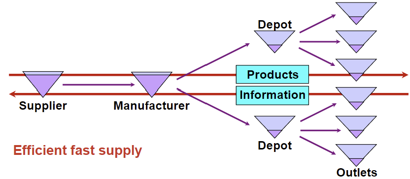

began: 13th Janurary 2025

# MSCI.102 Introduction to Operations Management

| Week | My Notes                                                                                      | Lecture Slides                                                               | Noted |
| :--: | --------------------------------------------------------------------------------------------- | ---------------------------------------------------------------------------- | :---: |
|  11  | [Lecture 1 - Module Introduction](#lecture-1---module-introduction)                           | [Introduction to OM](/MSCI.102.slides/a.introduction.pdf)                    |  ✅   |
|  11  | [Lecture 2 - Operations As A System](#lecture-2---operations-as-a-system)                     | [Operations As A System](/MSCI.102.slides/b.operationsAsSystem.pdf)          |  🟧   |
|  12  | [Lecture 3 - Intro to Supply Chain Management](#lecture-3---intro-to-supply-chain-management) | [Introduction To Supply Chain Management](/MSCI.102.slides/c.introToSCM.pdf) |  🟧   |
|  12  | [Lecture 4 - Supply Chain Management Part 2](#lecture-4---supply-chain-management-part-2)     | [SCM Part 2](/MSCI.102.slides/d.SCM2.pdf)                                    |  ✅   |
|  13  | [Lecture 5 - Inventory Management](#lecture-5---inventory-management)                         | [Inventory Management](/MSCI.102.slides/e.inventoryManagement.pdf)           |  🟧   |

## Lecture 1 - Module Introduction

<audio controls>
  <source src="MSCI.102.slides/a.introduction.mp3" type="audio/mpeg">
 Your browser does not support the audio element.
</audio>

Operations are responsible for the production of goods or delivery of services. It is the 'other' part of the business which is responsible for 60-70% of the costs, assets, and people.

Business operations is one of the 3 core functions; developing the market (marketing), creating product
s and services (design and development), and producing and delivering to the market (operations). Accounting & finance, and human resources are two 'supporting functions'.

For example, OM solves the problem of how to build airliners from millions of items on time when 2,000 workers are involved in the final assembly, when lead times vary from milliseconds to weeks, when errors happen, people get sick, machines malfunction, and when raw materials to major assemblies come from all over the world. (Scheduling & Control Systems)

### What I Will Be Able To Do

I'll be able to solve problems in OM by using:

- simple mathematical models (inventory analysis)
- specific planning methods (project planning & control)
- systems to manage suppliers (supply chain management)
- basic coordination principles (ERP & Lean Management)
- statistics to control variation (quality control)
- practices to focus improvement efforts (quality measure)

### Main Themes

Solving logical, rather than social, problems of producing products and delivering services:

- Dealing with complexity, scale & uncertainty
- Achieving improvement, change & competitiveness
- Concerning the nature of work rather than the people doing it

### Operations as a SYSTEM

A System is a complex whole where relationships between components define system behaviour. The components in the system are modified by interactions with each other and with external elements. The components maintain and reproduce their distinct structures and boundaries. The interactions between components via the exchange of materials and information can produce qualitatively new characteristics in a system.

## Lecture 2 - Operations As A System

<audio controls>
  <source src="MSCI.102.slides/b.operationsAsSystem.mp3" type="audio/mpeg">
 Your browser does not support the audio element.
</audio>

### Purpose In the Operations System

Systems have autonomous behaviour. They do more than react to stimuli, they pursue goals.

Operations have performance objectives, which typically include cost, quality, speed, dependability, flexibility, and sustainability. Each objective can have different types. For example:

- **Quality**: Top quality vs. consistent quality.
- **Speed**: On-time delivery vs. fast development.
- **Flexibility**: Product customization vs. product variety vs. volume flexibility.
- **Dependability**: Durability vs. reliability.

'Order Winning' operational factors are those that directly and significantly contribute to winning business as they provide a competitive advantage.

### Transformation In The Operations System

- **Materials Processor**: manufacturing, mining, energy
- **Information Processors**: accountancy, media, research
- **Customer Processors**: hotels, hospitals, education, transport

### Adaption In The Operations System

## Lecture 3 - Intro To Supply Chain Management

<audio controls>
  <source src="MSCI.102.slides/c.introToSCM.mp3" type="audio/mpeg">
 Your browser does not support the audio element.
</audio>

A supply chain is two or more parties linked by a flow of resources, typically material, information, or money, that fulfil a customer request.

- **Upstream**: Activities or firms positioned earlier in the supply chain
- **Downstream**: Activities or firms positioned later in the supply chain
- **First-tier Supplier**: A supplier that provides products or services to a firm's first-tier supplier
- **Second-tier Supplier**: A supplier that provides products or services to the firm's first-tier supplier.

### What A Supply Chain Looks Like

The standard view. A local firm, contracting with immediate neighbours:

Sometimes has parallel chains:

Chains often transition or are context-dependent:

Firms can swap roles on occasion:

Having more parties in the supply chain is risky. The specialisation model creates a supply network. Risk and vulnerabilities are inherent in networks. The more extensive the network, the bigger the tension. A balance between efficiency and resilience.

### Procurement Process

The procurement process is a series of steps a company takes to obtain the goods and services it needs to operate.

The process:

1. Enquiry/bidding/tendering
2. Supplier selection
3. Requisition/ordering
4. Supply
5. Invoicing & payment

## Lecture 4 - Supply Chain Management Part 2

<audio controls>
  <source src="MSCI.102.slides/d.SCM2.mp3" type="audio/mpeg">
 Your browser does not support the audio element.
</audio>

Crises put pressure on supply chains due to their disruptiveness. These crises present potential threats and create sudden increases/slumps in the demand for products and services. Firms will sometimes use the power they have over suppliers and this abuse of power damages social relationships which can undermine an effective supply chain.

### Functional vs Innovative Products

Can have 2 categories of product. Functional and innovative.

|                         |      Functional       |    Innovative      |
| :---------------------- | :-------------------: | :----------------: |
| Product Life Cycle      | greater than 2 years  |  3 to 12 months    |
| Margin                  |      5% to 20%        |    20% to 60%      |
| Product Variety         |         low           |       high         |
| Average Forecast Error  |         10%           |    40% to 100%     |
| Stockout Rate           |       1% to 2%        |     up to 40%      |
| Markdown Rate           |          0%           |    10% to 25%      |
| Lead Time               |    6 to 12 months     | 3 days to 3 weeks  |

Heinz Tomato Soup Performance Objectives: cost, delivery reliability, and conformance quality.

Coat Performance Objectives: flexibility, specification quality.

### SC Design - Different Types of SCs

- **SC Responsiveness** includes a SC's ability to:
    - Respond to wide ranges of quantities demanded
    - Meet short lead times
    - Handle a large variety of products
    - Build highly innovative products/services
    - Meet a high service level
    - Handle supply uncertainty
- **SC Efficiency** is the inverse of the cost of making and delivering a product to the customer:
    - Increases in cost --> lower efficiency
    - Minimum inventory
    - Low-cost suppliers

### Supply Chain As A Unit Of Management

1. A better understanding of vulnerabilities and risks which are inherent in supply networks.
2. Taking steps to ensure the balance between efficiency and resilience
3. A better understanding of opportunities in the network
4. Sharing information for better performance across the supply chain
5. Identifying structural changes in the industry
6. Stronger grasp of instability

Bullwhip Effect Case:

> "Not long ago, logistics executives at Procter & Gamble (P&G) examined the order
> patterns for one of their best-selling products, Pampers. Its sales at retail stores were fluctuating, but the variabilities were certainly not excessive. However, as they examined the distributors’ orders, the executives were surprised by the degree of variability. When they looked at P&G’s orders of materials to their suppliers, such as 3M, they discovered that the swings were even greater. At first glance, the variabilities did not make sense. While the consumers ... consumed diapers at a steady rate, the demand order variabilities in the supply chain were amplified as they moved up the supply chain." - Lee et al 1997

### Supply Chain As A Unit of Failure

1. Risks to the supply chain
      - loss of supply, especially when 'just in time'
2. Risks from the supply chain
      - distribution of contamination
3. Risks to and from the supply chain
      - product counterfeiting
4. Risks from the supply chain
      - Outsourcing

A supply chain can be resilient as well as vulnerable. Sustainability is possible through 'closed loop' supply chains and supplier development. They are often globalised and often involve anonymous markets like internet trading. This minimises procurement prices but makes tracing hard and leaves them open to subversion and infiltration.

Coat Performance Objectives: flexibility, specification quality.

### SC Design - Different Types of SCs

- **SC Responsiveness** includes a SC's ability to:
  - Respond to wide ranges of quantities demmanded
  - Meet short lead times
  - Handle a large vairety of products
  - Build highly innovative products/services
  - Meet a high service level
  - Handle supply uncertainty
- **SC Efficiency** is the inverse of the cost of making and delivering a product to the customer:
  - Increases in cost --> lower efficiency
  - Minimum inventory
  - Low-cost suppliers

### Supply Chain As A Unit Of Management

1. A better understanding of vulnerabilities and risks which are inherent in supply networks.
2. Taking steps to ensure the balance between efficiency and resilience
3. A better understanding of opportunities in the network
4. Sharing information for better performance across the supply chain
5. Identifying structural changes in industry
6. Stronger grasp of instability

Bullwhip Effect Case:

> "Not long ago, logistics executives at Procter & Gamble (P&G) examined the order
> patterns for one of their best-selling products, Pampers. Its sales at retail stores were fluctuating, but the variabilities were certainly not excessive. However, as they examined the distributors’ orders, the executives were surprised by the degree of variability. When they looked at P&G’s orders of materials to their suppliers, such as 3M, they discovered that the swings were even greater. At first glance, the variabilities did not make sense. While the consumers ... consumed diapers at a steady rate, the demand order variabilities in the supply chain were amplified as they moved up the supply chain." - Lee et al 1997

### Supply Chain As A Unit of Failure

1. Risks to the supply chain
   - loss os sipply, especially when 'just in time'
2. Risks from the supply chain
   - distribution of contamination
3. Risks to and from the supply chain
   - product counterfeiting
4. Risks from the supply chain
   - Outsourcing

A supply chain can be resilient as well as vulnerable. Sustainability is possible through 'closed loop' supply chains and supplier development. They are often globalised and often involve anonymous markets like the internet trading. This minimises procurement prices but makes tracing hard and leaves them open to subversion and infiltration.

## Lecture 5 - Inventory Management

<audio controls>
  <source src="MSCI.102.slides/e.inventoryManagement.mp3" type="audio/mpeg">
 Your browser does not support the audio element.
</audio>

Inventory could be raw materials, work-in-processes, or finished goods. We have a focus on physical inventories.

Inventory is found at all stages in the operations processes, between unsynchronised activities. However, you can also find inventory at supplier levels, such as inventory that does not enter the operation directly but is necessary for the process, such as office stationary/equipment, cleaning equipment, etc.

### Why We Hold Inventory

We hold inventory for various reasons such as:

- To meet unexpected supply or demand (**buffer**): For example, due to unreliable suppliers.
- For batch manufacturing (**cycle**): Usually in large, fixed quantities. For example, manufacturing batches of 100 bread loaves at a time.
- To take advantage of short-term opportunities (**discounts**): For example, quantity discounts on selected items.
- Due to fixed ordering (**economies of scale**): It is often cheaper to produce in bulk. For example, raw materials.
- Transportation (**pipeline**): For example, ocean transport takes time to deliver.

### Why We Might Avoid Holding Physical Inventory

- **Holding Costs**: Insurance, real estate, captial, interest.
- **Shrinkage**: Obsolesence, deterioration, theft.
- **Obstruction**
- **Hazards**: Hazmat (Hazardous Materials) Can cause fires or explosions.

### How Much Inventory We Should Have

Too little inventory is bad for the business as it can caus a stock-out which reduces sales (stock-outs cause walkouts). It can also lead to poor customer service which results in dissatisfied customers. The objective is to find a good level of stock in our spply chain. This good level is one that:

1. Guarantees customers' expected demand is satisfied (according to generated forecasts)
2. Minimises the total cost of ordering and carrying the inventory

These 2 types of cost can be used to determine an optimal level by analysing cost. We can add up costs linked to the 2 phases of the process:

- **Ordering Cost**: Placing order, transport, inspection, staff. Quantity discounts, supplements.
- **Holding Cost**: Capital cost, interest, storage & insurance, obsolescence, deterioration, handling & staff.

Here is a basic example. If we have a fixed demand of 1000 units, there are 2 options to fufil that demand:

- Plan A: Max of 400 units means order 400, 2.5 times/year
- Plan B: Max of 100 means order 100, 10 times/year

If you go with plan A then the holding cost would be more as you have to hold more, but the ordering cost could be less due to less orders per year. With plan B, the holding cost would be less, but the ordering cost greater.

Here is a more detailed example.

ORDERING COST: Let's assume the same ordering cost for any size order (£100). `orders placed/year = annual demand/order quantity`. For example, 1000/**100** = 10 orders : 1000/**80** = 12.5 orders. Total annual orderocst is 10 _ £100 = £1,000 : 12.5 _ £100 = £1,250.

C0 \* D/Q where C0 is the cost of each order, D is the annual demand, and Q is the order quantity.

HOLDING COST: Let's assume that the holding cost is a constant per item stored per unit of time (£10 per unit per year).

Average items stored over a full period

OR Ch \* Q/2

#### IDEK anymore:

Total cost is the sum of the above 2.

Ct = (Ch \* Q/2) + (C0 \* D/Q)

### EQQ Model & Formula

Assumptions:

- Uniform demand
- Constant Lead Time (LT)
- Receipt of inventory is instantaneous and complete (order date = delivery date)
- No quantity discounts
- No other Variable costs considered
- No stick-out (shortage) cost

EQQ = √((2 \* CO \* D) / Ch)

Limitations:

- Demand (steady/predicatable) assumptions
- Does not account for demand fluctuations
- Unsuitable to use EQQ models for different businesses
- Instantaneous delivery assumption
- Supply uncertainty
- More suitable for small-scale firms
