began: 9th October 2024

# MSCI.152 Introduction to Business Intelligence and Analytics

| Week | My Notes                                                                            | Lecture Slides                                                                | Noted |
| :--: | ----------------------------------------------------------------------------------- | ----------------------------------------------------------------------------- | :---: |
|  1   | [Lecture 1 - Module Introduction](#lecture-1---module-introduction)                 | [Module Intro](/MSCI.152.slides/a.introduction.pdf)                           |  ❌   |
|  1   | [Lecture 2 - Sampling Methods](#lecture-2---sampling-methods)                       | [Sampling Methods](/MSCI.152.slides/b.samplingMethods.pdf)                    |  ❌   |
|  2   | [Lecture 3 - Sampling Issues](#lecture-3---sampling-issues)                         | [Sampling Issues](/MSCI.152.slides/c.samplingIssues.pdf)                      |  ❌   |
|  2   | [Lecture 4 - Qualitative Data](#lecture-4---qualitative-data)                       | [Qualitative Data](/MSCI.152.slides/d.qualitativeData.pdf)                    |  ❌   |
|  3   | [Lecture 5 - Quantitative Data](#lecture-5---quantitative-data)                     | [Quantitative Data](/MSCI.152.slides/e.quantitativeData.pdf)                  |  ❌   |
|  3   | [Lecture 6 - Measures of Location](#lecture-6---measures-of-location)               | [Measures of Location](/MSCI.152.slides/f.measuresOfLocation.pdf)             |  ❌   |
|  4   | [Lecture 7 - Measures of Spread](#lecture-7---measures-of-spread)                   | [Measures of Spread](/MSCI.152.slides/g.measuresOfSpread.pdf)                 |  ❌   |
|  4   | [Lecture 8 - Correlation](#lecture-8---correlation)                                 | [Correlation](/MSCI.152.slides/h.correlation.pdf)                             |  ✅   |
|  5   | [Lecture 9 - Simple Linear Regression](#lecture-9---simple-linear-regression)       | [Simple Linear Regression](/MSCI.152.slides/i.simpleLinearRegression.pdf)     |  ❌   |
|  6   | [Lecture 10 - Regression Part 2](#lecture-10---regression-part-2)                   | [Regression Part 2](/MSCI.152.slides/j.regressionPartTwo.pdf)                 |  ✅   |
|  6   | [Lecture 11 - Regression Part 3](#lecture-11---regression-part-3)                   | [Regression Part 3](/MSCI.152.slides/k.regressionPartThree.pdf)               |  ✅   |
|  7   | [Lecture 12 - Multiple Linear Regression](#lecture-12---multiple-linear-regression) | [Multiple Linear Regression](/MSCI.152.slides/l.multipleLinearRegression.pdf) |  ✅   |
|  7   | [Lecture 13 - Forecasting](#lecture-13---forecasting)                               | [Forecasting](/MSCI.152.slides/m.forecasting.pdf)                             |  ✅   |
|  8   | [Lecture 14 - Forecasting Part 2](#lecture-14---forecasting-part-2)                 | [Forecasting Part 2](/MSCI.152.slides/n.forecastingPartTwo.pdf)               |  ✅   |
|  9   | [Lecture 15 - Modelling in Practice](#lecture-15---modelling-in-practice)           | [Modelling in Practice](/MSCI.152.slides/o.modellingInPractice.pdf)           |  ✅   |
|  10  | [Lectuer 16 - Data Mining](#lecture-16---data-mining)                               | [Data Mining](/MSCI.152.slides/p.dataMining.pdf)                              |  ✅   |
|  10  | [Lecture 17 - Report Writing](#lecture-17---report-writing)                         | [Report Writing](/MSCI.152.slides/q.reportWriting.pdf)                        |       |

## Lecture 1 - Module Introduction

## Lecture 2 - Sampling Methods

## Lecture 3 - Sampling Issues

## Lecture 4 - Qualitative Data

## Lecture 5 - Quantitative Data

## Lecture 6 - Measures of Location

## Lecture 7 - Measures of Spread

## Lecture 8 - Correlation

When examining the relationship betweern two variables, for each element in the sample, we record two values. These values are the two variables.

The X variable is the explanatory (independet) variable. The Y is the response (dependent) variable. The Y changes depending on the value of a X.

Correlation = r = corr(x, y)

The coeficcient r of a relationship measures the correlation between two variables. r ranges from -1 to 1.

The closer r is to -1 or 1 implies a stronger linear relationship. `r = o` implies there is no linear relationship at all. r = 1 or r = -1 implies there is a perfect linear relationship. The sign of r tells us whether the relationship is

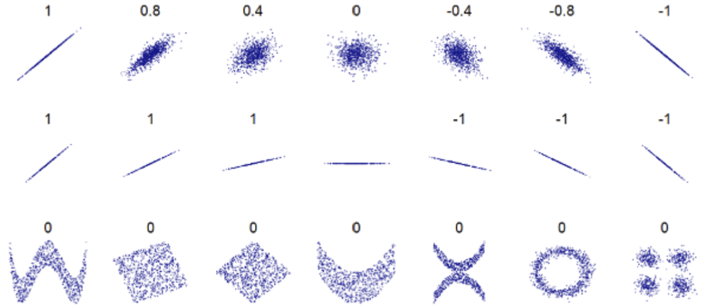

Correlation and causation can happen at the same time but correlation does not always impy causation. This is because there could be other factors (variables) that effect the outcome (Y).

## Lecture 9 - Simple Linear Regression

<audio controls>
  <source src="MSCI.152.slides/i.simpleLinearRegression.mp3" type="audio/mpeg">
  Your browser does not support the audio element.
</audio>

From previous lectures, we've got a data sample, plotted a scatter diagram, and calculated the correlation coefficient r. Now we want to model the relationship to observe an estimate of what generally happens.

The line of best fit aims to predict all the y values for all the x values.

## Lecture 10 - Regression Part 2

### Statistical Model Building

1. Problem Solution
   - Any Theories?
   - Data Collection & Analysis
2. Regression Modelling
   1. Model Identification
   2. Parameter Estimation
   3. Model Validation
3. Understanding & Using It
   - Inferences
   - Predictions
   - Decisions

### Multiple Linear Regression

By including multiple variables in a regression model, we can obtain the multiple linear regression.

### Building A Regression Model

1. Plot charts for each variable
   - Look for the shape of the relationship and outliers
   - The shape could be obscured by the effect of other variables
2. Think about what variables to include and how
   - What independent variables will be included?
   - What variables will be omitted?
3. Use Excel to fit a regression equation
4. Validate the model
   - Errors/Residules should have no patterns
   - GRAPH
5. Use Excel output to assess the strength of the relationship overall and for each variable (parameter estimation)
   - Any statistically insignificant/missing variables? Wrong spec?
   - Use confidence intervals to asses parameters.
   - If zero not included in the confidence intervals, then the parameter is significantly different from zero.
6. Consider alternative Methods
   - Any other variables we could use?

#### Plotting Variables

#### Fitting The Model

#### Validating The Model

#### Testing & Interpreting The Coefficients

#### Considering/Comparing Alternatives

Coursework will be nonoed if using R^2 instead of AdjustedR^2

1. Adjusted R2
2. Standard Error S
3. Information Criteria (AIC, BIC)

## Lecture 11 - Regression Part 3

### Categorical Independent Variables

A qualitative predictor (a factor) with two levels is called a **dummy variable**.

Lets say we have variable in data called OWN (if OWNS a house or not). This may seem qualitative but can turn the data from OWN or NOT OWN to 1 an 0. Now it is quantatitive.

### Linear vs Non-linear Relationships

To incorporate non-linear associations in a linear model is to include a transformed version of the predictors. We can model a non-linear relationshop by polynomial regression in which we add a quadratic shape.

### Forecasting with Regression

Once we have estimated a regression line I can use it to forcast by using numercial inputs for the variables in the model.

- X is known ahead of time.
- X is unknown but can still be forcast
- X is unknown but we wish to make what-if forcasts

A prediction interval is an interval estimatea of an individual y value given values of the independent variables. An approx 95% prediction interval associated with the forcast.

### Powerful but not complex Regression

Other types of regression:

- Log-regression
- Logistic Regression
- Multi-level regression

Different Varible selection methods:

- backward elimination
- forward selection
- stepwise selection
- best subset

## Lecture 12 - Multiple Linear Regression

yap

## Lecture 13 - Forecasting

Descriptive Analytics: desecribes what has happened in the past

Predictive Analytics: using models constructed from past data to predict the future or ascertain the impact of one variable on another. The main focus is to analyse current and histrorical facts to make predctions about future or otherwise unknown events. We might use:

- Linear Regression
- Time series analysis
- Extrapolation
- Data minning and Machine learning
- Simulation

### Decision Making & Forecasting

Forecasting can help us plan our future, and in turn may improve our quality of life.

Accurate forcasting, especially in businesses/organisations, leads to reduced uncertainty so better decisions made. It also helps to identify and capitalise on opportunities and saves costs.

- Forecasts aim to provide information about future, conditional on historical and current knowledge.
- Targets aim to provide direction towards a desirable future

### Time Series Data

- **Cross-sectional data** is measurements on multiple units, recorder in a single time period.
- A **time series** is a set of comparable measurements recorder on a single variable over multiple timet periods.
- **Panel data** are cross-sectionnal measurements that are repeated over time.

Our focus is on time series but I may need to predict any 3.

Noise (randomness) is inherently unforcastable since it has no structure, otherwise it should be captured by the forcasting method used. Is it impossible to predict whether the noise will go up or down as there is not structure.

Structure of a time series:

- Level
  - Series that are comprised only be a level component are referred to as a level/constant.
- Trend
  - The underlying long term chanes in the level (increase or decrease)
- Season
  - A repeating pattern of a fixed period
- Error/irregular/random part (noise)

### Introduction to Forecasting

1. Define the tforcasting and planning problem and decide the value of better forcasts
2. Determine the resources to be devoted to providing the forecasts
3. Collect relevant data
4. Conduct and initial analysis of the data
5. Select and appropriate forecasting method
6. Generate forecasts
7. Validate the forcaseting exercise by checking forecasts against actual outcomes

Forecasting problem structure:

- Forecasting object:
  - Level of aggregation
    - for a period
    - Cumulative accross periods
    - Growth rate
    - Events
- Forecasting Horizon: How far into the future?
- Forecasting Frequencty: Yearly/Monthly/Weekly/Daily/Hourly

A Time Series is a sequence of observations on a variable measured at successive points in time or over successive periods of time.

Time Series Notation:

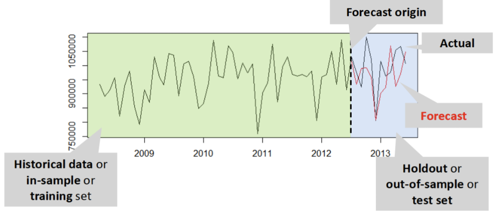

May need to predict multiple perios ahead

**Point Forcast** is our expectation of the most probable future value of a variable.

**Prediction intervals** show the bounds that the expected value should be in with a % chance.

#### Forecasting Methods

Qualitative:

1. Involve the user of expert judgement to develop forecasts
2. are appropriate when historical data are either unavailable or not applicable
3. informal, implicit human extraplations without systematic instructions how to generate a forecast
4. are subjective based upon personal experience and knowledge
5. can incorporate new, unstructured information
6. the results of forecast are not replicable by other experts or same expert at another time

Quantitative:

1. use formal mathematical models
2. can be used when past information is available and can be quantified
3. are based on the application of a prescribed explicit analysis of numerically coded data
4. are not based on subjective experience of human experts
5. can be replicated: when used on identical data, it will always lead to the same forecasts (any exceptions?)
6. quicker to obtain the results for many time series using many observations/variables

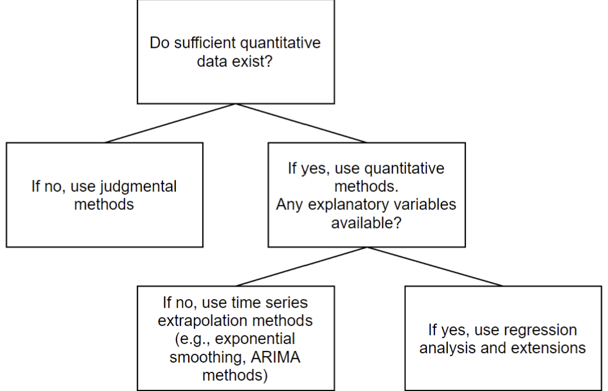

## Lecture 14 - Forecasting Part 2

### Time Series Exploration

To identify a trend, we have to fit a smooth line through the time serires and observe whether this line is going up or down. Need to fit a flexible enough smooth line that can capture various versions of trend, cycle, or lack of them. To do this we can use the 'Centred Moving Average' (CMA). Fitting a straight (regression) line, often called a trendline, is wrong.

In Excel we have the trendline function.

The CMA provides a smoothed version of the timer series. It can filter out noise, and seasonality.

### Simple Forecasting Methods

#### Naive (Random Walk)

The most simple forcast we can predict is that the time serires will continue as it is going - it will stay the same. This is why it is called the Naive forecast.

There is big issue with this. If there is an outlier in plot, Naive will not know it is outlier and forcast based on this.

#### Average Forecast

Random movements of noise is cancelled out. The more data there is, the better the correct level is estimated. It gives an equal importance to all observations.

It is resilient against outliers and provides a good estimation of the level.

However due to its long memory, it does not adjust to changes in the level, which makes very poor forecast.

#### Moving Average Forecast

Moving Average allows us to select the appropriate memory (length of the average). So specified time periods can have their own average. This helps adjusting to changes in the level.

The variable length allows us to control howreactive we are to new information and how robust we are against noisel.

#### CMA vs MA

CMA:

- CMA is a descriptive tool. It is a fitted value (e.g. CMA Jan, Feb, Mar = fitted value for February)
- Requires future information (it is centred).
- Difference in calculation between even and odd lengths.

MA:

- MA is a predicitve tool. It is a forecasted value (e.g. SMA Jan, Feb, Mar = forecasted value for April)
- Does not require any future information.
- No difference in the calculation of even or odd lengths.
- Is not a good estimation of the trend

### Exponential Smoothing

The Moving Average puts equal weight on each value, but if next months forecast should be based on the previous 12 months observations, more weight should be put on the more recent observations.

Exponential Smoothing uses a weighted average of past time series values as a forecast.

Recent forecasts are more important so weighted more heavily but the weight must add up to 100%.

### Other

Is a straight line forcast okay?
Yes...

1. A straight line forecast makes sense when a time series has no trend or seasonality.
2. Noise cannot be forecasted. A wiggly line trying to forecast noise will just reduce accuracy.
3. The forecast going forward contains all the information up to that point, so the straight line going forward does too.

## Lecture 15 - Modelling In Practice

### Project Understanding

All modelling starts with a problem. A problem can be captured by some data sets. Appropriate modelling techniques can learn relationships. Finding models can be transferred back to thet real problem and applied successfully.

While time spent on a project and data understandin is small compared to data preparation and modelling (20%:80%) the importance to success is the opposite.

When setting objectives, we must decide what it is, if that objective is deliverable, and what the SMART success criteria is for it.

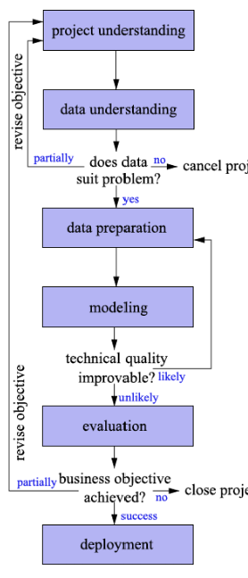

### Data Understanding

What kind of data do we have? Is the data relevant to the problem. Is there sufficient data? Is it valid? Is it showing what we would expect? Are there any errors in the data?

Missing values can have different causes. A sensor may have been broken...

### Data Preparation

1. Select data
2. Clean the data
   - treating missing data
   - identifying erroneous data and outliers
   - defining the appropriate way to represent variables
3. Construct data
   - split into training/test sets if needed
   - consider taking a smaller sample when dealing with big datasets
   - transofrm variables
     - categorical variables --> dummies
     - normalise/standardise variables
     - non-linear transformations

### Modelling

A problem in modelling is choosing a model that accurately captures both:

- in-sample structure
- behaviour of unseen data (generalise/predict)

The bias-variance tradeoff:

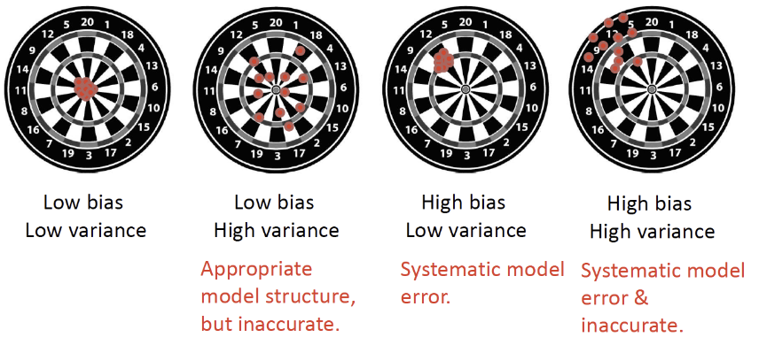

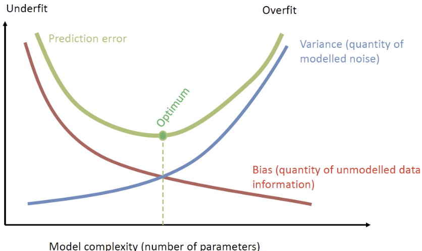

Under/overfitting:

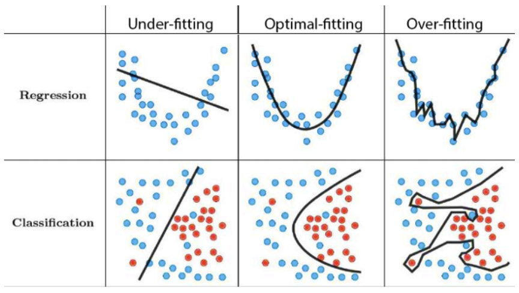

## Evaluation

**Model Interpretability**: A model is better interpretable than another model if its decisions are easier for a human to comprehend than decisions from the other model.

Occam's Razer Principle: when faced with several methods that give roughly equivalent performance, pick the simplest.

## Lecture 16 - Data Mining

**Statistical Learning** refers to a set of tools used to understand complex data sets.

**Supervised SL** involves building a statistical model for predicteding or estimating an output based on one ore more inputs.

**Unsupervised SL** is when there are inputs but no supervising output. There is no outcome/response variable to predict that can "supervise" our analysis.

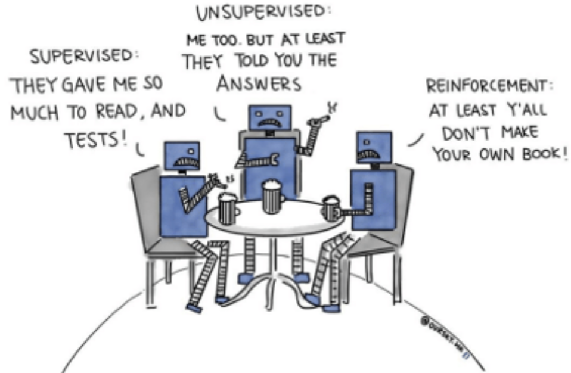

The goal of Unsupervised SL techniques is to use the variable values to identify relationships between observations. It is high-dimensional descriptive analytics, designed to describe patterns and relationships in large data sets with many observations of many variables. But it does all this without any outcome/response variable.

Unsupervised SL == Descriptive Data Mining

### Cluster Analysis

**Clustering**: Given a set of features X1, X2, ...Xp measured on _n_ observations, the goal is to divide these objects into groups (clusters) such that objects within a group tend to be more similar to one another as compared to objects belonging to different groups.

- We can discover subgroups among the variables and observations.
- **Difference to Classification**: Class labels are unknown --> Similarity depends on application.
- There is no unique definition of a cluster
- A part of an exploratory data analysis (to explore and characterise data before supervised modelling)
- Quite subjective and depends on the application: there is no way to check our work because we do not know the true answer.

Steps:

1. **Featuer Selection**: Features selected to encode as much information as possible concerning task
2. **Proximity Measure**: Quantifies how similar or dissimilar feature vectors are
3. **Clustering Criterion**: Determines what is a sensible type of cluster for application
4. **Clustering Algorithm**: Determined by previous 2 choices
5. **Validation and Interpretation of Results**

There are 2 main clustering techniques.

The **Euclidean Distance** is common method to measure dissimilarity between observations:

d = √[(u1 − v1)2 + (u2 − v2)2]

Here is an example:

Let:

- u = (23, £20,375) 23-year-old customer with income of £20,375
- v = (48, £19,475) 48-year-old customer with income of £19,475

As measured by the Euclidean Distance, the dissimilarity between these two observations is:

d = √[(23 - 48)2 + (20,375 - 19,475)2] = 900

In this case the amount of dissimilarity between the observations is dominated by the income variable because of the difference in scale. To avoid this we must standardise the units (replace the original values by (x - x̄)/xx>)

### k-Means Clustering

1. Specify number of clusters, `k`
2. Randomly assign each observation to one of the `k` clusters
3. After all observations have been assigned to a cluster, the resulting centroids are calculated (these cluster centroids are the "means" of k-means clustering)
4. Using the updated cluster centroids, all obsercations are reassigned to the cluster with the closest centroid (where Euclidean distance is the standard metric)
5. Repeat this process (calculate cluster centroid, assign each observation to the cluster with the nearest centroid) until there is no change in the clusters or a specified max number of iterations is reached

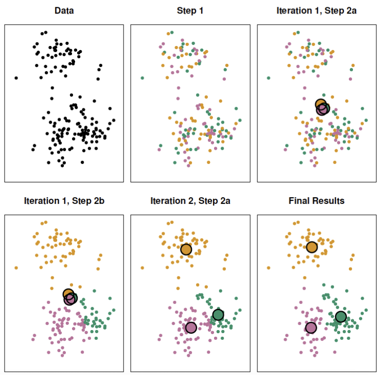

k-Means clustering is sensetive to initialisation of centroids and is designed to identify spherical clusters (elongated clusters, and clusters of different sizes cause problems).

### Hierarchical Clustering

A pair of clusters with the lowest dissimilarity merged recursively. The Height of connection lines reflects dissimilarity. It is a nested structure which means that each cluster at a lower level is a subset of a cluster at a higher level. Not all data can be structured this way.

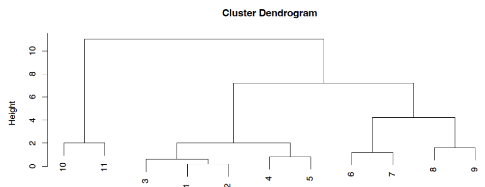

Steps:

1. At the beginning each respondent is their own cluster;
2. Measure distances between all pairs of respondents;
3. Construct a distance (or dissimilarity) matrix;
4. Join two closest objects, either by forming new group or joining to the old one;
5. Recalculate dissimilarities matrix based on linkage:
   - Single linkage: use smallest distance
   - Complete linkage: use largest distance
   - Average linkage: average distance between all pairs in clusters
   - Centroid linkage: distance between cluster centroids (mean)
   - etc...
6. Repeat steps 4 and 5 until all objects are clustered

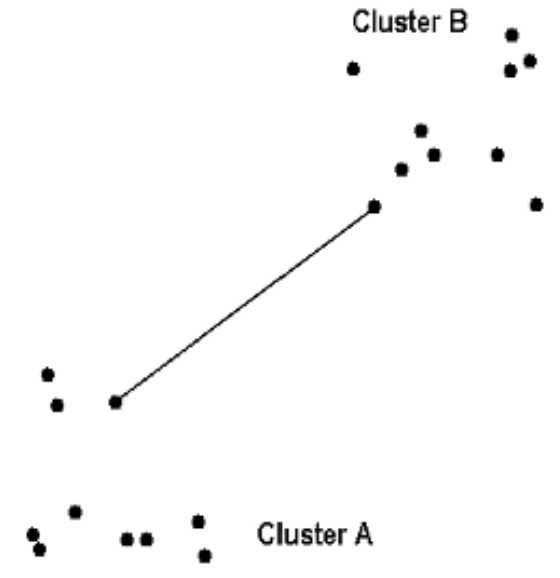
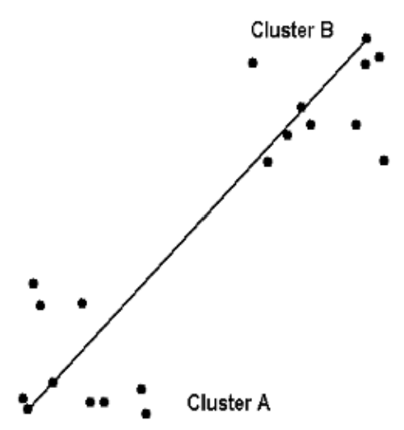
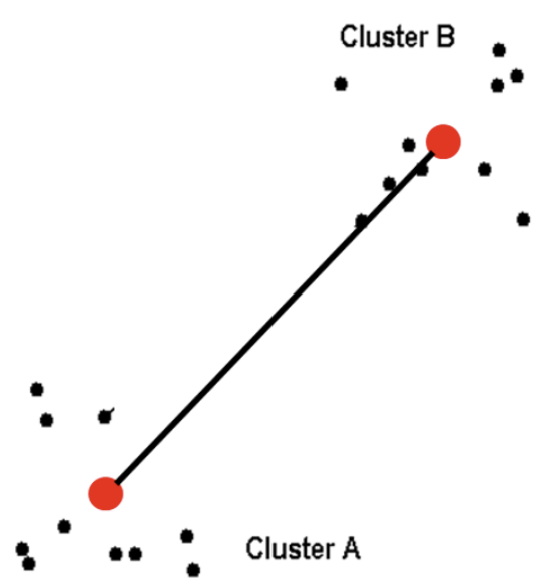
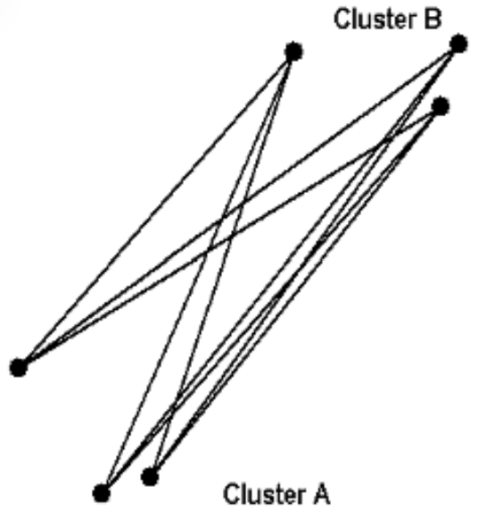

Average and Complete Linkage tend to yield more balanced results.

Hierarchical clustering aligns well with the idea of market segmentation. It is very suitable for specific applications like biology, medicine, social sciences, and text mining. It can do nested segments and does not assume much. However it is not clear how many clusters should be done. It might be heavy for big data sets and it does not guarantee finding the global optimum.

## Lecture 17 - Report Writing
