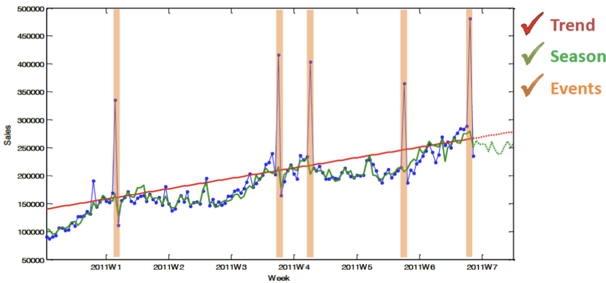

began: 9th October 2024

# MSCI.152 Introduction to Business Intelligence and Analytics

| Week | Lecture                                                                             | Original Slides                                                               | Noted |
| ---- | ----------------------------------------------------------------------------------- | ----------------------------------------------------------------------------- | ----- |
| 1    | [Lecture 1 - Module Introduction](#lecture-1---module-introduction)                 | [Module Intro](/MSCI.152.slides/a.introduction.pdf)                           | ❌    |
| 1    | [Lecture 2 - Sampling Methods](#lecture-2---sampling-methods)                       | [Sampling Methods](/MSCI.152.slides/b.samplingMethods.pdf)                    | ❌    |
| 2    | [Lecture 3 - Sampling Issues](#lecture-3---sampling-issues)                         | [Sampling Issues](/MSCI.152.slides/c.samplingIssues.pdf)                      | ❌    |
| 2    | [Lecture 4 - Qualitative Data](#lecture-4---qualitative-data)                       | [Qualitative Data](/MSCI.152.slides/d.qualitativeData.pdf)                    | ❌    |
| 3    | [Lecture 5 - Quantitative Data](#lecture-5---quantitative-data)                     | [Quantitative Data](/MSCI.152.slides/e.quantitativeData.pdf)                  | ❌    |
| 3    | [Lecture 6 - Measures of Location](#lecture-6---measures-of-location)               | [Measures of Location](/MSCI.152.slides/f.measuresOfLocation.pdf)             | ❌    |
| 4    | [Lecture 7 - Measures of Spread](#lecture-7---measures-of-spread)                   | [Measures of Spread](/MSCI.152.slides/g.measuresOfSpread.pdf)                 | ❌    |
| 4    | [Lecture 8 - Correlation](#lecture-8---correlation)                                 | [Correlation](/MSCI.152.slides/h.correlation.pdf)                             | ❌    |
| 5    | [Lecture 9 - Simple Linear Regression](#lecture-9---simple-linear-regression)       | [Simple Linear Regression](/MSCI.152.slides/i.simpleLinearRegression.pdf)     | ❌    |
| 6    | [Lecture 10 - Regression Part 2](#lecture-10---regression-part-2)                   | [Regression Part 2](/MSCI.152.slides/j.regressionPartTwo.pdf)                 | ✅    |
| 6    | [Lecture 11 - Regression Part 3](#lecture-11---regression-part-3)                   | [Regression Part 3](/MSCI.152.slides/k.regressionPartThree.pdf)               | ✅    |
| 7    | [Lecture 12 - Multiple Linear Regression](#lecture-12---multiple-linear-regression) | [Multiple Linear Regression](/MSCI.152.slides/l.multipleLinearRegression.pdf) | ✅    |
| 7    | [Lecture 13 - Forecasting](#lecture-13---forecasting)                               | [Forecasting](/MSCI.152.slides/m.forecasting.pdf)                             | ✅    |
| 8    | [Lecture 14 - Forecasting Part 2](#lecture-14---forecasting-part-2)                 | [Forecasting Part 2](/MSCI.152.slides/n.forecastingPartTwo.pdf)               |       |

## Lecture 1 - Module Introduction

Business Analytics is the process of transforming data into insight for making better decisions.

- Descriptive Analytics
- Predictive

### Recommender Systems

Are information filters that provide users with relevant outputs. These are used in online stores, streaming servies, social media, and search engines.

Pros:

- ...

Cons:

- ...

### Big Data:

The 5 V's of Big Data (IBM)

- Volume
- Velocity
- Variety
- Veracity
- Value

## Lecture 2 - Sampling Methods

## Lecture 3 - Sampling Issues

## Lecture 4 - Qualitative Data

## Lecture 5 - Quantitative Data

## Lecture 6 - Measures of Location

## Lecture 7 - Measures of Spread

## Lecture 8 - Correlation

## Lecture 9 - Simple Linear Regression

---

---

## Lecture 10 - Regression Part 2

### Statistical Model Building

1. Problem Solution
   - Any Theories?
   - Data Collection & Analysis
2. Regression Modelling
   1. Model Identification
   2. Parameter Estimation
   3. Model Validation
3. Understanding & Using It
   - Inferences
   - Predictions
   - Decisions

### Multiple Linear Regression

By including multiple variables in a regression model, we can obtain the multiple linear regression.

### Building A Regression Model

1. Plot charts for each variable
   - Look for the shape of the relationship and outliers
   - The shape could be obscured by the effect of other variables
2. Think about what variables to include and how
   - What independent variables will be included?
   - What variables will be omitted?
3. Use Excel to fit a regression equation
4. Validate the model
   - Errors/Residules should have no patterns
   - GRAPH
5. Use Excel output to assess the strength of the relationship overall and for each variable (parameter estimation)
   - Any statistically insignificant/missing variables? Wrong spec?
   - Use confidence intervals to asses parameters.
   - If zero not included in the confidence intervals, then the parameter is significantly different from zero.
6. Consider alternative Methods
   - Any other variables we could use?

#### Plotting Variables

#### Fitting The Model

#### Validating The Model

#### Testing & Interpreting The Coefficients

#### Considering/Comparing Alternatives

Coursework will be nonoed if using R^2 instead of AdjustedR^2

1. Adjusted R2
2. Standard Error S
3. Information Criteria (AIC, BIC)

---

---

## Lecture 11 - Regression Part 3

### Categorical Independent Variables

A qualitative predictor (a factor) with two levels is called a **dummy variable**.

Lets say we have variable in data called OWN (if OWNS a house or not). This may seem qualitative but can turn the data from OWN or NOT OWN to 1 an 0. Now it is quantatitive.

### Linear vs Non-linear Relationships

To incorporate non-linear associations in a linear model is to include a transformed version of the predictors. We can model a non-linear relationshop by polynomial regression in which we add a quadratic shape.

### Forecasting with Regression

Once we have estimated a regression line I can use it to forcast by using numercial inputs for the variables in the model.

- X is known ahead of time.
- X is unknown but can still be forcast
- X is unknown but we wish to make what-if forcasts

A prediction interval is an interval estimatea of an individual y value given values of the independent variables. An approx 95% prediction interval associated with the forcast.

### Powerful but not complex Regression

Other types of regression:

- Log-regression
- Logistic Regression
- Multi-level regression

Different Varible selection methods:

- backward elimination
- forward selection
- stepwise selection
- best subset

---

---

## Lecture 12 - Multiple Linear Regression

yap

---

---

## Lecture 13 - Forecasting

Descriptive Analytics: desecribes what has happened in the past

Predictive Analytics: using models constructed from past data to predict the future or ascertain the impact of one variable on another. The main focus is to analyse current and histrorical facts to make predctions about future or otherwise unknown events. We might use:

- Linear Regression
- Time series analysis
- Extrapolation
- Data minning and Machine learning
- Simulation

### Decision Making & Forecasting

Forecasting can help us plan our future, and in turn may improve our quality of life.

Accurate forcasting, especially in businesses/organisations, leads to reduced uncertainty so better decisions made. It also helps to identify and capitalise on opportunities and saves costs.

- Forecasts aim to provide information about future, conditional on historical and current knowledge.
- Targets aim to provide direction towards a desirable future

### Time Series Data

- **Cross-sectional data** is measurements on multiple units, recorder in a single time period.
- A **time series** is a set of comparable measurements recorder on a single variable over multiple timet periods.
- **Panel data** are cross-sectionnal measurements that are repeated over time.

Our focus is on time series but I may need to predict any 3.

Noise (randomness) is inherently unforcastable since it has no structure, otherwise it should be captured by the forcasting method used. Is it impossible to predict whether the noise will go up or down as there is not structure.

Structure of a time series:

- Level
  - Series that are comprised only be a level component are referred to as a level/constant.
- Trend
  - The underlying long term chanes in the level (increase or decrease)
- Season
  - A repeating pattern of a fixed period
- Error/irregular/random part (noise)

### Introduction to Forecasting

1. Define the tforcasting and planning problem and decide the value of better forcasts
2. Determine the resources to be devoted to providing the forecasts
3. Collect relevant data
4. Conduct and initial analysis of the data
5. Select and appropriate forecasting method
6. Generate forecasts
7. Validate the forcaseting exercise by checking forecasts against actual outcomes

Forecasting problem structure:

- Forecasting object:
  - Level of aggregation
    - for a period
    - Cumulative accross periods
    - Growth rate
    - Events
- Forecasting Horizon: How far into the future?
- Forecasting Frequencty: Yearly/Monthly/Weekly/Daily/Hourly

A Time Series is a sequence of observations on a variable measured at successive points in time or over successive periods of time.

Time Series Notation:

May need to predict multiple perios ahead

**Point Forcast** is our expectation of the most probable future value of a variable.

**Prediction intervals** show the bounds that the expected value should be in with a % chance.

#### Forecasting Methods

Qualitative:

1. Involve the user of expert judgement to develop forecasts
2. are appropriate when historical data are either unavailable or not applicable
3. informal, implicit human extraplations without systematic instructions how to generate a forecast
4. are subjective based upon personal experience and knowledge
5. can incorporate new, unstructured information
6. the results of forecast are not replicable by other experts or same expert at another time]

Quantitative:

1. use formal mathematical models
2. can be used when past information is available and can be quantified
3. are based on the application of a prescribed explicit analysis of numerically coded data
4. are not based on subjective experience of human experts
5. can be replicated: when used on identical data, it will always lead to the same forecasts (any exceptions?)
6. quicker to obtain the results for many time series using many observations/variables

---

---

## Lecture 14 - Forecasting Part 2
