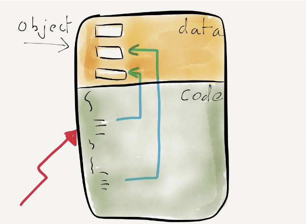

began: 9th October 2024

# SCC.111 Software Development

The module aims to help me understand software development. This includes instilling the knowledge, understanding, and skills expected of a principled computer programmer, and developing a coherent understanding of the principles & practice of imperative programming, the software development lifecycle, and its associated tools and techniques.

| Assessment          | When               | Worth         |
| ------------------- | ------------------ | ------------- |
| In-lab quiz         | Week 5, 10, 15, 20 | 20% (5% each) |
| Programming Project | Week 21-25         | 10%           |
| Exam                | Summer Term        | 70%           |

---

### Table of Contents

| Week | My Notes                                                                                                    | Original Slides                                                                                 | Noted |
| :--: | ----------------------------------------------------------------------------------------------------------- | ----------------------------------------------------------------------------------------------- | :---: |
|  1   | [Lecture 1 - Module Introduction](#lecture-1---module-introduction)                                         | [Module Intro](/SCC.111.slides/a.introSlides.pdf)                                               |  ✅   |
|  1   | [Lecture 2 - Writing Code](#lecture-2---writing-code)                                                       | [Intro to C](/SCC.111.slides/b.introToC.pdf)                                                    |  ✅   |
|  2   | [Lecture 3 - Control Flow](#lecture-3---control-flow)                                                       | [Control Flow](/SCC.111.slides/c.controlFlow.pdf)                                               |  ✅   |
|  2   | [Lecture 4 - Functions & Flow](#lecture-4---functions--flow)                                                | [Functions & Flow](/SCC.111.slides/d.functionsAndFlow.pdf)                                      |  ✅   |
|  3   | [Lecture 5 - Variables & Arrays](#lecture-5---variables--arrays)                                            | [Variables & Arrays](/SCC.111.slides/e.variablesAndArrays.pdf)                                  |  ❌   |
|  3   | [Lecture 6 - Reading Code](#lecture-6---reading-code)                                                       | [Reading Code](/SCC.111.slides/f.readingCode.pdf)                                               |  ❌   |
|  4   | [Lecture 7 - Testing](#lecture-7---testing)                                                                 | [Testing](/SCC.111.slides/g.testing.pdf)                                                        |  ❌   |
|  4   | [Lecture 8 - Debugging](#lecture-8---debugging)                                                             | [Debugging](/SCC.111.slides/h.debugging.pdf)                                                    |  ❌   |
|  5   | [Lecture 9 - Deubbign Part 2](#lecture-9---debugging-part-2)                                                | [Debugging Part 2](/SCC.111.slides/i.debuggingPartTwo.pdf)                                      |  ❌   |
|  5   | [Lecture 10 - Indirection & Pointers](#lecture-10---indirection--pointers)                                  | [Indirection & Pointers](/SCC.111.slides/j.indirectionPointers.pdf)                             |  🟧   |
|  6   | [Lecture 11 - Pointers & Strings](#lecture-11---pointers--strings)                                          | [Pointers & Strings](/SCC.111.slides/k.pointersAndStrings.pdf)                                  |  ❌   |
|  6   | [Lecture 12 - Dynamic Memory & Compound Types](#lecture-12---dynamic-memory--compound-types)                | [Dynamic Memory & Compound Types](/SCC.111.slides/l.dynamicMemoryAndCompoundTypes.pdf)          |  ✅   |
|  7   | [Lecture 13 - Quiz Solutions](#lecture-13---quiz-solutions)                                                 | [Quiz Solutions](/SCC.111.slides/m.quizResults.pdf)                                             |  n/a  |
|  7   | [Lecture 14 - APIs & Files](#lecture-14---apis--files)                                                      | [APIs & Files](/SCC.111.slides/n.APIsAndFiles.pdf)                                              |  ✅   |
|  8   | [Lecture 15 - More Files](#lecture-15---more-files)                                                         | [Files Continued](/SCC.111.slides/o.moreFileStuff.pdf)                                          |  ✅   |
|  8   | [Lecture 16 - Libraries](#lecture-16---multi-file-projects)                                                 | [Libraries](/SCC.111.slides/p.libraries.pdf)                                                    |  ✅   |
|  9   | [Lecture 17 - Version Control](#lecture-17---version-control)                                               | [Version Control](/SCC.111.slides/q.versionControl.pdf)                                         |  🟧   |
|  9   | [Lecture 18 - Dynamic Data Structures](#lecture-18---dynamic-data-structures)                               | [Dynamic Data Structures](/SCC.111.slides/r.dynamicDataStructures.pdf)                          |  🟧   |
|  10  | [Lecture 19 - C Highlights](#lecture-19---c-highlights)                                                     | [C Highlights](/SCC.111.slides/s.cHighlights.pdf)                                               |  ❌   |
|  10  | [Lecture 20 - Fun By The C](#lectuer-20---fun-by-the-c)                                                     | [Fun By The C](/SCC.111.slides/t.funByTheC.pdf)                                                 |  🟧   |
|  11  | [Lecture 21 - Intro to Term 2](#lecture-21---introduction-to-term-2)                                        | [Intro To Term 2](/SCC.111.slides/u.introToTerm2.pdf)                                           |  ✅   |
|  11  | [Lecture 22 - Principles of OOP](#lecture-22---principles-of-oop)                                           | [Principles of OOP](/SCC.111.slides/v.principlesOfOOP.pdf)                                      |  ✅   |
|  12  | [Lecture 23 - Encapsulation](#lecture-23---encapsulation)                                                   | [Encapsulation](/SCC.111.slides/w.encapsulation.pdf)                                            |  ❌   |
|  12  | [Lecture 24 - Debugging](#lecture-24---debugging)                                                           | [Debugging](/SCC.111.slides/x.debugging.pdf)                                                    |  ✅   |
|  13  | [Lecture 25 - Principles of Reuse](#lecture-25---principles-of-reuse)                                       | [Principles of Reuse](/SCC.111.slides/y.reuse.pdf)                                              |  ❌   |
|  13  | [Lecture 26 - References, Composition & OO Cast Study](#lecture-26---references-composition--oo-cast-study) | [References, Composition & OO Cast Study](/SCC.111.slides/z.referencesCompositionCaseStudy.pdf) |  ❌   |
|  14  | [Lecture 27 - Reflections on C++](#lecture-27---reflections-on-c)                                           | [C++ Reflections](/SCC.111.slides/za.C++Reflections.pdf)                                        |  ❌   |
|  14  | [Lecture 28 - Introduction To Java](#lecture-28---introduction-to-java)                                     | [Intro To Java](/SCC.111.slides/zb.JavaIntro.pdf)                                               |  ✅   |
|  15  | [Lecture 29 - OO Fundamentals in Java](#lecture-29---oo-fundamentals-in-java)                               | [OO Fundamentals in Java](/SCC.111.slides/zc.OOinJava.pdf)                                      |  ✅   |
|  15  | [Lecture 30 - OO Case Study](#lecture-30---oo-case-study)                                                   | [OO Case Study](/SCC.111.slides/zd.OOcaseStudy.pdf)                                             |  ✅   |
|  16  | [Lecture 31 - OO Case Study Part 2](#lecture-31---oo-case-study-part-2)                                     | [OO Caset Study Prt 2](/SCC.111.slides/ze.OOcaseStudy2.pdf)                                     |  ✅   |
|  16  | [Lecture 32 - Collaborative Workflows](#lecture-32---collaborative-workflows)                               | [Collaborative Workflows](/SCC.111.slides/zf.collaborativeWorkflows.pdf)                        |  ✅   |
|  17  | [Lecture 33 - Collaborative Workflows Part 2](#lecture-33---collaborative-workflows-part-2)                 | [Collaborative Workflows Prt 2](/SCC.111.slides/zg.collaborativeWorkflows2.pdf)                 |  ✅   |

> **_NOTE:_** The AI Podcasts used for each lecture are produced from that lecture's slides. The structure of my notes for each lecture may differ to the order of topics discussed in the podcast.

## Lecture 1 - Module Introduction

A program is a detailed plan or procedure for solving a problem with a computer.

Imperative programming is a programming paradigm of software that uses statements that change a program's state. So I should think about what to represent, and how my program should manipulate that.

C is a compact and low-level language used to generate fast and efficient code that exploits hardware features well. It is compiled (translated into assembly only the computer understands).

## Lecture 2 - Writing Code

```C
#include <studio.h>

int main()
{
    printf("Hello world\n")
}
```

Line 1 copies the contents of the file 'stdio.h' into the file this program is written in. Line 3 declares 'main' a function that is the starting point for execution when the program is run. The '{ }' makes up the body of the main function. Line 5 calls a function printf, which we pass in "Hello world", to output the message.

I solve all problems by repeatedly breaking them down into smaller more manageable steps.

C Vocab:

|          |         |        |          |        |
| -------- | ------- | ------ | -------- | ------ |
| auto     | break   | case   | char     | const  |
| continue | default | do     | double   | else   |
| enum     | extern  | float  | for      | goto   |
| if       | int     | long   | register | return |
| short    | signed  | sizeof | static   | struct |
| switch   | typedef | union  | unsigned | void   |
| volatile | while   |        |          |        |

Programming languages have syntax - rules on how keywords/reserved words are used (the how). Variables hold data (the what). Operators manipulate the data to produce the desired output.

```C
#include <stdio.h>

int main()
{
    //Declaring counter a variable and setting it to 0
    int counter = 0;

    while (counter < 10) {
        // while counter is less than 10, add 1
        counter++;
    }

    printf("The variable counter is now %d\n", counter)
}
```

Program Flow: 'counter' controls the flow around a loop linked to the keyword 'while'. This is a logical test < or less than which is either true or false.

### Variables Types

```C
int main()
{
    int i;
    char c;
    float f;
    double d;
    short s;
    unsigned char b;
    unsigned int u;
}

```

### Operators

Binary Operators:

- `+` add
- `-` subtract
- `/` divide
- `*` multiply
- `%` remainder (mod)
- `<<` left shift
- `>>` right shift

Logical Operators:

- `<` less than
- `>` greater than
- `<=` less than or equal to, `>=` greater than or equal to
- `==` equivalen to, `!=` not equivilent to
- `!` NOT
- `&&` AND
- `||` OR

```C
int main()
{
    int a, b;

    a = -1;
    a = a + 3;
    b = (a * 5) + 2;
    b = b / 2 + 2;

    printf("b is %d\n", b)

    return 0
}
```

## Lecture 3 - Control Flow

When writing code we need to see how it is executed to make sense of what it will do. So we need to understand keywords, operators and function calls.

Code can move between programs, blocks of code, statements in the program, and within a line of code as expressions within the statement are evaluated.

Flow can be controlled by conditional statements (statements that must be true for a block of code to execute).

A program executes from start to finish with statements that can be repeated. Choosing the path for a program to flow through can also be decided with if statements.

'Do... while' loops test a condition after the block of code is executed.

## Lecture 4 - Functions & Flow

We solve all problems by decomposing them into smaller components. Sometimes the solution to these components can be packaged up into a functional and callable unit. This means we have to write less code and and makes it easier to maintain and reuse.

C lets us define functions which package and name specific functionality. C also has libraries. In C, functions follow this form:

```
direct-declarator (parameter-type-list)

int function_name()
{
    some code
}
```

They can only return an arithmetic type or nothing (void)

`main()` is the entry point to the program. It takes no parameters and returns a code to the shell.

In C, the parameter values in the function are only ever a copy of what passed in (passed by value).

## Lecture 5 - Variables & Arrays

## Lecture 6 - Reading Code

## Lecture 7 - Testing

## Lecture 8 - Debugging

## Lecture 9 - Debugging Part 2

## Lecture 10 - Indirection & Pointers

A pointer is a variable that contains the address of something else in memory such as another variable. This means that the pointer is not the value itself, it is the where to find it. It has its own type - pointer - in C.

Think of computer memory as a street of houses (memory section) each with a unique location identifier (an address).

When we declare a variable, a space in memory is set aside to store that type of data and the location is labelled with a name. E.G. declaring `x = 65` in our program will find free space in memory. In memory location `0x1012`. It labels that memory location as `x` and stores `65` there. We could get that data by the variable name or by targeting the address. This is good because if we have that box labelled x that contains 65, if I want to get that box I either need the address 0x1012 or i need the variable name. But if i want to get to the location 0x1024 I don't have a variable name for it, but I do have an address so I can get there without a name.

What pointers allow us to talk about the space where x is, not what it is. Pointers give us this level in indirection. Pointers are variables themselves that we can change and make them point to different places.

```C
int *p = &y;
// a pointer p is equal to the address of int y
// so if y = 32 is stored in 0x1004 then x = 0x1012
// the & is saying give me the address of y not the data at y.
// the * is declaring a pointer to an integer not the integer itself
```

Dereferencing:

```C
*x = 65;
// go to var x, find the value stored in it, treat it as an address, follow the address, and in the place that youve got to put the number 65.
// so the * is saying, treat the thing in x as an address. then the data at that memory address is set to the RHS in this case 65

// so if you didnt have the *, then the data at x would be replaced by 65. the compiler might complain as x is a type pointer but you trying to put int in it.
```

When we call a function we use a copy of the parameters the function is using. E.G.:

```C

void add_5(int value) {
    value = value + 5;
}

int main() {
    int amount = 10;
    add_5(amount);
    printf("Amount = %d\n", amount);
    // you would expect this to print 15. but the function is passed a copy of the data in var amount, not the actual thing. So the data in var amount is not changed. scope issue.
    return 0;
}
```

To combat this we need to pass in the address of the thing that needs to be changed.

```C
void add_5(int *value) {
    *value = *value + 5;
    // 'value' is now where the data is that we modify
}

int main() {
    int amount = 10;
    add_5(amount);
    printf("Amount = %d\n", amount);
    return 0;
}
```

## Lecture 11 - Pointers & Strings

## Lecture 12 - Dynamic Memory & Compound Types

A string is a sequence of characters (an array).

```C
int main() {
    char *password = "Password";
    *userEntry = "guess";

    if(userEntry == password) { // this is wrong as it is comparing the values stored in the pointer variables. this returns false because there are different memory addresses stored in password and userEntry
        printf("Correct Login\n");
    }
}
```

#### Comparing Strings

```C
char *password = "pass123";

if (strcomp(password, "paass123") == 0 || strcomp(password, "secret") == 0) {
    printf("Yes\n")
}
```

#### `<string.h>`

```C
int strlen(char *) // find the length of string s
char *strchr(char *, int) // find a character within a string (pointer or NULL)
strcat(char *d, char *s) // append string s to d
strcpy(char *d, char *s) // copy string s to d
```

### Beyond Basic Variables

We have only seen variables that represent simple scalar values like int, char, etc or as fex length arrays of values. These are all declared with a fixed size.

Variables also go out of scope at the end of the block they are declared in. They also incur overhead when copied.

#### Addressing Fixed Size

Types of storage:

- **Literals**
- **Standard Variables**
- **Global Variables**
- **Dynamic Variables** - from the heap

Dynamic Memory is allocated at runtime by my code. It needs managing (must free and return to the heap when done with it). Gotta take extreme care to avoid memory leaks, and crashes.

`maccloc()` gets a pointer to some memory.

```C
//create pointer str to 100 bytes
char *str = (char *) malloc(sizeof(char) * 100);

// do something with it
str[0] = 'h';
strcpy(str, "hello");

// return str to the heap
free(str)

//malloc will return NULL if it fails (we ask for too much)

// `sizeof(char)` asks how much a char is (1 byte)
// `* 100` multiplies 1 byte by 100
// `malloc(100)` allocates the heap space (returns a pointer)
// `char *str` declares pointer str
// `= (char *)` casts thet pointer to be of the type "points to char"
```

### More than just scalar values

Compound types combine simple types into 1 entity. For example, a Q&A are always a pair we keep together.

#### `struct`

```C
// Declare a new type (not variable, struct person)

struct person {
  char name[20]; // array of chars (string name)
  int age;
  char gender; // gender will be a single letter, e.g. 'f' or 'm'
};
// Declare the variable of type struct person */
struct person aPerson;

```

Assigning:

```C
struct person aPerson;

strcpy(aPerson.name, "Nigel");
aPerson.age = 30;
aPerson.gender = 'm';
```

An array of structs:

```C
struct person *people; // A pointer to a 'type struct person'

// Try allocate memory (an array of struct persons)

if ((people = (struct person *)
    malloc(sizeof(struct person) * 100)) != NULL) {
//it worked, do something with 100 people
// free when done

people[50].age = 18;

free(people)

} else {
    // oh no out of memory
}
```

access a struct field from a pointer:

```C
struct person *p = &aPerson;
strcpy(p->name, "Nigel");
p->age = 30;
p->gender = 'm’;
printf("%s's age is %d\n", p->name, p->age);
```

## Lecture 13 - Quiz Solutions

## Lecture 14 - APIs & Files

### APIs

We need a way of running a program to interact with its environment, get data from long-terms presistent storage, and to handle any errors (missing giles, permissions, read/write data).

To do this we can use an API (Application Programming Interface) is just a software interface. In our case, it's a set of operations defined for interacting with the systme in a controlled way.

In C, An API we access is simply:

- **One or more function** we can call
- **Declared in a header** (.h) file that we need to include to use them

### Files

Informally, a file is a collection of (usually related) data, which can be logically viewed as a stream of bytes. This is the smallest unit of storage in the UNIX file system.

A file:

- Provides persistent storage of data
- Either text or binary format
- Can be accessed serially (line by line), OR randomly (jumping to specific data we want).
- Needs to be opened, read/written to, and closed.

Serially accessing:

1. Open file
2. Read next line
3. Step 2. until all lines read
4. Close File

### Character Streams

Processese input and output at a characater stream level...

```C
int getchar(void) // returns the next input character each time it is called, or when it encounters EOF (End Of File). EOF is defined in <stdio.h>

int putchar(int) // is used for output. it puts the character c on the standard output (the screen). returns the character written, or EOF if an error occurs.
```

### File System Rules

File must be opened by the library function `fopen`. This function takes a file name and returns a pointer (_FILE_ \*) to be used in the reads or writes. This file pointer points to a structure that contains information about the file (e.g. where to read from).

```C
// Declare pointer to a FILE structure
FILE *fp;

// The API call to open a file
FILE *fopen(char *name, char *mode);


// Read and write Characters
int getc(FILE *fp);
int putc(int c, FILE *fp);

// Close file
fclose(FILE *fp);


// working with lines of text (text files)
char *fgets(char *line, int maxline, FILE *fp);


// Reading and writing records (binary files)

size_t fread(void *ptr, size_t size, size-t nobj, FILE *fp);

// fread reads from stream into arry ptr at most nobj objects of size size
// fread returns the number of objects read
// feof and ferror must be used to determine status

//alt:
size_t fwrite(const void *ptr, size_t size, size_t nobj, FILE *fp);
```

## Lecture 15 - More Files

### Challenge 1 - Copying A File

1. Only copy a file that exists
2. Only write to a 'valid' file
3. Copy data from the input, to the output until we reach the end of the input file

### Challenge 2 - Finding A Pattern in a text file

1. Find a pattern
2. Read the file line-by-line
3. Search the line for the pattern
4. Count how many times we find the pattern

### Challenge 3 - Record Access (Binary Data)

1. Read and write binary data to a file
2. Use binary file IO
3. Assuming that the format of the data structure is the formatof the file

## Lecture 16 - Multi File Projects

Having all our code in a single file can be straightforward as the compiler only has one file to parse to find all the functions in the program. It also means that the programmer only has one place to look. It also means that

However, it is problematic. One file won't scale well. Eventually, scrolling becomes unmanageable, making teamwork and handling larger projects difficult. It also becomes harder to package functions for reuse in other projects. Additionally, there is a risk of hidden dependencies and side effects.

To combat this we can split a project into multiple smaller files. We can create useful sets of functions (cleaner APIs) that are grouped by purpose and can be reused across projects.


We need to let main.c (or any function callers) know about the functions, and tell the compiler that there are multiple parts to compile and assemble.

We can tekk the compiler what to expect for a function by declaring a forward declaration:

```C
int dequeue(); // compiler learns about the function spec

int main() {
    // call dequeue from here
    dequeue(); // Compiler knows what to expect here
}

// implementation of dequeue here
int dequeue() {
    // the function
    // Compiler actually declares function here
}
```

Example of splitting across files:

```C
//FILE:  main.c
int dequeue();

int main() {
    dequeue();
}
```

```C
//FILE: queue.c
int dequeue() {
    // ...
}
```

Even better:

```C
//FILE: queue.h
int dequeue();
```

```C
//FILE:  main.c
#include "queue.h"

int main() {
    dequeue();
}
```

```C
//FILE: queue.c
int dequeue() {
    // ...
}
```

But now that we have multiple C files we need to combine them into a single executable: `gcc -o target source1.c source2.c etc.c`. Continued example:

```
gcc -o main main.c queue.c
```

## Lecture 17 - Version Control

Code is changed all the time. We start with nothing and write code line by line. We fix logical and syntax errors. The requirements evolve so we extend the code. We work with multiple developers and in many teams.

We need a more principled approach to tracking your code base. We need to know what was changed, when, and by whom. We need version control.

A version is essentially a new 'save'. Everytime someone makes a change tothe code (including adding/removing files and dependencies) to the project, the new 'version' is the sum of the differences between the source files. It's only a version when you chose to 'mark' the set of changes at some point in time.

So version control is essentially software that we explicitly choose to track of mark certain changes. Revisions are created by 'committing' the changes. We label each revision. The differences between the source files are stored. This forms a revision history over the timeline of the project.

This revision history allows us to see the cumulative differences, where the changes are, what the changes were, and we can 'go back in time' (reverting the changes to previous versions).

## Lecture 18 - Dynamic Data Structures

If the data we want to process is of unknown size then we'd need our application to work despite flexible sixed data. Or we would need a more powerful way of organising the data to make it quicker to search or sort. Simple arrays lend themselves to linear organised data ideally of known size. These are not good enough.

Fortunately we can use dynamic memory to allocate elements in data structures. We can also use pointers between dynamic instances to organise our data structure like a list of tree.

### Building a Dynamic 'singly linked list'

1. Allocate space for a 'node' of the appropriate type
2. Find where to add our item (start, end, insertion point)
3. Adjust the pointers to stay consistent with the type of data structure we're working with

A linked list has 3 operations:

- **Insert**: add to the list
- **Find**: returns a pointer to the item in the list
- **Delete**: remove from the list

To develop these we need a good understanding of pointers, compound types, and dynamic memory (malloc).

```
struct {
    char name[20]
    char college[10]
    struct pointer next
} element {

}
```

### Compound Variables & Dynamic Memory

1. Declare a type for our node (struct)
2. A variable representing the pointer to the data structure
3. For each node, allocate a new node (using malloc)
4. Chain it, so our first item points to the new item

### Algorithms

```C
typedef struct tagNode {
    char name[20], college[10];

    struct tagNode *next;
} tElement;

// insert function
tElement *insert(tElement *head, char *name, char *college) {
    //create new node
    tElement *new = (tElement *) malloc(sizeof(tElement));

    // initialise node
    strcpy(new->name, name);
    strcpy(new->college, college);
    new->next = NULL;

    // look through the list, find where to insert and inser

}

// print function
tElement *print(tElement *head) {
    for (tElement *item = head; item != NULL; item = item->next) {
        print("item %p contains %s\n", item, item-<name);
    }
}

```

## Lecture 19 - C Highlights

## Lectuer 20 - Fun By The C

`gcc -o main main.c` makes preprocesor, c compiler, linker.

The preprocessor defines constants, macros, and includes other files. lets you define a thing then it is substituted in the source file.

there is no true or false, only 1 or 0. can define TRUE and FALS in constant in preprocess,r

```C++
#define FALSE 0
#define TRUE !FALSE

// textually replaces "FALSE" with 0
```

## Lecture 21 - Introduction To Term 2

<audio controls>
  <source src="SCC.111.slides/u.introToTerm2.mp3" type="audio/mpeg">
  Your browser does not support the audio element.
</audio>

## Lecture 22 - Principles of OOP

<audio controls>
  <source src="SCC.111.slides/v.principlesOfOOP.mp3" type="audio/mpeg">
  Your browser does not support the audio element.
</audio>

To write scalable code, it must be modular. Modularity relies on standards. The interface between modules and the world must be well-defined. For example, almost every lego brick can plug into every other leg brick. Their interfaces have the same standard. In software, these standards are called an Application Programmable Interface (API).


Programming langiuages are classified on the core paradigm on which they are based.

C is a procedural language. This is because there is a well-defined start point, the code is broken down into manageable chuncks (functions), functions are called by one another, and programs hold information in the form of variables. These variables are passed as parameters to those functions, or can be global. So procedural languages are structured around the code.

Procedural programming languages give little thought to the location of the data. Code modularity occurs in functions and libraries. Data modularity only occurs in structures.

### Oobject Oriented Programming

OOP languages combine code and data. Objects are the lego bricks. They group similar data and functions (tight cohesion). They isolate parts of the program from the rest, reducing the complexity of the software.

Objects provide **encapsulation** in which datat and code cannot be separated. Data is defined through **attributes**. Behaviour/methods/functions are defined through **methods**. Objects protect their inner workings through an API. Interactions with objects occur throufh its methods. The programmer only exposes what they choose to. This provides tight control over how it is used. This allows programmers to provide sealed boexes of code in order to promote simplicity.



Objects are defined by **classes**. This is a specification (like a blueprint) of an object someone might build.

Class: Bank Accont
Object: Jake Evans
Attribute: Current Balance

Bank account blueprint. instantiate for Jake Evans. Current Balance Attribute of £10,000,000.

```c++
// Captialised Camel Case
// Class keyword defines that everything in the block is part of the class. Similar to a structure.

// an objects attributes are implemented through variables. These are declared inside a classs, but outside any method. These attributes provide a new level of scope which are more controlled than global variables but less specific than local.

class Car {
    int milesDriven = 0;
    char *colour;

public:
    void drive(int miles);
    void respray(char *c);
    void show();
};

// implementation of methods from class
void Car::drive(int milels) {
    milesDriven = milesDriven + miles;
}

void Car::respray(char *c) {
    colour = (char *)c;
}

void Car::show() {
    printf("I am a %s car, and I've driven %d miles.\n", colour, milesDriven);
}
```

We initialise a object from a class like this:

```c++
Car amysCar;

amysCar.respray((char *)"White");
amysCar.drive(16);
amysCar.show();
```

## Lecture 23 - Encapsulation

<audio controls>
  <source src="SCC.111.slides/w.encapsulation.mp3" type="audio/mpeg">
  Your browser does not support the audio element.
</audio>

Object oritented programming is all about modularity (Data + Methods = Object). Classes provide a specification of objects. Classes are types. Object instances are real, concreate realisations of classes. We use `class` to define classes and

## Lecture 24 - Debugging

<audio controls>
  <source src="SCC.111.slides/x.debugging.mp3" type="audio/mpeg">
  Your browser does not support the audio element.
</audio>

> "Everyone knows that debugging is twice as hard as writing a program in the first place. So if you're as clever as you can be when you write, how will you ever debug it?" - Brian Kernighan, The Elements of Programming Style, 2nd edition, chapter 2

> "Generative AI tools will mean that typical code written by humans will be harder to write, and they will spend a larger proportion of their time analysing and debugging" - Joe Finney (2003)

> "You can't win until you're not afraid to lose" - John Francis Bongiovi

Finding bugs is a good thing. Compile often. Test frequently. Add one feature at a time. A compiler is your friend when it comes to syntax errors. Compiler messages tell you the file and line of code where the syntax error is found. Debugging is like finding a needle in a haystack... so don't add more hay until you know there is no needle.

Thoroughly read through the code you have written. Dry run it in your head before you execute the code. This is a cheap approach but relys on experience. If your code is modular, you can start at the beginning of the method where the program goes wrong.

If you fail to find a bug by inspection, then stop trying to fix it and instead try to find it using logging diagnostics. Like printf(), entry/exit points, loops, conditionals, outputting the value of a key variable, etc.

Runtime debuggers allow you to visualise what the program is doing. You can see each line of code being executed in real-time, and see the values of variables changing as the program is running. You can also add breakpoints to your program. These pause the program in the debugger when a specified line of code is reached.

Rubber Duck Debugging is when you explain the problem and code to yourself (or any inanimate object) out loud. The act of talking about it often makes your brain think differently, however they may be unconscious bias.

You can also use a divide and conquer technique. Reude the place where the bug can hide by creating a minimal reproducable test case and remove as much unnecessary code as possible, whilst still demonstrating the bug.


## Lecture 25 - Principles of Reuse

<audio controls>
  <source src="SCC.111.slides/y.reuse.mp3" type="audio/mpeg">
  Your browser does not support the audio element.
</audio>

## Lecture 26 - References, Composition & OO Cast Study

<audio controls>
  <source src="SCC.111.slides/z.referencesCompositionCaseStudy.mp3" type="audio/mpeg">
  Your browser does not support the audio element.
</audio>

## Lecture 27 - Reflections on C++

<audio controls>
  <source src="SCC.111.slides/za.C++Reflections.mp33" type="audio/mpeg">
  Your browser does not support the audio element.
</audio>

## Lecture 28 - Introduction To Java

<audio controls>
  <source src="SCC.111.slides/zb.JavaIntro.mp3" type="audio/mpeg">
  Your browser does not support the audio element.
</audio>

### Virtual Machine Based Languages

A Virtual Machine (VM) is a software emulation of physical computer hardware that runs programs in an isolated environment. So, instead of directly running on hardware, BM-based languages run on a software-based virtual environment. This is because code written in a VM-based language can run on any system with the appropriate VM installed. Furthermore, VMs handle memory allocation and garbage collection, which reduces the risk of memory-related errors. Also the execution within a VM provides a layer of isolation.

### Introducing Java

Java is a mordern, platform independent, object-oriented programming language. It was developed by SUN microsystems in 1995 (James Gosling). It is now owned by Oracle. It was designed with simplicty and reuse in mind. It was originally designed for embedded devices. It's first envisioned application was the Java toaster, but then it was the web language of choice. Since then it has evolved into a programming language of choice for high reliability and good performance. It is commonly used in Enterprise Systems (IBM/ORacle), Mobile Devices (Android), Embedded Devices (SmartTVs, IoT), and Financial, Medical, and Automotive Domains.

Since Java has open standards, it allows interoperation and promotes innovation. It uses a VM to abstract over device operating systems.


#### Java Virtual Macnhine (JVM)

Java abstracts over a device hardware: Processor, Memory, Input/Output, Graphical Interfaces.

Contains a virtual computer processor. It executes its own machine language known as bytecode. Very simple instructions, such as add, multiply, compare, etc. Java programs are compiled into bytecode by the developer. The JVM interprets these into whatever the hardware understands at run time. Java bytecode is an example of an intermediate language (neither something you write in, nor something that is directly executed by a computer).

#### Java Machine Language: Bytecode

```Java
public static void main(String[] args) {
    int a = 1;
    int b = 2;
    int c = a + b;
}
```

```byteCode
0: iconst_1
1: istore_1
2: iconst_2
3: istore_2
4: iload_1
5: iload_2
6: iadd
7: istore_3
8: return
```

> "There are only two types of languages: the ones people complain about and the ones nobody uses" - Beharne Stroustrup

#### Classes

Every Java progam is made up of one more more classses. In Java, a class is a unit of modularity; they define objects. The class keyword defines a unique name for the class you're writing. Curly braces fedine the code that is part of that class. There can only be one class per file, with the filename matching the class name.

```Java
public class HelloWorld
{
    public static void main( String[] arguments )
    {
        // put what you want the program to do here
        System.out.println( "Hello World" );
    }
}
```

Differences to C/C++:

- Never return anything from main. It is always void.
- Access specifier for main function. should always be `public`
- Capital S
- Static means it is a class method and not an instance method. locks function in memory so it is always in the same place.
- implemented the method inside the class definition

#### Methods

The main method defines the start point for the program. This method always returns void in Java. Parameter is an array of strings. Methods are like functions in C. They are blocks of code with names, parameters, and return types.

#### Comments

A single line comment begins with `//`. Comment blocks are like `/* */`.

#### Statements

Method invocation (like calling a function in C) statements end with a semicolon. E.g. `System.out` is the name of an object (the console output stream). `println` is the tname of a method - there is also a `print` method.

### Compiling a Java Program

Create a text file. Filename must match name of the class it contains and must end in .java. Open command line prompt (shell in Unix and cmd in Windows). Change the directory to the location of the file, compile it into bytecode `javac HelloWorld.java`. Then start a Java VM that interprets the program `java HelloWorld`.

### Development Tools

## Lecture 29 - OO Fundamentals in Java

<audio controls>
  <source src="SCC.111.slides/zc.OOinJava.mp3" type="audio/mpeg">
  Your browser does not support the audio element.
</audio>

Classes:

- Use the class keyword to define a class
- Create a .java file matching the name of the class
- Almost always declare as public
- No header file

Attributes:

- Create as variables inside the class
- Almost always declared as private

Methods:

- Create inside the class
- May be declared public or private
- Implementation also goes inside the class definition

Constructors:

- Create as a standard method inside the class
- Method name must match the name of the class
- Multiple constructs are permitted, provided the parameters are different

Public:

- Access modifier that states the following method/variable is accessible to all code
- Add the `public` keyword explicity before each method/variable

Private:

- Access modifier that states the following method/variable is accessible only to code inside th class
- Add the `private` keyword explicity before each method/variable

Composition:

- Classes may hold attributes of class type, not just any types

Example Java Class:

```Java
public class Car {
    private int milesDriven;
    private String colour;

    public void drive (int miles) {
        milesDriven = milesDriven + miles;
    }

    public Car (String newColour) {
        colour = newColour
        milesDriven = 0;
    }
}
```

Example creating object instances:

```Java
public static void main( String[] arguments ) {
    Car c = new Car("white");
}

// first `Car` is class name.
// `c` is the name of the new variable which is an object reference
// second `Car` is the constructor for the new object
```


Java objects are automatically garbage collected (deleted) when they have no references:


Java is entirely a 'pass by value' language. Primitive types are also known as Value Types. When used, it is the data itself that is being accessed/modified or passed into a function. They can be identified as they use lower case. E.g. int, char, float, double, boolean.

Everything else is a 'Reference Type'. These use object references to objects. Whenever variables of this type can be identified as they should use capitalised camel case. E.g. Car, String, FluffyElephant, Minion, CatDog.

They keyword `this` returns an object reference to the object instance which the current method is executing in. It is used to unambigiously refer to methods and variables which can be particularly useful in constructors but also anywhere we want to be explicit or anywhere we want to pass the current object as a parameter.

```Java
this.drive(4);

if (this.milesDriven > 18) {
    ...
}
```


There is a Java Class library that includse a set of pre-written classes known as a class library.

Example 1:


Example 2:

```Java
public static void main (String[ ] arguments) {
    String s = "Hello World";
}

public static void main( String[ ] arguments) {
    String s = new String("Hello World");
}


public static void main( String[ ] arguments) {
    String s = "Hello Wordld";

    int len = s.length()

    String l = s.toLowerCase();

    char[] myArray = s.toCharArray();
}
```

Programmers document their classes so that others can learn how to use them in their applications. Java uses a standard called JavaDoc. All Java programs use this so they all have documentation in the same common format. This makes it easy to learn about other peoples classes which promots reuse. Documentation is embedded inside your code using comment blocks. Keywords allow structured documentation of methods, return values, and required parameters. `@param <name>` documents the meaning of the parameter called 'name'. `@return` documents the meaning of a value returned from a method. E.g.:

```Java
/**
 * Creates a new Car with the given characteristics.
 * @param col The colour of the car being created.
 * @param miles The number of miles the car has driven.
 **/

public Car(String col, int miles) {
    colour = col;
    milesDriven = miles;
}
```

JavaDoc can generate documentation automatically. The semi-structured comments and Java code are processed ot build web pages documenting your classes. These can be posted online to let other programmeres know how to use your classes. You just have to run the `javadoc` tool from the command line to generate the web pages. `javadoc -d doc *.java`. The `-d` parameter specifies the directory (folder) to store the web pages in. After running javadoc, just double click the 'index.html' in this folder.

## Lecture 30 - OO Case Study

<audio controls>
  <source src="SCC.111.slides/zd.OOcaseStudy.mp3" type="audio/mpeg">
  Your browser does not support the audio element.
</audio>

Swing is the stanrard Java package for GUIs and is platform independent like the rest of Java. It is heavily object oriented so is good for clean OO design. It is also very large and extremely flexible, including textboxes, sliders, buttons, images, etc. GUIs like Swing are built from a standard set of components such as the abovementioned.

These graphical components are implemented as Java classes. Each type of component is a different type of class. The implementation is therefore encapsulated so the complexity of the task is hidden. This means you don't need to know how it works, just how to use it.


Swing classes reside in a package called javax.swing. A package is a named collection of classes grouped together. Classes from a package are used via fullname like `javax.swing.JFrame`. The import keyword tells the Java compiler of any addition classes packages that we want to import into our programs namespace:

```Java
import javax.swing.*;

public class ...
```

### JFrame

JFrame represents a window in the host Operating System. It's style matches the local OS. It includes title bar, icons to minimise, resize, close, etc. The constructor has two commonly used forms and contains useful (private) attributes and associated accessor/mutator methods:

```Java
JFrame();
JFrame(String title);
```

```Java
boolean getVisible();
void setVisible(boolean b);
String getTitle();
void setTItle(String s);
void setSize(int x, int y);
```

To instantiate a JFrame class to create a window: One instance for every window you need. Make an instance in the usual way: use `new` to call its constructor. Windows are created in an invisible state so that all the components can be built before it is displayed to the user.

Several things can happen when the window is closed:

- `setDefualtCloseOperation(int operation)`
- `JFrame.EXIT_ON_CLOSE` - terminate application
- `JFrame.DISPOSE_ON_CLOSE` - close window, keep app running
- `JFrame.DO_NOTHING_ON_CLOSE` - ignore

```Java
Jframe a = new JFrame();    // Create a blank window
a.setVisible(True);         // Make it visible
a.setTitle("Hello World!"); // Change window title
a.setSize(300, 300);        // Change window size
a.setDefualtVloseOperation(JFrame.EXIT_ON_CLOSE);
```

What exactly is `JFrame.EXIT_ON_CLOSE`? The `JFrame` part is the Class, the `EXIT_ON_COSE` part is an integer variable. Example of a static final variable: `public static final int EXIT_ON_CLOSE = 1;`. A **static** variable or method is called on a class, not an instance. This should be used sparingly as it is only useful when a more procedural programming style is prefered to OO. The variable is also shared between all instances of the class. A **final** variable cannot have it's value changed after it has been initialised. This is a commonly used technique for defining constants and is more humanly readable than trying to remeber values.

### Adding Components

JFrames are responsible for managing the window, not its content. So we need a container t ohold all our components. The JPanel calss provides this functionality. It holds a list of components are provides `add()` and `remove()` methods for Swing components, so:

```Java
import javax.swing.*;

public class HelloWorld {
    JFrame a = new JFrame();        // Create a blank window
    JPanel panel = new JPanel();    // Create a panel
    a.setcontentPane(panel);        // Use panel on Window
}
```

To add components to a window, instantiate the component, see Java API documentation on a component's constructor, and add it to the relevant JPanel. Common components include `JButton`, `JLabel`, and `JTextField`.

#### JLabel

This is the simplest component: a read only text field. Text cannot be changed by the user on the GUI. It is very useful for prompts, status nessages, instructions ot the user, etc. Below are several commonly usef constructors:

```Java
JLabel(String s);   // Plain Text
JLabel(Icon i);     // Image
```

Accessor and mutator methods provided to inspect and change the text displayed:

```Java
String getText();
void setText(String s);
```

#### JButton

JButton is a clickable component an is useful for performing user-initiated actions. There are several simple constructors:

```Java
JButton(String s);      // Clickable Text Button
JButton(ImageIcon i);   // Clickable Image Button
```

#### JTextField

JTextField is a user editable clock of text ueful for collecting user input. It has simple constructors:

```Java
JTextField();           // Initially empty
JTextField(String s);   // Created with given text
```

Accesor and mutator methods provided to inspect and change the text displayed:

```Java
Stirng getText();           // Retrieve the text that has been typed in
void setText(String s);     // Set the text box to the given value
void setEditable(boolean);  // Enables/displays user input
```

#### Examples

Example 1:

```Java
import javax.swing.*;

public class HelloWorld {
    public static void main(String [] args) {
        JFrame a = new JFrame();                            // Create a blank window
        JPanel panel = new JPanel();                        // Create a panel
        JButton b = new JButton("Press");                   // Create a button

        panel.add(b);                                         // Add button to the panel
        a.setContentPane(panel);                              // Use panel on Window
        a.setTitle("Hello world!");                           // Change window title
        a.setSize(300, 300);                                  // Change window size
        a.setDefaultCloseOperation(JFrame.EXIT_ON_CLOSE);
        a.setVisible(true);                                  // Make it visible
    }
}
```

Example 2:

```Java
import javax.swing.*;
public class HelloWorld
{
    private JFrame a = new JFrame();                          // Create a blank window
    private JPanel panel = new JPanel();                      // Create a panel
    private JButton b = new JButton("Press!");                // Create a button

    public HelloWorld()
    {
        panel.add(b);                                         // Add button to the panel
        a.setContentPane(panel);                              // Use panel on Window
        a.setTitle("Hello world!");                           // Change window title
        a.setSize(300, 300);                                  // Change window size
        a.setDefaultCloseOperation(JFrame.EXIT_ON_CLOSE);
        a.setVisible(true);                                   // Make it visible
   }
}

```

## Lecture 31 - OO Case Study Part 2

<audio controls>
  <source src="SCC.111.slides/ze.OOcaseStudy2.mp3" type="audio/mpeg">
  Your browser does not support the audio element.
</audio>

### Creating Non-trivial User Interfaces

To be useful, most GUIs require many components. We've seen how we can add components to a JPanel, but how do we define where exactly these components are displayed in the panel. All swing components allow you to define specific locations if you want to.

Java specifically tries to prevent you from specifying where our components go. Swing provides a set of Layout Managers class that dynamically layout GUIs for you. These make the application flexible and platform independent. These Layout Managers are part of a package called AWT: `import java.awt*;`.

### FlowLayout

FLowLayout is the simplest latout manager. It arranges components beset to fit the size of JPanel. Purely in a left to right, top to bottom order. This simplicity makes for simple GUIs for things like lists, etc.

FlowLayout is implemented in the FlowLayout class. The `setLayout()` method provided by JPanel allows you to define the layout manager you want to use in that JPanel:

```Java
FlowLayout layout = new FlowLayout();   // Create Layout manager
panel.setLayout(layout);                // Assign to Panel
```


FlowLayout is simple to use and highly reactive so layouts react dynamically to changes in size of the panel. However there is a lack of control over where components are placed.

By defualt, FlowLayout will centre your components in the panel but you can specify left, right, or centre alignment in the constructor. Note the American spelling: `CENTER`.:

```Java
FlowLayout layout = new FlowLayout(FlowLayout.LEFT);
FlowLayout layout = new FlowLayout(FlowLayout.CENTER);
FlowLayout layout = new FlowLayout(FlowLayout.RIGHT);
```

### GridLayout

Defines fixed size components in a matrix. The GridLayout fits components into a `n x m` grid structure. This is still arranged left to right, top to bottom, but on a grid boundaries, and you can specify the shape of the grid:

```Java
GridLayout layout = new GridLayout(int rows, int columns);
panel.setLayout(layout);
```

GridLayout managers are excellent for repeating sets of components which is remarkably common, like mixing desk, numerical keyboard, and powerpoints. However it is far too clinical to layout everything thist way though as wel still don't have any control over which components go where.

### BorderLayout

BorderLayout provides relative positioning of up to five components. It divides the JPanel into five areas, North, South, East, West, and center. Compass points take priority over space. You can specify which area to put component inside the add method. Only one component permitted per location.:

```Java
BorderLayout layout = new BorderLayout();
panel.setLayout(layout);
panel.add("North", buttonPanic);
panel.add("East", buttonRun);
panel.add("West", buttonLeave);
panel.add("South", buttonBlame);
panel.add("Center", buttonExit);
```


### Setting Your Own Layout

It is possible to manually specify locations. To do this we must specify a null Layout manager. Use `setLocation(int x, int y)` and `setSize(int x, int y)` to manually place components.:

```Java
panel.setLayout(null);  // Disable layout manager

public void setLocation(int x, int y);
public void setSize(int x, int y);
```

```Java
// We can also use ratios:

JButton button = new JButton("Press");
int width = (int)(frame.getWidth() * 0.5);
int height = (int)(frame.getHeight() * 0.2);
button.setSize(width, height);
```

Manual positioning provides total control but no flexibility. It is difficult to handle conditions of window reizing and painful to specify locations manually (IDEs help here though). Layout managers provide flexibility at the cost of control. So we need to give up control of GUI design - often not too tempting. But we can draw on the modularity of OO to help.

### Multiple Panels

Panels can be placed inside other panels. Each JPanel has its own Layout Manager. This can gie us much more flexibility with the layoutm while maintaining the ability to handle window resizes. For example you can use a panel with a Grid Layout inside a panel with a BorderLayout.:


### Sequential Programming

So far all out Java programs have looked a bit like this:


Which means that all interactive programmings would have to look like this:

```Java
while (true) {
    // do something
}
```

Which is not good for modularity or efficiency.

Event-based programming (asynchronous programming) is when your code does not have a simple start to end flow of execution. Instead the application registers interest in certain events (e.g. button presses). The environment informs the aplpication when they occur.


Swing lets you register 'Listeners' on GUI components. Your register an interest in the events you wish to receiv. You provide an object with a well-known method. This method is then invoked when that event occurs.

For example, the following interfaces notify you when:

- **ActionListener**: when buttons are clicked
- **ChangeListener**: when sliders are moved
- **KeyListener**: when a button is pressed on the keyboard
- **MouseListener**: when a mouse button is pressed/moved
- **Window Listener**: when windows are resized/closed/minimised

All listeners follow the same steps:

1. Import the `java.awt.event` package
2. Declare you want to receive an event by adding implements ActionListener to your class definition
3. Use the `addActionListener()` method to register interest in the relevant buttons
4. Write a method called `actionPerformed()` in your class, with the parameters shown below

Implement ActionListener:

```Java
public void actionPerformed(ActionEvent e) {
    // code you want to execute when the button is clicked
}
```

Example:

```Java
import java.awt.event.*;
import javax.swing.*;

public class HelloWorld implements ActionListener {
    private JButton someButton;

    public HelloWorld() {
        someButton = new JButton("Click me!");
        someButton.addActionListener(this);
    }

    public void actionPerformed(ActionEvent e) {
        // code you want to execute when the button is clicked
    }
}
```

One ActionListener can be register with multiple buttons. The ActionEvent object can differentiate the source for us. Responds to the getSource() method. Returns the object that generated the event (thet JButton). Combined with a conditional this can be used to trap all your events in one place:

```Java
public void actionPerformed(ActionEvent e) {
    if (e.getSource() == okButton) {
        //...
    }

    if (e.getSource() == cancelButton) {
        //...
    }
}
```

## Lecture 32 - Collaborative Workflows

<audio controls>
  <source src="SCC.111.slides/zf.collaborativeWorkflows.mp3" type="audio/mpeg">
  Your browser does not support the audio element.
</audio>

Git repositories are usually stored on a server somewhere. The repo is cloned onto computers as needed. All changes made within a repo are automatically tracked. When a useful change is made locally, you commit that change. Then when ready, you push those commits back to the server. If others have made changes to the same repo and have committed and pushed their changes, we can pull the changes, and merge them, from the cloud repo to our local. If the version on the server is newer than your local version you must pull before pushing your changes.

If someone has updated a file on the server that you have edited locally, this is called a merge conflict. Files in conflict will be updated with both copies of the lines of code that differ. fix this by either choosing the versions of the lines you want or by editing the code until it is correct. Then add these changed files and commit.

## lecture 33 - Collaborative Workflows Part 2

<audio controls>
  <source src="SCC.111.slides/zg.collaborativeWorkflows2.mp3" type="audio/mpeg">
  Your browser does not support the audio element.
</audio>

Branches help support longer running changes. Every repo has a main branch (the definitive 'true' version of the code). Any changes make will ultimately updated the main branch. You can directly work on and commit to the main branch. But sometimes this is detrimental when working on larger, longer running changes. Team mebers must either push partial changes to the main branch that others are using or keep their updaes locally on their computer and not push it for a long time. Neither of these options is good for stability and safety of the codebase.

Devs are free to create a branch of a repo at any point. A branch is like a sub-copy of the repo that diverges at a given commit. This branch can have new commits pushed to it independently of the main branch, ensuring work is always backed up. At a later point in time, when the code development is complete, the branch can be merged back into main.


A fork is a deeop copy of a repo. It allows repos to experiment with changes without affecting the original project. The fork is created on the devs own account/organisation rather than the account/organisation hosting the original repo.

In open-source projects, we might want to accept merge requests from people we don't know. We don't trust these people enough to be collaborators but they may still have valuable contributions to make.

Continuous Integration (CI) is a software dev practice where developers regularly integrate their code changes into a central repository. Each integration is verified by an autmoated build and autmoated tests. This allows us to detect and fix integration issues early and ensures code quality and reliability.
