began: 8th October 2024

# SCC.121 Fundamentals of Computer Science

This module of the course is taught by 4 Lecturers:

- Discrete Maths & Logic
  - Taught by Corina Sas
  - Weeks 1 - 5
- Data Structures
  - Taught by Amit Chorpra
  - Weeks 6 - 11
- Algorithms & Complexity
  - Taught by Emma Wilson
  - Weeks 12 - 15
- Sorting, Trees, & Graphs
  - Taught by Fabien Dufoulon
  - Weeks 16 - 20
- Linear Algebra, Searching & Sorting, Sorting & its efficiency, PageRank, Revision Lectures
  - Taught by Mixed Lecturers
  - Weeks 21 - 25

The module aims to help me understand the fundamentals of Computer Science. This includes...

- ...the role of discrete mathematics and logic
- ...designing algorithms using common data structures
- ...analysing the efficiency of algorithms
- ...the role of abstract data types

Assessed with Exams and Coursework:

| Task                       | When                | Worth           |
| -------------------------- | ------------------- | --------------- |
| "Coursework" (In-lab quiz) | Week 5, 10, 15, 20  | 20% (5% each)   |
| "Summer Project"           | Summer Term         | 10%             |
| Exam                       | Summer Term         | 70%             |

---

### Table of Contents

| Week  | Lecture                                                                                                                             | Original Slides                                                                                          | Noted  |
| ----- | ----------------------------------------------------------------------------------------------------------------------------------- | -------------------------------------------------------------------------------------------------------- | ------ |
| 1     | [Lecture 1 - Module Introduction & Sets](#lecture-1---sets)                                                                         | [Sets](/SCC.121.slides/b.setsPartOne.pdf)                                                                | ✅     |
| 1     | [Lecture 2 - Types of Sets](#lecture-2---types-of-sets)                                                                             | [Types of Sets](/SCC.121.slides/c.setsPartTwo.pdf)                                                       | ✅     |
| 2     | [Lecture 3 - Relations](#lecture-3---relations)                                                                                     | [Relations](/SCC.121.slides/d.relationsPartOne.pdf)                                                      | 🟧     |
| 2     | [Lecture 4 - Relations Part 2](#lecture-4---relations-part-2)                                                                       | [Relations Part 2](/SCC.121.slides/e.relationsPartTwo.pdf)                                               | ✅     |
| 3     | [Lecture 5 - Functions](#lecture-5---functions)                                                                                     | [Functions](/SCC.121.slides/f.functions.pdf)                                                             | ❌     |
| 3     | [Lecture 6 - Functions Part 2](#lecture-6---functions-part-2)                                                                       | [Functions Part 2](/SCC.121.slides/g.functionsPartTwo.pdf)                                               | ❌     |
| 4     | [Lecture 7 - Propositional Logic](#lecture-7---propositional-logic)                                                                 | [Propositional Logic](/SCC.121.slides/h.propositionalLogic.pdf)                                          | ✅     |
| 4     | [Lecture 8 - Propositional Logic Part 2](#lecture-8---propositional-logic-part-2)                                                   | [Propositional Logic Part 2](/SCC.121.slides/i.propositionalLogicPartTwo.pdf)                            | ✅     |
| 5     | [Lecture 9 - Predicate Logic](#lecture-9---predicate-logic)                                                                         | [Predicate Logic](/SCC.121.slides/j.predicateLogic.pdf)                                                  | ❌     |
| 5     | [Lecture 10 - Predicate Logic Part 2](#lecture-10---predicate-logic-part-2)                                                         | [Predicate Logic Part 2](/SCC.121.slides/k.predicateLogicPartTwo.pdf)                                    | ❌     |
| 6     | [Lecture 11 - Introduction to Data Structures & Abstract Data Types](#lecture-11---introduction-to-data-types--abstract-data-types) | [Introduction to Data Structures & Abstract Data Types](/SCC.121.slides/l.introDataStructuresAndADT.pdf) | ✅     |
| 6     | [Lecture 12 - Memory, Pointers, & Records](#lecture-12---memory-pointers--records)                                                  | [Memory, Pointers, & Records](/SCC.121.slides/m.memoryPointersRecords.pdf)                               | ✅     |
| 7     | [Lecture 13 - Two Dimenstional Arrays](#lecture-13---two-dimensional-arrays)                                                        | [Two Dimensional Arrays](/SCC.121.slides/n.TwoDArrays.pdf)                                               | ✅     |
| 7     | [Lecture 14 - The Kitchen Sink](#lecture-14---the-kitchen-sink)                                                                     | [The Kitchen Sink](/SCC.121.slides/o.theKitchenSink.pdf)                                                 | n/a    |
| 8     | [Lecture 15 - The Stack](#lecture-15---the-stack)                                                                                   | [The Stack](/SCC.121.slides/p.stack.pdf)                                                                 |        |

---

---

## Lecture 1 - Sets

A Set is a collection of unique and unordered objects/elements/members. E.g. `A = {4, 3, 2, 1, 5}`

### Membership

Elements in a set have a membership to that set.

For example, the element 4 is in set A. Write this as `4 ∈ A`. This means 4 'belongs to' or 'is an element of' set A.

However, the element 6 is not in set A. Write this as `6 ∉ A`. This means 6 'does not belong to' or 'is not an element of' set A.

### Defining Sets

Finite and small sets are easy to write out. For example, set A: `A = {4, 3, 2, 1, 5}` is finite with just 5 elements.

Infinite/large sets cannot be enumerated. Instead, we provide a property that all the set's elements satisfy.

For example, set B: `B = {1, 2, 3, 4, 5, 6...}` and so on until infinity. To write this, we can give this set a property of x. We would say that, every element of x such that x is an integer and greater than 0. So `B = {x | P(x)}`. This means that B is the set of elements x such that x has the property P.

### Set Operations

- Union: `∪`
- Intersection: `∩`
- Difference `-`
- Cartesian Product `x`

For the following examples: `A = {1, 2, 3, 4}`, `B = {4, 5, 6}`.

Unionisation forms a new set from two sets, made of all the elements from both. Any duplicates of an element are removed. For example, `A ∪ B = {1, 2, 3, 4, 5, 6}`. Here we unionised two sets into one and removed duplicate element, 4, at the same time.

Intersection forms a new set from two sets, made of the elements that are common between A and B. For example, `A ∩ B = {4}`. This is because both sets have element 4, and nothing else, in common.

Difference forms a new set from two sets, made of all the elements from the first set that are not in the second set. For example. `A - B = {1, 2, 3}`.

To understand Cartesian Product, first I need to understand Ordered Pairs:

- An Ordered Pair is a pair of elements, with an order (usually ascending) associated with them
- An Ordered Pair is written as `<x, y>`. Where x and y are elements
- Two Ordered Pairs `<a, b>` and `<c, d>` are equal if `a = c` and `b = d`. This means that `<1, 2>` is not equal to `<2, 1>`

The Cartesian Product of two sets creates a set of all possible ordered pairs between the sets. For example:

```
A x B =
{
 <1, 4>, <1, 5>, <1, 6>,
 <2, 4>, <2, 5> <2, 6>,
 <3, 4>, <3, 5>, <3, 6>,
 <4, 4>, <4, 5>, <4, 6>
}
```

Summary of set operations:

| Symbol  | Symbol name        | Meaning                                                                        |
| ------- | ------------------ | ------------------------------------------------------------------------------ |
| A ∪ B   | Union              | Elements that belong to set A **or** set B                                     |
| A ∩ B   | Intersection       | Elements that belong to set A **and** set B                                    |
| A - B   | Difference         | Elements that belong to set A but not set B                                    |
| A x B   | Cartesian Product  | All ordered pairs with the first element from set A and the second from set B  |

---

---

## Lecture 2 - Types of Sets

Types of sets:

- Empty
- Disjoint
- Equal
- Sets of sets
- Subsets & Proper Subsets
- Supersets & Proper Supersets
- Universal
- Complement

### Empty Sets

An empty/null/void set contains no elements. Written as `{}` or `∅`. For example `Z = {}` can also be written as `Z = ∅`.

### Disjoint Sets

Sets are disjoint if they have no elements in common (if their intersection is empty). For example, `C = {1, 2, 3}` is disjoint from `D = {4, 5, 6}`. This is because they have no common elements.

### Equal Sets

Sets are equal if they have the same elements. For example `E = {1, 2, 3}` is equal to `F = {2, 3, 1}`. Written as `C = D`. If sets are unequal use the `≠` symbol. For example, `D ≠ E`.

### Sets of Sets

Sets can contain atomic elements like letters, numbers, or a pair of elements. They can also contain other sets. For example take `A = {1, {2, 3}}`. Set `A` contains the atomic element `1`, and the set `{2, 3}`.

### Cardinality of Sets

The Cardinality of a set is the number of a set's elements. They are written as `|A|`. For example, `A = {1, 2, 3, 4, 5}` so `|A| = 5`. For example, `B = {1, {1, 2}, ∅, 4}` so `|B| = 4`.

### Subsets & Supersets

Set A is a subset of set B if every element of A is also an element of B. This is written as `A ⊆ B`. This would mean that if `x ∈ A`, then `x ∈ B` In some cases A could also be equal to B.

For example, if `A = {1, 2, 3}` and `B = {1, 2, 3, 4, 5}` then:

- `1 ∈ A` and `1 ∈ B`
- `2 ∈ A` and `2 ∈ B`
- `3 ∈ A` and `3 ∈ B`

All of A's elements are in B so `A ⊆ B`.

This makes B a superset of A. Written `B ⊇ A`.

#### Proper Subsets & Proper Supersets

A is also a proper subset of B because B has some elements not in A. So `A ⊂ B`. This makes B a superset of A. Written as `B ⊃ A`. This also means that for a Proper Subset, `A ≠ B`.

### Universal Sets

A Universal set is a non-empty set that contains all the possible elements relevant to the solution of a given problem. Example: `U = {red, orange, yellow, green, blue, indigo, violet}`.

### Complement Sets

A complement set is the difference between the universal set and a given set. Denoted by `comp(A) = U - A`. For example if `A = {red, yellow, blue}` then `comp(A) = {orange, green, indigo, violet}`.

Summary of Type of sets:

| Symbol   | Symbol name      | Meaning                                                                        |
| -------- | ---------------- | ------------------------------------------------------------------------------ |
| ∅        | Empty Set        | Set with no elements                                                           |
|          | Disjoint Sets    | Sets whose intersection is the empty set                                       |
| A = B    | Equal Sets       | Sets with the same elements                                                    |
| A ≠ B    | Unequal Sets     | Sets which do not have the same elements                                       |
| A        | Set Cardinality  | Number of elements in a set                                                    |
| A ⊆ B    | Subset           | Elements of set A are also in set B                                            |
| A ⊂ B    | Proper Subset    | A is a subset and there is at least one element in set B that is not in set A  |
| B ⊇ A    | Superset         | Elements of set A are also in set B                                            |
| B ⊃ A    | Proper Superset  | B is superset and there is at least one element in set B that is not in set A  |
| U        | Universal Set    | Set of all of the possible elements relevant to a specific problem             |
| comp(A)  | Complement Set   | The difference between the universe and a given set A                          |

---

---

## Lecture 3 - Relations

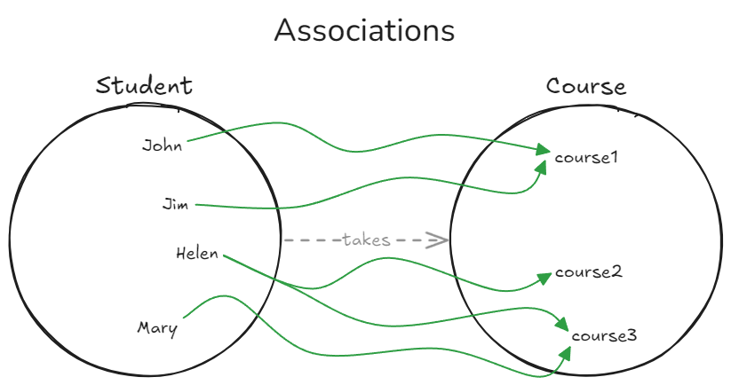

Pairs of objects are related in specific ways. We can represent a relationship by describing what course each student takes. Starting from the student and ending with the course. We specify the relationship this way because it is a student that takes a course; a course does not take a student.

Relations are asymmetric. The direction matters because the order of elements in the order pair matters.

The cartesian product will give us all possible ordered pairs (12 in this example). But there are only 5 relations. In real life, which students take which course could be all the possible pairs, but often it will be a subset of the cartesian product.

A binary relation is an ordered pair where two elements are brought together.

Binary Relation R from set A to set B, or over `A x B`. A set of ordered pairs `<a, b>`, `a ∈ A` and `b ∈ B`. An ordered pair `<a, b> ∈ R`. This means element a is related to element b through the relation R.

The relationship between R and A x B is as follows:

- A x B is the set of all ordered pairs (the cartesian product)
- R is a subset of `A x B`. So `R ⊆ A x B`. It is not a proper subset as R could be the cartesian product.

In the above diagram, Relation T (Takes):

- John Takes course1
    - `<John, course1> ∈ T`
- Jim Takes course1
    - `<Jim, course1> ∈ T`
- Helen Takes course2 and course3
    - `<Helen, course2> ∈ T`
    - `<Helen, course3> ∈ T`
- Mary Takes course3
    - `<Mary, course3> ∈ T`

Another example:

- `A = {0, 1, 2, 3}` and `B = {0, 1, 2, 3, 4}`
- List the ordered pairs in the relation R from A to B that satisfy `<a, b> ∈ R`, if `b - a = 1`.
- `b - a = 1` is equivilant to `b = a + 1`. So `<a, b> = <a, a + 1>`:
- So the relation R looks like: `R = {<0, 1>, <1, 2>, <2, 3>, <3, 4>}`

---

---

## Lecture 4 - Relations Part 2

### Operations on Relations

| Symbol  | Symbol name               | Meaning                                                                                          |
| ------- | ------------------------- | ------------------------------------------------------------------------------------------------ |
| R1 ∪ R2 | union of relations        | set of all ordered pairs `<a, b>` that are in R1, or R2, or both                                 |
| R1 ∩ R2 | intersection of relations | set of all ordered pairs `<a, b>` that are common to both R1 and R2                              |
| R1 - R2 | difference of relations   | set of all ordered pairs `<a, b>` that are in R1 but not in R2                                   |
| R1 ⊆ R2 | subrelation               | R1 is subrelation of R2 if every ordered tuple that is an element of R1 is also an element of R2 |

### Properties of Relations

### Properties of Relations

| Property      | Definition                                                                                                      | Explanation                                                                                                             | Example                                                                                                                                                         |
| ------------- | --------------------------------------------------------------------------------------------------------------- | ----------------------------------------------------------------------------------------------------------------------- | --------------------------------------------------------------------------------------------------------------------------------------------------------------- |
| Symmetry      | `R ⊆ A x A` is symmetric if for any `a` and `b` in `A`, if `<a, b> ∈ R` then `<b, a> ∈ R`.                      | There is symmetry if for any `<a, b>`, there is also a `<b, a>`. Otherwise, there is no symmetry.                       | "is a sibling of" is a symmetrical comparison, whereas "is a brother of" is not. `Jake is a sibling of Sophie` is symmetrical to `Sophie is a sibling of Jake`. |
| Transitivity  | `R ⊆ A x A` is transitive for any `a`, `b`, and `c` in `A`, if `<a, b> ∈ R` and `<b, c> ∈ R` then `<a, c> ∈ R`. | There is transitivity if, for any `<a, b>` and `<b, c>` in `R`, then `<a, c>` should also be in `R`.                    | The `=` relation is transitive. If `a = b` and `b = c`, then `a = c`.                                                                                           |
| Reflexivity   | `R ⊆ A x A` is reflexive if `<a, a> ∈ R` for every element `a` of `A`.                                          | There is reflexivity if, for any `a` in `A`, then `<a, a>` should be in `R`. Every element of `A` is related to itself. | Let `B = {5, 6, 7}`. For `R` to be reflexive it must contain `<5, 5>, <6, 6>, <7, 7>`.                                                                          |
| Irreflexivity | `R ⊆ A x A` is irreflexive if `<a, a> ∉ R` for every element `a` of `A`.                                        | No element of `A` is in relation to itself.                                                                             | "is the parent of" is an irreflexive relation. No one can be their own parent.                                                                                  |
| Equivalence   | `R ⊆ A x A` is an equivalence relation if `R` is reflexive, symmetric, and transitive.                          |                                                                                                                         |                                                                                                                                                                 |

---

---

## Lecture 5 - Functions

A function is a machine which given an input produce a unique output. Deterministic linkage ebtween two sets of values: inputs an outputs.

It is a special type of binary relation. It associates each element of a set with a unique element of anotehr set.

Abstract relation between sets. Each input value corresponds to a unique output value. Output vlaue depends in some way on the input value.

### Formal Defintiions of Fuinctions

Function from set A to B: for every `a ∈ A`, there is a unique `b ∈ B` such that `<a, b> ∈ f`. Notation: `f : A → B`.

A function from set A to set B is a relation from A to B that satisifes:

- for each element a in A, there is an element b in B such that `<a, b>` is in the relation, and that element is unique: if `<a, b>` and `<a, c>` are in the relation, then `b = c`.

### Domain, Codomain, & Range

Let the function f from A to B be: `f : A → B`.

- A is the **domain** of function f - all input elements
- B is the **codomain** of function f - all possible output elements

The **range** is the set of values that are produced by a function. Therefore the range is a subset of the codomain: `range ⊆ codomain`.

### Image & Preimage

---

---

## Lecture 6 - Functions Part 2

---

---

## Lecture 7 - Propositional Logic

Logic is the study of reasoning. It is a rational way of drawing conclusions.

A proposition is a claim about how things are. It can either be true OR false. Not both. For example:

True propositions:

- Grass is green
- Snow is white
- 2 + 2 = 4

False propositions:

- Grass is red
- Snow is pink
- 2 + 2 = 5

The following are examples of non-propositions

- Is the water warm?
- Go for it!
- Where are we?
- Put the phone down!
- Ouch!

An Atomic proposition is one that is true or false value does not depend on that of any other proposition.

A compound proposition is one which is constructed from atomic propositions by combining them with fundamental connectives.

### Truth Tables

These tabulate the value of a compound proposition for all possible values of its atomic propositions and their combination. For example, the truth table for 2 atomic propositions:

| P   | Q   | Compound  |
| --- | --- | --------- |
| F   | F   |           |
| F   | T   |           |
| T   | F   |           |
| T   | T   |           |

### Fundamental Connectives

| Operation      | Symbols  |
| -------------- | -------- |
| AND            | ⋀        |
| OR             | ⋁        |
| XOR            | ⊕, ⊻     |
| NOT            | ~, ¬     |
| Conditional    | →        |
| Biconditional  | ⇔        |

#### AND

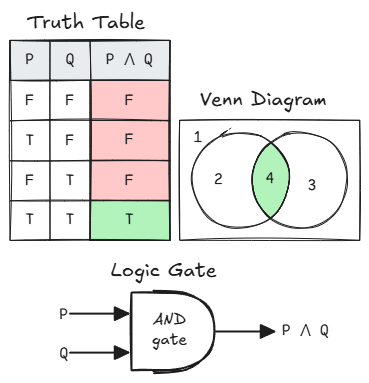

#### OR

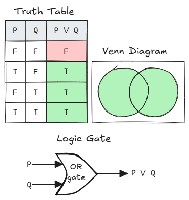

#### XOR

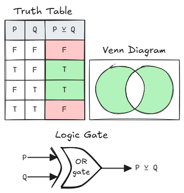

#### NOT

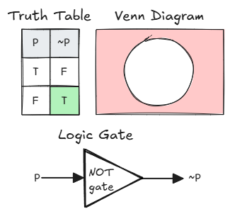

#### Conditional / Implication

IF antecedent THEN consequent. For example: IF the train is late, THEN we will miss our flight.

This combines two propositions into a third proposition called the conditional or implication. The conditional/implication is false when the antecedent is True and the consequent is False.

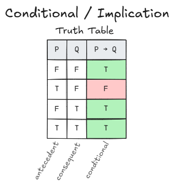

#### Biconditional

The biconditional is only True when both propositions have the same truth value.

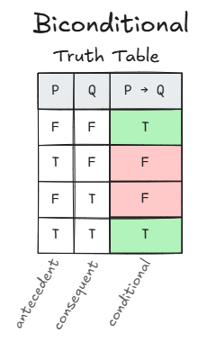

### Logical Properties

Tautologies are propositions which are always True, regardless of the truth values of their atomic propositions. For example, Q = "I passed the exam". ~Q = "I did not pass the exam!.

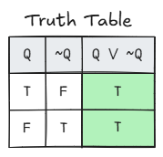

Contradictions are propositions which are always false, regardless of the truth values of their atomic propositions. For example, Q = "I passed the exam". ~Q = "I did not pass the exam!.

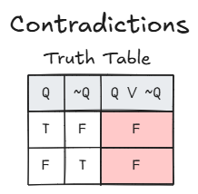

Contingencies are propositions that are neither tautologies nor contradictions. For example, P = "I passed the exam". ~P = "I did not pass the exam".

Contingencies have both True's and Falses in their truth tables.

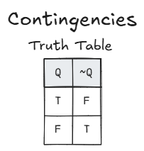

Equivalence is when two propositions are logically equivalent if they have the exact same truth value under all circumstances. Written `P ≡ Q`.

---

---

## Lecture 8 - Propositional Logic Part 2

### Logical Reasoning

- An Argument is a sequence of propositions that end with a conclusion.
    - The argument is VALID if, given that the premises are true, then the conclusion is true.
- A Premise is the basis on which we establish the conclusion.
- A Conclusion is a claim that we try to establish as true.

Written in the form:

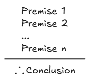

### Propositional Logic

Building blocks of propositional logic:

- Atomic & Compound Propositions
- Fundamental Connectives

A rule is a function that takes propositions as premises and returns others as conclusions.

- **Inference Rules**: templates for building valid arguments
- **Replacement Rules**: replaces parts of propositions with logically equivalent expressions

### Inference Rules

Inference rules give methods to evaluate the validity of arguments. They highlight logical reasoning behind a valid argument are justify stems from premises to conclusion. An alternative to this is truth tables, but these are inconvenient with more propositions and are less intuitive.

The rules:

| Rule                                      | Description                                                                                                                                                                                                         | Example Image                                                                                                                 |
| ----------------------------------------- | ------------------------------------------------------------------------------------------------------------------------------------------------------------------------------------------------------------------- | ----------------------------------------------------------------------------------------------------------------------------- |
| Modus Ponens                              | one premise is a conditional statement, the other premise affirms the antecedent and the conclusion affirms the consequent                                                                                          | 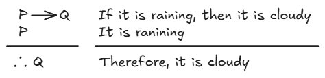                                |
| Modus Tollens                             | one premise is a conditional statement, the other premise denies the consequent, and the conclusion denies the antecedent                                                                                           | 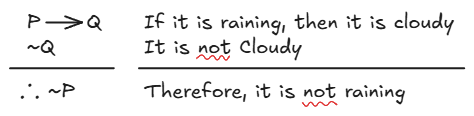                             |
| Addition (disjunction introduction)       | the premise is a proposition, and the conclusion is a disjunction formed by that proposition and any other proposition                                                                                              | 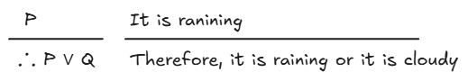                                           |
| Simplification (conjunction elimination)  | the premise is a conjunction, and the conclusion is either of the propositions forming the conjunction                                                                                                              | 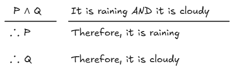                         |
| Hypothetical Syllogism                    | the premises are two conditionals such as P → Q and Q → R so that one’s antecedent matches the consequent of the other, and the conclusion is another conditional which results from the chain of reasoning: P → R  | 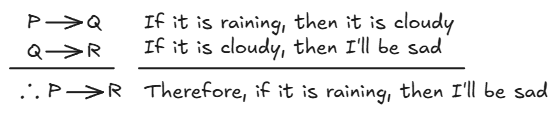  |
| Disjunctive Syllogism                     | one premise is a disjunction, the other premise denies one of the propositions in the disjunction, and the conclusion affirms the other proposition in the disjunction                                              | 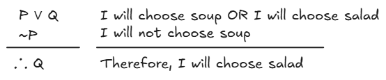     |
| Absorption                                | the premise is a conditional: P → Q, and the conclusion is also a conditional whose consequent is a conjunction of the consequent and antecedent: P → ( P ∧ Q )                                                     | 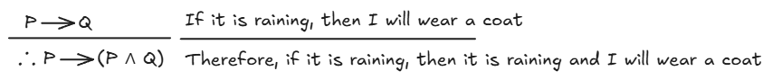                                     |

### Replacement Rules

| Rule/Law             | Description                                                                                                                                                                                                   | Example                                                                   |
| -------------------- | ------------------------------------------------------------------------------------------------------------------------------------------------------------------------------------------------------------- | ------------------------------------------------------------------------- |
| Commutative law      | The order of laws does not affect the result of the conjunction or disjunction                                                                                                                                | `P ∨ Q` = `Q ∨ P` / `P ∧ Q` = `Q ∧ P`                                     |
| Associative law      | The grouping of propositions does not affect the result of the conjunction or disjunction                                                                                                                     | `(P ∨ Q) ∨ R` = `P ∨ (Q ∨ R)` / `(P ∧ Q) ∧ R` = `P ∧ (Q ∧ R)`             |
| Distributive law     | 'Multiply' out the brackets                                                                                                                                                                                   | `P ∧ (Q ∨ R)` = `(P ∧ Q) ∨ (P ∧ R)` / `P ∨ (Q ∧ R)` = `(P ∨ Q) ∧ (P ∨ R)` |
| De Morgan’s laws     |                                                                                                                                                                                                               | `~P ∧ ~Q` = `~(P ∨ Q)` / `~P ∨ ~Q` = `~(P ∧ Q)`                           |
| Absorption law       | The disjunction of any proposition P with (P ∧ Q) has the same truth value as P                                                                                                                               | `P ∨ (P ∧ Q)` = `P` / `P ∧ (P ∨ Q)` = `P`                                 |
| Identity law         | The conjunction of any proposition P with an arbitrary tautology T has the same truth value as P. <br> The disjunction of any proposition P with an arbitrary contradiction F has the same truth value as P   | `P ∧ T` = `P` <br> `P ∨ F` = `P`                                          |
| Idempotence law      | The property of a conjunction or disjunction to be applied multiple times on a proposition without changing the proposition                                                                                   | `P ∧ P` = `P` / `P ∨ P` = `P`                                             |
| Negation law         | The disjunction of any proposition P and its negation is a tautology                                                                                                                                          | `P ∨ ~P` = `True` / `P ∧ ~P` = `False`                                    |
| Double negation law  |                                                                                                                                                                                                               | `~(~P)` = `P`                                                             |
| Implication law      | Implication can be expressed by disjunction and negation                                                                                                                                                      | `P → Q` = `~P ∨ Q`                                                        |
| Contraposition law   |                                                                                                                                                                                                               | `P → Q` = `~P → ~Q`                                                       |
| Equivalence law      | A biconditional is equivalent to the conjunction of two conditionals                                                                                                                                          | `P <--> Q` = `(P → Q) ∧ (Q → P)`                                          |

---

---

## Lecture 9 - Predicate Logic

here...

---

---

## Lecture 10 - Predicate Logic Part 2

here...

---

---

## Lecture 11 - Introduction to Data Types & Abstract Data Types

A structure being an Abstract Data Type (ADT) tells us what operations can be performed, but now how they will be implemented. This means the ADT does not specify how the data will be organisd in memory, or the algorithms used for implementing the operations.

It is abstract because it is an implementation independent view.

Abstraction is the process of provoding only the necessary information and hiding the internal details is known as abstraction.

### The Queue

A queue is an ordered collection of items which are added at the tail, and removed from the head. It is a First In First Out (FIFO) ordering property.

| Operations    | def                                                 | Parameters     | Returns                                |
| ------------- | --------------------------------------------------- | -------------- | -------------------------------------- |
| Queue()       | Creates new empty queue                             | None           | Empty queue                            |
| enqueue(item) | Adds new item to the tail of the queue              | An item to add | Nothing                                |
| dequeue()     | If not empty, removes item in the head of the queue | None           | Item removed from the queue            |
| isEmpty()     | Tests if the queue is emppty                        | None           | Boolean True if empty. False otherwise |
| size()        | Coutns number of items in the queue                 | None           | Number of items in the queue           |

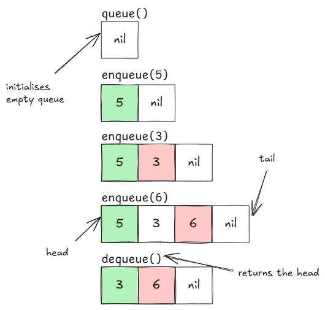

### Data Structures vs Abstract Data Types

A data structure is the physical representation of the structure of the datya being stored in memory.

An abstract data type is both the data structure and the procedures/functions which manipulate that data structure.

### Encapsulation

Encapsulation wraps attributes and methods in a class, hiding the details from the user.

The only way the user can interact with a variable of that ADT is through an interface (a set of procedures that operate on the data structure).

Encapsulation is strong if the details of how the data structure is actually stored can be completely hidden from the user. The user will have a conceptual (abstract) understanding of what the ADT does, but not how it does it.

C does not have encapsulation. So instead we have to declare a new data structure to model an ADT then provide it with procedures/functions that operate on the data structure.

### Arrays

```C
// Declaring an array in C
int counts[26] = {a, b, c, d, e, f, g, h, i, j, k, l, m, n, o, p, q, r, s, t, u, v, w, x, y, z};
```

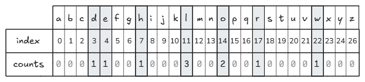

```C
// to increment the count for 'l' we can write
counts[11] = counts[11] + 1;

//print the value of the count for 'h'
printf("%d\n", counts[7]);
```

- upb (upper bound) stores the index of the last element.
- lwb (lower bound) stores the index of the first element. (always 0)

---

---

## Lecture 12 - Memory, Pointers, & Records

Computer memory is **byte addressable**. This means every byte of memory has 1 address. Thought of as an array. This can be thought of as an array where the address is the index of the array.

A **word**'s length can differ between machines. We'll assume a word is 32 bits (4 bytes) long. An integer is usually 1 word long.

**Variable**'s have 3 components:

- A symbolic **name**
- A **value** it contains
- An **address** where it is in memory

If a variable is on the left of the statement, it is assignment, on the right it is fetch.

### Pointers

C variables have local scope to the function they appear in. This makes it harder for multiple functions to work with - and acctually affect the value in a variable - the same variable. For example there may be a function to create a student record, and another that modifies that record. Functions pass variables by value which means that they copy the value into the function so that the actual value stored at the variables memory address is not affected.

Pointers fix this by allowing us to pass the memory address of a variavble to the function as well as the value.

```C

// define character variable, and pointer variable
char val;
char *addr;

// initialise by assigning values
val = 3;
addr = &val;
printf("val = %d, addr = %x\n", val, addr);

*addr = *addr + 2; // deference means go to address and fetch contents. so go to content stored at address and add 2
printf("val = %d, addr = %x\n", val, addr);

// Outputs:

// val = 3, addr = 4063e8
// val = 5 addr = 4063e8
```

### Levels of Indirection

```C
val = val + 2;

// fetch - get content from the location where RHS val resides
// evaluate - add 2 to it
// store - the value in the location where val resides
```

### Notation

```C
//indicate that a variable is a pointer with the * "type modifier"

int* x;
int * x;
int *x; // can be read as "x is a pointer to an int

// all above are equivalent
```

```C
// unary operator * is the dereference operator (indirection operator)

*ptr; // fetches the value stored at ptr
%val; // returns address of val
```

### Records

Records are compound and heterogeneous (multile data types in it). A records components are called fields and each field is identified with a name (rather than an index). It holds many properties of a single entity.

```C
// define record with MAXSIZE 20

typedef struct student { //typedef: type definition. // struct: a structure // student: name of the tstruct
  char name[MAXSIZE];
  int age;
  char gender;
  int entryYear;
  char subject[MAXSIZE];
  char maritalStatus;
} Student; // Student: name of the type
```

Function that creates space for a new Student record and returns a pointer to that space.

```C
Student* newStudent()
//allocates space for a new Student record
//returns pointer to allocated space
{
Student* pt = malloc(sizeof(Student));
return pt;
};
```

#### Arrow -> Operator

The following creates a new Student record and allocates values to the fields

```C
Student* stu = newStudent();
strcpy(stu->name, "James T. Kirk");
stu->age = 19; // stu -> age is the same as (*stu).age = 19
stu->gender = 'M';
stu->entryYear = 2252;
strcpy(stu->subject, "Space Command");
```

#### Dot . Operator

Dot is used to access the fields rather than the arrow to allocate values.

```C
Student stu2;
strcpy(stu2.name, "Nyota Uhura");
stu2.age = 18;
stu2.gender = 'F';
stu2.entryYear = 2257;
strcpy(stu2.subject, "Communications");
stu2.maritalStatus = 's';
```

#### Arrays of Records

Can have an array of students.

```C
Student* arrayOfStudents[2];
arrayOfStudents[0] = stu;
arrayOfStudents[1] = &stu2;
```

#### "set" Functions

Function to only allow certain values for martial status

```C
bool setMaritalStatus(Student* s, char x)
{
  bool ok = false;
  switch (x)
  {
    case 'm': case 'w':
    case 's': case 'd': ok = true; break;
  };
  if (ok) s->maritalStatus = x;
  return ok;
}
```

## Lecture 13 - Two Dimensional Arrays

Elements in a 2D array are accessed by two indexes - one for a row, the other for a column.

```C
rating[0][2] // [0] specifies the row - [2] specifies the column
```

Declaring in C:

```C
int arrayName[3][4]; // creates empty arraw with 3 rows and 4 columns.

// another example with char instead of integers

char characterArray[2][3] // empty array with 2 rows and 3 columns
// each element is type char
```

Generating each pair of inicies:

```
for (int row = 0; row < 2; row++) {
  for (int col = 0; col < 3; col++) {
    print row, col;
  }
}
```

Initialising the 2D array:

```C
void initCounts() {
  for (int r = 0; r < NUMBER_OF_LANGS; r++) {
    for (int c = 0; c < NUMBER_OF_LANGS; c++) {
    counts[r][c] = 0;
    }
  }
  counts[18][18] = 569;
  counts[18][22] = 32;
  counts[22][18] = 24;
  counts[22][22] = 743;
}
```

Examining elements of 2D array:

```C
void printCounts() {
  for (int r = 0; r < NUMBER_OF_LANGS; r++) {
  for (int c = 0; c < NUMBER_OF_LANGS; c++) {
    if (counts[r][c] != 0) {
      printf("%d, %d = %d\n", r, c, counts[r][c]);
      }
    }
  }
}
```

Summing the total number of samples in our 2D array:

```C
int getTotal() {
  int total = 0;
  for (int r = 0; r < NUMBER_OF_LANGS; r++) {
    for (int c = 0; c < NUMBER_OF_LANGS; c++) {
      total = total + counts[r][c];
    }
  }
  return total;
}
```

Summing the correct values:

```C
int getTotalCorrect() {
  int correct = 0;
  for (int l = 0; l < NUMBER_OF_LANGS; l++) {
    correct = correct + counts[l][l];
  }
  return correct;
}
```

Finding the accuracy of the classifier:

```C
void printAccuracy() {
  int total = getTotal();
  int totalCorrect = getTotalCorrect();
  printf("\nAccuracy: %d/%d: %.2f%%\n", totalCorrect, total, ((double)totalCorrect / (double) total) * 100.0);
}
```

| Pros                                                          | Cons                              |
| :------------------------------------------------------------ | :-------------------------------- |
| Use single name to represent many data items of the same type | Fixed size                        |
| Random access so very fast                                    | Insertion and deletion are costly |

---

---

## Lecture 14 - The Kitchen Sink

---

---

## Lecture 15 - The Stack

A stack is an Abstract Data Type (ADT) where the collection of items is ordered by when they were added. It follows the Last In First Out (LIFO) principle.

It has functions `push` and `pop`. `Push` places an item on the top of the stack. `Pop` removes the item on the top of the stack and returns it.

### What Can Go Wrong?

- Trying to pop an empty stack causes an underflow error. The `pop` method needs to check if the stack is empty before trying to pop.
- In bounded stacks, trying to push an item onto a full stack causes an overflow error. The `push` method needs to check if the stack is full before trying to push.

Each element has a value and a pointer to the previous element.

### Unbounded Stack

Initialize empty stack:

```
Stack() {
  top = nil;
}
```

An element:

```
Element {
  int data;
  Element prev;
}
```

Check if the stack is empty:

```
bool Empty(S) {
  if (S.top == nil) {
    return true;
  }
  return false;
}
```

Push element to an unbounded stack:

```
Push(S, x) {
  el = new Element;
  el.data = x;
  el.prev = nil;
  if (Empty(S)) {
    S.top = el;
  } else {
    el.prev = S.top;
    S.top = el;
  }
}
```

Pop element from an unbounded stack:

```
int Pop(S) {
  if (Empty(S)) {
    "Underflow";
  } else {
    tmp = S.top;
    S.top = S.top.prev;
    return tmp.data;
  }
}
```

### Bounded Stack

Initialize empty stack:

```
Stack() {
  top = -1;
}
```

Check if stack is empty:

```
bool Empty(S) {
  if (S.top == -1) {
    return true;
  }
  return false;
}
```

Check if stack is full:

```
bool Full(S) {
  if (S.top == MAX_SIZE - 1) {
    return true;
  }
  return false;
}
```

Push element to a bounded stack:

```
Push(S, x) {
  if (Full(S)) {
    "Overflow";
  } else {
    S.top++;
    S.A[S.top] = x;
  }
}
```

Pop element from a bounded stack:

```
int Pop(S) {
  if (Empty(S)) {
    "Underflow";
  } else {
    data = S.A[S.top];
    S.top--;
    return data;
  }
}
```
