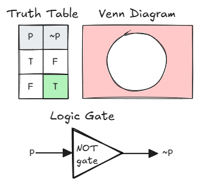
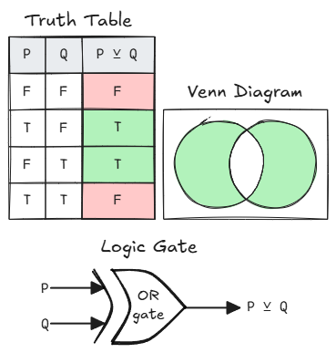
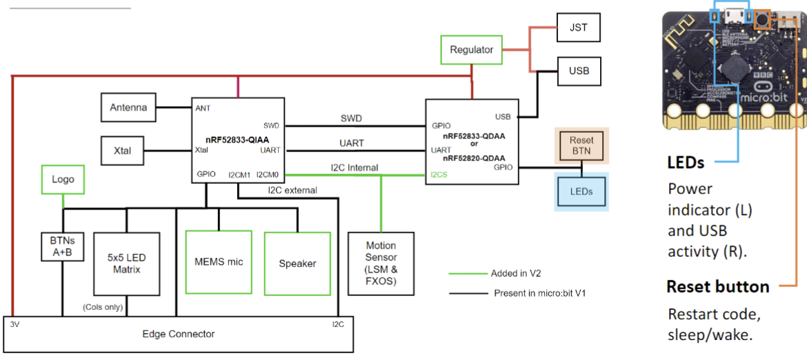
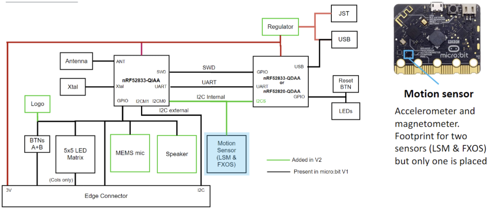

began: 8th October 2024

# SCC.131 Digital Systems

The module aims to help me understand digital systems. This includes fundamental concepts of hardware & Entire Computer Systems, how hardware and software interact, and how to program and debug software at low levels.

| Task                       | Week               | Worth         |
| -------------------------- | ------------------ | ------------- |
| "Coursework" (In-lab quiz) | Week 5, 10, 15, 20 | 20% (5% each) |
| Programming Project        | Week 23            | 10%           |
| Exam                       | Summer Term        | 70%           |

---

### Table of Contents

| Week | My Notes                                                                                              | Lecture Slides                                                                                  | Noted |
| :--: | ----------------------------------------------------------------------------------------------------- | ----------------------------------------------------------------------------------------------- | :---: |
|  1   | [Lecture 1 - Module Introduction](#lecture-1---module-introduction)                                   | [Module Introduction](/SCC.131.slides/a.introSlides.pdf)                                        |  ✅   |
|  1   | [Lecture 2 - Architecture & Speed](#lecture-2---architecture--speed)                                  | [Comp Architecture](/SCC.131.slides/b.compArchitectureIntro.pdf)                                |  ✅   |
|  2   | [Lecture 3 - Information Coding](#lecture-3---information-coding)                                     | [Information Coding](/SCC.131.slides/c.infoCodingPartOne.pdf)                                   |  ✅   |
|  2   | [Lecture 4 - Information Coding Part 2](#lecture-4---information-coding-part-2)                       | [Information Coding Contd](/SCC.131.slides/d.infoCodingPartTwo.pdf)                             |  ❌   |
|  3   | [Lecture 5 & 6 - Boolean Logic](#lecture-5--6---boolean-logic)                                        | [Boolean Logic](/SCC.131.slides/e.booleanLogic.pdf)                                             |  ❌   |
|  4   | [Lecture 7 - Instruction Set Architecture](#lecture-7---instruction-set-architecture)                 | [Instruction Set Architecture](/SCC.131.slides/f.instructionSetArchitecture.pdf)                |  ❌   |
|  4   | [Lecture 8 - Building the ALU](#lecture-8---building-the-alu)                                         | [Building The ALU](/SCC.131.slides/g.buildingTheALU.pdf)                                        |  ❌   |
|  5   | [Lecture 9 - Building Memory](#lecture-9---building-memory)                                           | [Building Memory](/SCC.131.slides/h.buildingMemory.pdf)                                         |  🟧   |
|  5   | [Lecture 10 - Building The Control Unit](#lecture-10---building-the-control-unit)                     | [Building The Control Unit](/SCC.131.slides/i.buildingCU.pdf)                                   |  ❌   |
|  6   | [Lecture 11 - Building the Input/Output System](#lecture-11---building-the-inputoutput-system)        | [Building The IO](/SCC.131.slides/j.buildingIO.pdf)                                             |  ✅   |
|  6   | [Lectute 12 - Weeks 1-6 Recap](#lecture-12---weeks-1-6-recap)                                         | [Weeks 1-6 Recap](/SCC.131.slides/j.recapUpToWeek6.pdf)                                         |  ✅   |
|  7   | [Lecture 13 - The Micro:Bit](#lecture-13---the-microbit)                                              | [Architecturing The Micro:Bit](/SCC.131.slides/k.microbit.pdf)                                  |  ✅   |
|  7   | [Lecture 14 - The Micro:Bit Part 2](#lecture-14---the-microbit-part-2)                                | [Micro:bit Part 2](/SCC.131.slides/l.microbitPartTwo.pdf)                                       |  ✅   |
|  8   | [Lecture 15 - C/C++ & CODAL](#lecture-15---cc-codal)                                                  | [C/C++ & CODAL](/SCC.131.slides/m.introCODAL.pdf)                                               |  ✅   |
|  8   | [Lecture 16 - CODAL Part 2](#lecture-16---codal-part-2)                                               | [CODAL Part 2](/SCC.131.slides/n.CODALpartTwo.pdf)                                              |  ✅   |
|  9   | [Lecture 17 - Compiler, Assembler, Linker, & Loader](#lecture-17---compiler-assembler-linker--loader) | [Compiler, Assembler, Linker, & Loader](/SCC.131.slides/o.compilerAssemblerLinkerAndLoader.pdf) |  ✅   |
|  9   | [Lecture 18 - The C Proprocessor](#lecture-18---the-c-preprocessor)                                   | [The C Preprocessor](/SCC.131.slides/p.theCproprocessor.pdf)                                    |  ✅   |
|  10  | [Lecture 19 - Debugging](#lecture-19---debugging)                                                     | [Debugging](/SCC.131.slides/r.debugging.pdf)                                                    |  ✅   |
|  10  | [Lecture 20 - Revision and Discussion of Lab Tasks](#lecture-20---revision--discussion-of-lab-tasks)  | [Revision & Discussion of Lab Tasks](/SCC.131.slides/s.labTasksReview.pdf)                      |  ✅   |
|  11  | [Lecture 21 - The Micro:bit Radio Module](#lecture-21---the-microbit-radio-module)                    | [The Micro:bit Radio Module](/SCC.131.slides/t.microbitRadioModule.pdf)                         |  ✅   |
|  11  | [Lecture 22 - Memory Layout Part 1](#lecture-22---memory-layout-part-1)                               | [Memory Layout Part 1](/SCC.131.slides/u.memoryLayoutPrt1.pdf)                                  |  ❌   |
|  12  | [Lecture 23 - Memory Layout Part 2](#lecture-23---memory-layout-part-2)                               | [Memory Layout Part 2](/SCC.131.slides/v.memoryLayoutPrt2.pdf)                                  |  ❌   |
|  12  | [Lecture 24 - Build Automation](#lecture-24---build-automation)                                       | [Build Automation](/SCC.131.slides/w.buildAutomation.pdf)                                       |  ❌   |
|  13  | [Lecture 25 - Introduction To ARM Assembly](#lecture-25---intro-to-arm-assembly)                      | [Intro To ARM Assembly](/SCC.131.slides/x.ARMassemblyIntro.pdf)                                 |       |
|  13  | [Lecture 26 - Arithmetic Operators](#lecture-26---arithmetic-operations)                              | [Arithmetic Operators](/SCC.131.slides/y.arithmeticAndLogicalOperators.pdf)                     |       |

## Lecture 1 - Module Introduction & Computer Architecture

Architecture is the science of putting together building materials to produce buildings.

Computer Architecture is the science of putting together hardware to produce computers.

## Lecture 2 - Architecture & Speed

A computer is an electronic device for storing and processing data, in binary form, according to instructions given to it in a variable program.

### Computer History

- Analytical Engine
  - First computer
  - Partly built by Englishman Charles Babbage in the 19th century
  - A fully program-controlled mechanical computer
  - Consisted of the mill (calculating unit), the store, the reader, and the printer
  - Data was entered onto physical punched cards
  - Ada Lovelace wrote the first algorithm for a computer based on this machine.
- ENIAC
  - Electronic Numerical Integrator And Computer was the first programmable, electronic, general-purpose digital computer
  - Built during WW2 in the USA
  - Programmed via switches and cables
- Manchester SSEM
  - Small-Scale Experimental Machine was the first electronic stored-program computer
  - Built-in the Uni of Manchester
- Cambridge EDSAC
  - Electronic Delay Storage Automatic Calculator
  - Built at Cambridge Uni
  - First practical stored-program computer in regular use
  - Used punched cards to load programs
- IBM Personal Computer
  - Released 1981
  - Led to the era of cheap commodity-based computation

Computer Architecture is rules and methods that describe the functionality, organisation, and implementation of computer systems which can be applied at many levels such as processor, memory, and instruction sets.

### Von Neumman

- Memory that stores, data & instructions together
- A Control Unit (CU) that contains an instruction register and Program Counter (PC)
- Processing unit that contains Arithmetic Logic Unit (ALU) and processor Registers
- Input & Output mechanisms


CPU contains

- ALU + CU and Cache Memory
- Logically the same as the above diagram


### Harvard

Instructions and data are stored in separate memories to overcome the bottleneck of Von Neumman. This allows parallel access to data and instruction so this can be faster.


Modified Harvard:

- Separates instructions and data caches internally but a single main memory is visible to programs.


### Modern Architecture


### Speed Factors & Limitations

Computer speed metrics:

- Clock Rate
  - 3GHz processor makes 3 billion ticks per second
  - instructions take different numbers of ticks so bad
- Millions of Instructions Per Second (MIPS)
  - Better than previous but depends on which instructions are counted (number of instructions)
  - Different Results for programs
- Floating Point Operations Per Second (FLOPS)
  - Better indication of speed where it counts

Density Limitations

- number of transistors per square inch
- Moore's Law

## Lecture 3 - Information Coding

Computer hardware should be as simple as possible due to cost, performance, and scalability factors. Because of this, we focus on handling small, positive integers. Any other data type is a code/representation that maps to positive integers.

### ASCII

The American Standard Code for Information Interchange is a 7-bit binary (2<sup>7</sup>) code for characters.


In practice, we use numbers such as negatives, fractions, floating-points, etc. But all of these map to small, positive whole numbers held in memory.

### Decimal in Base-10

Representing 1984:

| Thousands (10<sup>3</sup>) | Hundreds ((10<sup>2</sup>)) | Tens ((10<sup>1</sup>)) | Units/Ones (10<sup>0</sup>) |
| :------------------------: | :-------------------------: | :---------------------: | :-------------------------: |
|    1 \* 10<sup>3</sup>     |     9 \* 10<sup>2</sup>     |   8 \* 10<sup>1</sup>   |     4 \* 10<sup>0</sup>     |
|         1 \* 1000          |          9 \* 100           |         8 \* 10         |           4 \* 1            |
|            1000            |             900             |           80            |              4              |

1000 + 900 + 80 + 4 = 1984.

### Multiplication and Division

1984 \* 10 = 19840

Multiplying a number by 10<sup>n</sup> shifts the number left by n decimal places, feeding in 0's on the right.

Dividing a number by 10<sup>n</sup> shifts the number right by n decimal places.

### Negative Numbers

There are 3 coding approaches for negative numbers:

- Sign and Magnitude
- Excess N
- Twos Complement

#### Sign and Magnitude

Binary number split into a sign-bit and the magnitude. The sign-bit indicates whether the value is positive or negative. For example. The following decomal numbers are represented in 8bit-binary using Sign and Magnitude:

- +6 = 00000110
- -6 = 10000110

#### Excess N

MSB used to represent an excess. Example:

1. Code the decimal 20 using excess 127:

   - Take the value 20 and add 127 to it: `20 + 127 = 147`.
   - Encode 147 into binary: `147` in binary is `10010011`.
   - This is the excess 127 representation of 20.

2. To convert back:

   - Take the excess 127 binary representation `10010011` and convert it back to decimal: `10010011` in decimal is `147`.
   - Subtract the excess 127: `147 - 127 = 20`.

Another Example:

3. Code the decimal -20 using excess 127:

   - Take the value -20 and add 127 to it: `-20 + 127 = 107`.
   - Encode 107 into binary: `107` in binary is `01101011`.
   - This is the excess 127 representation of -20.

4. To convert back:
   - Take the excess 127 binary representation `01101011` and convert it back to decimal: `01101011` in decimal is `107`.
   - Subtract the excess 127: `107 - 127 = -20`.

To determine excess N value, we use half of the maximum possible value as a buffer. For example, if the max value is 100, the excess is 50; if it's 10,000, the excess is 5,000. This "half-rule" provides a safe margin without setting limits too close to the maximum.

Rule in action: If given the decimal 2,976, the max number is 10,000. 10,000/2 = 5,000. So could expect to encode in Excess 5000.

## Lecture 4 - Information Coding Part 2

## Lecture 5 & 6 - Boolean Logic

## Lecture 7 - Instruction Set Architecture

## Lecture 8 - Building The ALU

## Lecture 9 - Building Memory

Memory stores bits. Volatile memory is a type of memory that maintains its data only while there is power. There are 2 types of Volatile Memory:

- Dynamic Memory
  - Used for Main Memory
  - Slower, Cheaper
- Static Memory
  - Used for Registers & Cache
  - Faster, more expensive


Memory is made of locations, each of which holds one unit of data. Each location has an address.


### Address Decoding

An address decoder maps from a linear address to a specific memory location in a specific memory chip.


### Byte Ordering in Multi-Byte words

Different machine architectures may organise multi-byte words differently in memory. There are 2 ways:

- Big-endian
  - Within a multi-byte word, the location with the lowest memory address holds the **most**-significant-byte
- Little-endian
  - Within a multi-byte word, the location with the lowest memory address holds the **least**-significant-byte

### Static Memory

Stored bits are organised into multi-bit storage slots called registers. Networks of logic components are used to build storage for individual data bits.

### Combinatorial Logic

- Combinatorial Logic: Output is a function of its input.
- Sequential Logic: Output is a function of its input AND its current outputs.
  - So the output is fed into the inputs. Feedback loop.

### Sequential Logic & S-R Flip-Flop

The S-R Flip-Flop 'remembers' which of the 2 possible stats it is in.

- Q<sub>0</sub> represents the current state
- Q represents the next state.
  - Q depends on the inputs S & R.


EXPLAIN IT HERE

Has several limitations:

- It's got distinct SET and RESET inputs
  - It's better to have one single input that 'sets' the state if 1, and 'resets' the state if 0
- There is no way of telling the flip-flop when it should store input data
  - It's better to have a 'latch' signal for this to work in a practical system with a control unit

## Lecture 10 - Building The Control Unit

## Lecture 11 - Building the Input/Output System

The Input/Output system enables I/O devices to connect to the processor.

Input Devices:

- keyboard
- mouse
- trackpad
- camera
- other sensor

Output devices:

- Monitor
- Printer
- Speakers
- Actuators

Input AND Output devices:

- Network Interfaces - ethernet, wifi, bluetooth
- disks
- audio cards
- MIDI devices

I/O Challenges:

1. The Speed-Gap
   - I/O devices are mechanical so run massively slower compared to the CPU
2. The Device Diversity
   - Diversity of data-access modes
     - read-only, or write-only, or read-and-write
     - Access by the induvidual byte or by the block/by the stream
     - Access randomly (like a disk) or sequentially (like a tape)
   - Device-specific Operations
     - change for resolution, set the time, focus
   - I/O protocol
     - potential data transfer errors
     - synchronous or asynchronous

Device drivers are software plug-ins inside the operating system. They abstract over device diveristy by grouping sets of similar types of device. E.G. many inputs can be made to look like a mouse to software. E.G. all hard disks are basically the same.

Functions of drivers:

- Registering a device with the OS and initialising it
- Initiating data transfers to or from a device
- Monitoring status events from a device
- Managing device/system shutdown

### Two-fold Classification of device Types

Classification of Device Types:

1. Character Devices
   - Send and recieve one byte at a time
   - E.G. A keyboard
2. Block Devices
   - Send and reviece a multi-byte block at a time
   - E.G. A hard disk

Classification of Processor Support for I/O:

1. Isolated I/O
   - Processor porivdes dedicated physical pins for the connection of I/O devices...
   - ...and dedicated instructions for doing I/O operations.
   - It is suited to simple devices
   - Having only a fixed set of special I/O instructions does not help with device diversity
2. Memory-mapped I/O
   - Devices sit within processors linear memory address space
   - Simple, flexible programming model
   - However, it addes complexity to devices

## Lecture 12 - Weeks 1-6 Recap

### Architecture

Von Neumann:


Harvard:


- Instructions & data memories are separate
- So can access instructions & data simultaneously
- So probably faster
- So more expensive

### Information Coding

Every data type is a code like ASCII.

Number representations:

- Binary
- Decimal
- Octal
- Hex

Negative number representations

- Excess n
- Sign & Magnitude

Adding & Subtracting numbers:

- 2's complement

Floating Points:

- Range & accuracy
- converting decimal/hex to binary/decimal/hex

#### IEEE 754

LOOK HOW TO DO THIS

### Boolean Logic

For any pair of binary digits (bits) A and B:






INSERT building AND/OR/NOT from NAND/NOR

#### Boolean Algebra

| Law                 | AND form                | OR form                   |
| ------------------- | ----------------------- | ------------------------- |
| Identity 1          | A = A′′                 | A = A′′                   |
| Identity 2          | 1A = A                  | 0 + A = A                 |
| Null                | 0A = 0                  | 1 + A = 1                 |
| Idempotence         | AA = A                  | A + A = A                 |
| Complementarity     | AA′ = 0                 | A + A′ = 1                |
| Commutativity       | AB = BA                 | A + B = B + A             |
| Associativity       | (AB)C = A(BC)           | (A + B) + C = A + (B + C) |
| Distributivity      | A + BC = (A + B)(A + C) | A(B + C) = AB + AC        |
| Absorption          | A(A + B) = A            | A + AB = A                |
| **de Morgan’s law** | (AB)′ = A′ + B′         | (A + B)′ = A′B′           |

Karnaugh Maps

### Fetch Decode Execute Cycle

All the CPU does is repeate the process of fetching the next instruction, decoding it, and executing it.

### Registers

A register is a holding place for data being worked on in the CPU. They are much faster than main memory.

There are general prupose and special registers. Registers used by arithmetic & logic instructions are general purpose.

Special:

- PC (program counter)
- SP (stack pointer)

### ALU

- half adders and full adders work.
- ripple-carry - carry select adders
- the status and the overflow flag
- bit shifting left and right

### Memory

- Dynamic vs Static Memory
- Memory Address Decoding
- Combinatorial vs Sequential Logic
- SR Flip Flip

### The Control Unit

A 'little program' that endlessly executes the FDE cycle.

### Pipelining

Improves performance by exploiting inherent parallelism inside the control unit to speed up the FDE Cycle.


## Lecture 13 - The Micro:Bit

### Requirements

Micro:bit has 3 core goals:

- Be simple and easy to use
- Be the mosteffective tool for teaching digital skills and creativity
- Inspire a diverse range of students

These goals are turned into requirements:

- Easy for students
- Easy for teachers
- No installation, setup, or internet
- Appeal to a range of ages
- Support a range of languages
- Leverage system developed by different companies
- Resource constrained
- Millions of devices, tens of millions of users

### Demo

Website to build micro:bit programs looks like scratch (click-and-drag block programming). Behind the scenes this is turned into JavaScript/Python. Can change the language so you can write, instead of dragging blocks, in your preffered language.

The microbit compiples all the blocks of code in the website interface into one program.

Program is saved to the micro:bit. Needs power source but the program is stored in non-volatile memory.

### Architecture

A micro:bit contains:

- 25 LED matrix screen
- Light sensor
- User definable buttons
- Touch sensetive logo
- Privacy indicator
- 17 digital I/Os
- 3 analog inputs
- 3 PWM outputs
- 3 touch sensetive pins
- I2C, SPI, UART
- 64MHz ARM Cortex M4
- 128kB RAM, 512kB FLASH
- USB storage/programming/debug
- Microphone
- Magnetic Speaker
- 3 axis magnetmeter
- 3 axis accelerometer
- Temperature sensor
- Bluetooth / 2.4GHz radio

Each hardware component is supportedby a corresponding C/C++ software component.

## Lecture 14 - The Micro:Bit Part 2

**Runtime code**/**software**: A software platform that provides an environment for executing user code. An asbstraction layer that developers can use to write software.

**Microcontroller**: A processor, for somplicity, or a microcontroller unit (MCU). A compact integrated circuit equipped with oneor more central pocessing units and memory.

**Embedded System**: An electronic product that comprises a microcontroller or multiple microcontrollers executing software instructions stored on a memory module to perform an essential function.

### BBC micro:bit

The Micro:Bit was built on The BBC's legacy with the BBC Micro for computing in education in 1981-1984.

It is an open0source embedded system based on ARM microcontrollers. V1 was accounced in 2015, V2 in 2020.

| factor          | V1                                                                                   | V1                                            |
| --------------- | ------------------------------------------------------------------------------------ | --------------------------------------------- |
| Target/APP. MCU | 16MHz 32-bit ARM Cortex-M0                                                           | 64MHZ 32-bit ARM Cortex-M4                    |
| Flash Memory    | 256 KB                                                                               | 512KB                                         |
| Static RAM      | 16 KB                                                                                | 128 KB                                        |
| Interface MCU   | 48MHz ARM Cortext-M0+                                                                | 64 MHz ARM cortex-M4f                         |
| Extras          | 3-axis accelerometer and magnetometer (compass), and temperator sensor. Light sensor | V1 + microphone, Speaker, Touch sensor button |

### The Hardware








### Firmware (DAPLink)

DAPLink is an open-source interface firmware that createst a connection between the PC and SWD. The Micro:bit presents itself as a USB disk and drag-and-drop programming is enabled without installing drivers.

Interface Mode: The hex file dropped into the USB disk is written into the target MCU flash.

Bootloader Mode: The hex file is dropped onto the USB disk is written into the interface MCU flash and updates the version of DAPLink.

### Software


nRF5 Software Dev Kit is a rich dev environment for nRF51/nRF52 series MCUs (Nordic). Provides hardware abstraction and includes drivers, libraries, examples of peripherals and radio controls.


COmponent Oriendted Device Abstraction Layer is the micro:bit runtime software written in C/C++. It abstracs hardware components as software components represented by C++ classes. Offers eventing subsystem for mapping asynchronous events to event handlers.


Interpreted Languages: User code and interpreter are copied into the target MCU. This allows users to program the micro:bit live over USB.

Compiled Languages: User code is compiled to ARM assembly.

Editors: high-level programming using blocks.

## Lecture 15 - C/C++ CODAL

### The Microbit Class

The Microbit Class consists of variables and methods that operate as drivers to control commonly used features of the micro:bit.

MicroBit uBit;

- uBit.i2c
- uBit.sotrage
- uBit.serial
- uBit.messageBus
- uBit.buttonA
- uBit.buttonB
- uBit.buttonAB
- uBit.display
- uBit.accelerometer
- uBit.compass
- uBit.thermometer
- uBit.io
- uBit.radio

```C
#include "MicroBit.h" // Include library that contains key functions for micro:bit

Microbit uBit; // Declare uBit as a 'variable' of type MicroBit (creates object uBit which is an instance of class MicroBit)

int main() {
  uBit.init(); // initialise uBit
  while (1) {
    uBit.display.scroll("Hello World!") // output
  }
}
```

### The MicroBitDisplay class

### The MicroBitImage Class

```C
MicroBitImage smiley("0,255,0,255,0\n 0,255,0,255,0\n 0,0,0,0,0\n 255,0,0,0,255\n
0,255,255,255,0\n");

uBit.display.print(smiley)
```

The `MicroBitImage` class represents a bitmap picture. The string constructor takes the form of a series of CSVs. Each value is the brightness of a pixel value in the range 0-255, starting at the top left and working right.

```C
//Create a 3x3 picture of a cross

MicroBitImage cross("0,1,0\n1,0,1\n0,1,0\n");

// Create blank 4x4 image
MicroBitImage myImage(4, 4);

// Paste content of cross onto myImage at pixel (1, 1)
myImage.paste(cross, 1, 1);

// Set brightness of pixel (2, 2) to 0
myImage.setPixelValue(2, 2, 0);

//Print myImage
uBit.display.print(myImage);
```

Storing and printing read-only images:

```C
const uint8_t smiley[] = {0,1,0,1,0,0,1,0,1,0,0,0,0,0,0,1,0,0,0,1,0,1,1,1,0};

MicroBitImage myImage(5, 5, smiley);

uBit.display.print(myImage);
```

Example:

```C
const uint8_t hearts[] = {0,1,0,1,0,0,0,0,0,0,1,1,1,1,1,0,1,0,1,0,1,1,1,1,1,0,1,1,1,0,0,1,1,1,0,0,0,1,0,0,0,0,1,0,0,0,0,0,0,0};
MicroBitImage twoHearts(10,5,hearts);
MicroBitImage bigHeart(5,5);
MicroBitImage smallHeart(5,5);
bigHeart.paste(twoHearts,0,0);
smallHeart.paste(twoHearts,-5,0);
while(1) {
  uBit.display.print(bigHeart);
  uBit.sleep(100); // time in ms
  uBit.display.print(smallHeart);
  uBit.sleep(100); // time in ms
}
```

```C

#include "MicroBit.h"
MicroBit uBit;
int main() {
   MicroBitImage largeHeart("0,1,0,1,0\n \
                             1,1,1,1,1\n \
                             1,1,1,1,1\n \
                             0,1,1,1,0\n \
                             0,0,1,0,0\n");
   MicroBitImage smallHeart("0,0,0,0,0\n \
                             0,1,0,1,0\n \
                             0,1,1,1,0\n \
                             0,0,1,0,0\n \
                             0,0,0,0,0\n");
    uBit.init();
    uBit.display.setDisplayMode(DISPLAY_MODE_BLACK_AND_WHITE);
    while (1) {
      uBit.display.print(largeHeart); // a large heart
      uBit.sleep(500);
      uBit.display.print(smallHeart); // a small heart
      uBit.sleep(500);
    }
}
```

## Lecture 16 - CODAL Part 2

The Micro:Bit has 2 buttons, A and B. They are expostede on the Micro@Bit object as ubit.buttonA and ubit.buttonB. Also uBit.buttonAB when pressed at the same time. isPressed() returns 1 if the corresponding button is pressed.

Syncrhonous button detection:

```Cpp
while(1) {
  if (uBit.buttonA.isPressed())
    uBit.display.print("A")
  if (uBit.buttonB.isPressed())
    uBit.display.print("B")
  if (ubit.buttonAB.isPressed()) {
    uBit.display.print("C")
    uBit.sleep(100)
  }
}
```

We want to determine when something has happened as well as if it has happened. Components have been designed to raise events when they sense a change. For example the MicroBitAccelerometer class and MicrBitButton class.

The aim of MicroBitMessageBus class is to listen to events and deliver MicroBitEvents to our program as the occur. When an event of interest is detected, the MicroBitMessageBus class calls a function linked to that event, known as an event handler.

```Cpp
ubit.messageBus.listen(//ID of component we lsiten to, //Event of interest, // Event handler to be called if raised
)

//E.G.

uBit.messageBus.listen(MICROBIT_ID_BUTTON_A, MICROBIT_BUTTON_EVT_DOWN, onButtonA)
```

The MicroBitThermometer class provides access to the surface temperature of the application MCU, rather than the ambient temperature.

```Cpp
readTemp = uBit.thermometer.getTemperature(); //uncalibrated reading

//the temp is 20c
uBit.thermometer.setCalibration(readTemp-20);
readTemp = uBit.thermometer.getTemperature(); // Calibrate Reading
```

The MicroBitLog class enables us to store data in a table-like foramat containing rows of readings or other types of data.

```Cpp
beginRow() //to open file and create a new row
logData("x", y) // x is label of col, y is the data
endRow() // to complete logging and close the file.

//E.G.
uBit.log.beingRow();
uBit.log.logData("temperature", uBit.thermometer.getTemperature());
uBit.log.endRow();
```

It is often good practice to add a timestamp to our data as we could use it to plot.

```cpp
uBit.log.setTimeStamp(TimeStapFormat::Seconds)

uBit.log.setVisibility(true);

// can keep logging until...
uBit.log.isFull() //returns 0

ubit.log.clear()
```

## Lecture 17 - Compiler, Assembler, Linker, & Loader

1. Preprocessor
   - Macros, `#include directives`, `#xxx statement`'s.
   - Outputs 'pure' C code.
2. Compiler
   - Converts C into Assembly code
   - Not machine code, still human readable
   - Dependent on machine architecture.
3. Assembler
   - Creates machine code stored in an object file
4. Linker
   -Combines several object files together


### Object Files

Has main formats:

- ELF: Executable and Linking Format (Linux)
- COFF: Common Object-File Format (Windows)
- Mach-O: Mac OS X (Mach Kernel)

Object File components:

- Machine Code of Program (the 'text' section)
- Data (global const)(the 'data' secetion)
- Required space for uninitialised data ('bss' for block starting symbol)
- Symbol Tables (location of functions)
- Relocation Information (what to modify when linking)


### Symbol Table & Relcation Information

When a program consists of several parts:

- myProg.c calls a function that is described in myLib.c
- myProg.o needs to jump to code my myLib.o

In myProg.o, the actual address of jump can not be decided

1. put a placeholder until the address is known
2. remeber address is not resolved
3. this should be resolved when building the executable file

1 and 2 are achieved with a symbol table in myLib.c and relocation information in myProg.o

3 is thet job of the linker.

### Linker

Linking object files and libraries is carried out by the linker. On Linux, this is done by the program `1d`. This is a compelx program. `gcc -o` is used to call `1d` internally, takinging care of the correct parameters and complexity.

Linking Multiple Files Together:

- Object files will include references to eachother's code and/or data.
- The linker uses the relocation records to fill in all addresses.
- The linker combines information from the symbol tables and relocation records
- Assembling to machine code removes all labels from the code.

### Shared Objects

### Static Linking

The program and the library it is linked against, are combined by the linker at linking time. The binding time is fixed. Programs that are linked statically, are linked against archives of objects (libraries) that have the same extension `.a` (for archived).

This means that when you compile a program, you know what library is used, and when you compy programs, you know that everything is present. However the programs take more disk space (and often memory space).

### Dynamic Linking

The program and the library is references, are not combined. The linker places information into the executable that tells the loader the location of the shared objects where required code can be found. References are found during runtime.

Programs that are linked dynamically are linked against shared objects that hve the extension `.so` (for shared object.).

This means that the file size is smaller on disk, libraries can be upgraded without the need to re-assemble the whole program, and that two programs can share the same libraries in memory. However libraries may change and the impact on the program is not always clear.

### Separating the compiler from the linker

We compile and link files in separate stages as program elements can be compiled independently. The linker puts objects together so changes in code only require re-compilation of the rorresponding object.

### Loader

In Linux, a process is loaded from a file in ELF format (Exercutable and Linkable Format). Code and data are loaded onto main memory. This is done by the loader, which is part of the OS.

It performs memory and access validatoon, and performs the process setup.

### In Micro:bit

The C++ source files should be in the folder source with `main.cpp`. The statement `#include "MicroBit.h"` found at the begining of `main.cpp` prompts the preprocessor to include `MicroBit.h` found in the codal `-microbit-v2` library. The object file `main.cpp.obj` is linked with 3 libraries to create the .hex file.

## Lecture 18 - The C Preprocessor

The C Preprocessor is used automatically by the C compiler to transform your program before compilation. It is also called a macro processor because it allows you to define macros, and brief abbreviations for longer constructs.

### Initial Processing

The input file is read into memory and broken into lines. Different systems use different conventions to indicate the end of a line. GCC accepts LF, CR LF, and CR as end-of-line markers (LF = Line Feed, CR = Carriage Return).

Continued lines are merged into one long line. A continued line is a line that ends with a backslash. The backslash is removed, and the following line is joined with the current one.

All comments are replaced with single spaces. There are two kinds of comments. Block comments begin with `/*` and can span multiple lines until the end of `*/`. Line comments begin with `//` and continue until the end of the line.

### Tokenization

The C file is split into preprocessing tokens.

- **Identifier**: a sequence of letters, digits, or underscores, beginning with a letter or underscore.
- **Number**: any C integer and floating-point constants.
- **String literals**: string/character constants and header file names.

The stream of tokens can be passed to the compiler's parser. But if the stream contains any operations (identifiers) in the preprocessing language, it will be transformed first.

### Preprocessing Language

The preprocessing language consists of directives to be executed and macros to be expanded.


There are no semicolons at the end of macros.

- **Macro Expansion**: abbreviations for C code fragments. The preprocessor replaces macros with their definitions throughout the program.
- **Conditional Compilation**: include or exclude code segments from compilation based on conditions.
- **Diagnostics**: detect problems at compile time and issue errors or warnings.
- **Inclusion of Header Files**: file declarations substituted in your program.
- **Control the Compiler**: provide hints to the compiler on how to process the code.

### Macro Expansion

#### Object-like Macros

- An object-like macro replaces an identifier with a code fragment.
- Macros are defined using the `#define` directive.
- This directive must be followed by a macro name and the intended expansion of the macro.
- By convention, macro names are written in UPPERCASE.
- The macro's body ends at the end of the `#define` line.
- You can continue the definition onto multiple lines using a backslash.

#### Function-like Macros

- Function-like macros are macros that look like a function call.
- To define a function-like macro, you use the same `#define` directive but append a pair of parentheses immediately after the macro name.
- They accept arguments like C functions.

#### Stringification/Stringizing

- The stringification or stringizing operator `#`, when used with a macro definition, converts macro parameters into a string constant.
- This means that a macro parameter with a leading `#` is replaced with the string literal of the actual argument.

#### Undefining Macros

- A macro may be undefined with the `#undef` directive.
- This is followed by the macro's name.
- It has no effect if the name is not a macro.
- The identifier may be redefined as a macro by a subsequent `#define` directive.

### Conditional Compilation

The `#if` directive allows you to test the value of an arithmetic expression. It is like a C expression of integral type. You can use arithmetic operators and logic operators. The operator `defined` is often useful if we are interested in the existence of an identifier but not its value.

The `#else` directive is added to a conditional to provide alternative preprocessing language for use if the condition fails. The directive `#elif` stands for "else if" and considers alternative conditions if the main condition fails. Do not forget that the directive `#endif` is required to close an `#if` statement in the preprocessing language.

The `#ifdef` can be used to check if an object-like identifier or function-like identifier has been defined. They are macros themselves, for example, `#ifdef HI` means `#if defined(HI)`.

All conditionals can be nested inside each other.

### Header Files

Header files are included using the preprocessing directive `#include`. Use `#include <file.h>` for system header files. Use the `#include "file.h"` for header files in your project path.

The output of the preprocessor contains the output resulting from the included file followed by the output that comes after the `#include` directive in the source file. Metadata is also added to the preprocessed file to further assist compilation.

### Control the Compiler: Double Inclusion

If a header file happens to be included twice, the compiler will process its contents twice. This is likely to raise an error. If no errors are raised, the compilation time will increase (poor practice). The standard way to prevent double inclusion is to enclose the entire C code of the header file in a conditional.

### Control the Compiler: Computed `#include`

Sometimes it is necessary to select one of several different header files to be included in your program. They might specify config parameters to be used on different operating systems. An alternative is to use a computed include. Instead of considering all possible conditions internally, the header file that needs to be included can be specified externally as a compiler option.

## Lecture 19 - Debugging

Bugs that occur during compilation time:

- syntactically incorrect
- code violates programming conventions
- issues may appear as warnings
- static analysis of your code detects that it is invalid

Bugs that occur during run time:

- logical error in code
- it will run but not as expected

### Debugging Strategies

**Divide & Conquer**: gradually remove/add code to create the smallest source file that contains the bug.

1. Remove Code
   - start with current code
   - slowly remove code until the program works well
   - examine last removed lines
2. Add Code
   - Start with smallest working program
   - Add functionality until program works
   - Examine the last added lines

We can also insert `printf()` in different places to follow the program flow. This is useful but it can take many `printf()` statements and the inclusion of many could change the behaviour of the code (timing, the stack, etc...). The program could work with a bunch of `printf()` but the code could fail when they are removed. This is known as a 'heisenbug'.

### Micrp:bit & Printing on the screen

`printf()` and `scanf()` operations can be used to print and read data using a serial/UART interface. This is a communication interface between 2 computers. It transmits information sequentially one bit at a time but you need a serial client to read and write data (a screen).

### Micro:bit Sending data through the serial

For Linux:

1. Install the program "screen
2. Upload code to the micro:bit and open a terminal window
3. Type `ls /dev/ttyACM*` to find the device node that it has been assigned to.
4. Type `screen /dev/ttyACM0 1152000` (example/assumed device node) to display the serial output on the screen
5. Press `Ctrl-A` and `Ctrl-D` to exit the screen. To return to screen type `screen -r`

### Using a debugger

A debugger is a less invasive alternative to `printf()`. It allows you to step through a program (slowly execute one instruction at a time), set breakpoints, investigate machine state (memory, registers, etc), investigate crashes. However it does not find problems for you or fix them.

## Lecture 20 - Revision & Discussion of Lab Tasks

In Week 7 Lecture 1, we met Joe and Steve, two inventors of the micro:bit. We learnt about initial requirements like a tangible approach for teaching computing that is easy to use and engage in, with no installation, set or internet. We found out the differences between micro:bit and other devices. We also followed a demo in MakeCode using block coding and were given a very high level of the architecture of micro:bit.

In Week 7 Lecture 2, we talked about the key hardware components of the micro:bit and how they interact. We also found out the functions of the target MCU and interface MCU. Furthermore, we discussed the role of the interface firmware (DAPLink), runtime environment (CODAL) and how it facilitates code development. We also discovered the pros and cons of compiled code and interpreted code when it is flashed to the micro:bit.

In Week 8 Lecture 1, we described the necessary tools to create C/C++ programs for micro:bit. We explained the sequence of steps, from editing main.cpp and building MICROBIT.hex to 'flashing' it using Windows. We were also introduced to some classes like MicroBit, MicroBitDisplay, and MicroBitImage.

In Week 8 Lecture 2 we explained how to detect and react to events synchronously and asynchronously. We found out how to set up event listeners, which call event handlers when a MicroBitEvent is detected. We also learnt the use of wildcards that enable us to listen to multiple events triggered by the same component and associate a different response to each event. Finally, we learnt how to use the MicroBitThermometer class to measure temperature and the MicroBitLog class to log data to a file that can be accessed by a web browser.

In Week 9 Lecture 1 we explained the stages of the preprocessor, compiler, and assembler, which translate a C source file into an object file. We described the sections of the object file the symbol table and the relcation table. We learnt the difference between dynamic linking against shared objects and static linking against archives of objects. Finally, we highlighted the importance of separating the linking stages from preprocessing, compilation, and translation into assembly.

In Week 9 Lecture 2 we learnt about the initial processing of merging continued lines, breaking them, and removing comments. Then deepened our understanding by looking into tokenisation which is where each line is broken down into tokens. The Preprocessor looks at tokens that contain directives and macros. The flexibility that preprocessing offers in replacing object-like and function-like identifiers with their definitions, including header files and controlling compilation (using conditionals and computed include directives), and using predefined macros to diagnose problems.

In Week 10 Lecture 1, we looked at types of bugs and debugging strategies, including using logging (printf) and reading the serial port to display messages sent by micro:bit. We also delved into potential issues that could arise when printf is removed and looked at debugging using GDB. We finally looked at Big-endian and little-endian systems, as well as on-chip debugging (OCD).

Cohort average for 131 week 10 quiz (61.3%).

## Lecture 21 - The Micro:bit Radio Module

<audio controls>
  <source src="SCC.131.slides/t.microbitRadioModule.mp3" type="audio/mpeg">
  Your browser does not support the audio element.
</audio>


Micro:bits have a Nordic Semiconductor nRF52833 System on Chip (SoC). This chip contains a 2.4GHz radio Module. The radio module is designed to run the Bluetooth low Energy (BLE) protocol.

The radio mode has capabilitiies:

- **Bandwidth & Frequency**: 1MHz narrowband, 2.407 GHz
- **Transmission Rate**: 1Mbps
- **Max Transfer Unit**: 32 bytes
- **Encryption**: None
- **Error Detection**: 16-bit hardware cyclic redundancy check (CRC) coding
- **Transmission Power**: Eight user-configurable settings from 0 (-30 dBm) to 7 (+4dBm)
- **Transmission Range**: 20m at 0dBm

The strength of the recieved signal is expressed in decibles (dB) with respoect to 1 mW.

If we express P as the power in Watts (W), then P/(1 MW) is how much stronger 1mW is to P.

| dBm |        |
| :-- | :----: |
| 4   | 2.5 mW |
| 0   |  1 mW  |
| -10 | 100 μW |
| -20 | 10 μW  |
| -30 |  1 μW  |
| -40 | 100 nW |
| -50 | 10 nW  |
| -60 |  1 nW  |

A Micro:bit device can transmit 1 datagram at a time. This is a packet that is up to 32-bytes long.

Before transmission or reception, radio module must be enabled:

```
uBit.radio.enable()

uBit.radio.datagram.send(datagram)

uBit.radio.datagram.recv()
```

The receiving micro:bit should use `uBit.radio.datagram.recv` after a `MICROBIT_RADIO_EVT_DATAGRAM` is raised:

```
uBit.messageBus.listen(MICROBIT_ID_RADIO, MICROBIT_RADIO_EVT_DATAGRAM, onRx);
```

### ManagedString and PacketBuffer

ManagedString and PacketBuffer are managed types so they will automatically reserve and release memory, as needed (you do not need to allocate and free memory). Variables of type ManagedString are immutable.

```
// Strings can be compared
ManagedString part1("HELLO");
ManagedString part2("micro:bit");
if (part1 == part2) uBit.display.scroll("SAME");
if (part1 < part2) uBit.display.scroll("LESS");
if (part1 > part2) uBit.display.scroll("MORE");

// Strings can be joined to create a new string
ManagedString greeting("HAPPY NEW YEAR ");
ManagedString year(2024); // a value can be passed too!
ManagedString msg = greeting + year;
uBit.display.scroll(msg);
```

Elements in arrays of type PacketBuffer can be changed at any time, A byte can be read or written to the buffer by dereferencing it with square brackets:

```
#include "MicroBit.h"          // The MicroBit header file
MicroBit uBit;                 // The MicroBit object

int main() {                   // C CODE for the TRANSMITTER
  uBit.init();                 // Initialise the device
  uBit.radio.enable();         // Enable the radio component
  PacketBuffer b(2);           // Create a sequence of two bytes
  b[0] = 255;                  // Set the value of the first byte
  b[1] = 10;                   // Set the value of the second byte
  uBit.radio.datagram.send(b); // Transmit packet as a datagram
}
```

```
#include "MicroBit.h"                            // The MicroBit header file
MicroBit uBit;                                   // The MicroBit object
void onData(MicroBitEvent e) {                   // The event handler
    PacketBuffer b = uBit.radio.datagram.recv(); // Store the received datagram
    uBit.display.scroll(b[0]);        // Display the first byte of the datagram
}
int main() {                                     // C CODE for the RECEIVER
    uBit.init();                                 // Initialise the device
    uBit.radio.enable();                         // Enable the radio component
    uBit.messageBus.listen(MICROBIT_ID_RADIO, MICROBIT_RADIO_EVT_DATAGRAM, onData);
    release_fiber();
}
```

### Other methods/functions of interest

`getRSSI()` retrieves the recieved signal strength indicator which is measured in dBm, of the most recently recieved datagram.

`enable()` initialises the radio components of micro:bit for transmission/reception, `disable()` disables this component for use as a multipoint sender/receiver.

Users can define a group to which their micro:bit devices belong. Datagrams sent will only be recieved by other micro:bits in the same group. If a group is not specified, the defualt is 0.

## Lecture 22 - Memory Layout Part 1

<audio controls>
  <source src="SCC.131.slides/u.memoryLayoutPrt1.mp3" type="audio/mpeg">
  Your browser does not support the audio element.
</audio>

## Lecture 23 - Memory Layout Part 2

<audio controls>
  <source src="SCC.131.slides/v.memoryLayoutPrt2.mp3" type="audio/mpeg">
  Your browser does not support the audio element.
</audio>

## Lecture 24 - Build Automation

<audio controls>
  <source src="SCC.131.slides/w.buildAutomation.mp3" type="audio/mpeg">
  Your browser does not support the audio element.
</audio>

**Build automation systems** automate the process of compiling source code (from multiple source files) into binary executable code. **Build script generation tools** generate files for build automation systems. This means they do no build executable code direcetly. Users can set up a high-level configurationand generate build scripts for a specific operating system.

The **Make** build automation system reads a script, called makefile, which contains the project structure, and instructions for the creation of binary files.

### makefile

#### Version 1

`makefile`:

```
exec: primary.c secondary.c mylib.h
    gcc primary.c secondary.c -o exec
```

`exec:` This is called the TARGET. It could be a filename, variable, or string. It is the name for the ACTIONS that follow. To execute the ACTIONS of TARGET exec, type `make exec`. If the makefile contains just one TARGET, there is no need to specify the TARGET when running make. If it contains multiple, running make without specifying a TARGET will execute the ACTIONS of TARGET `all` (if it is defined) or the first TARGET.

`primary.c secondary.c mylib.h` are DEPENDENCIES (prerequisites). It's a list of requirements for a TARGET. It could be the filenames or other TARGETS. If the tTARGET and DEPENDENCIES are filenames then their timestamps are compared and the ACTIONS are executed only if the TARGET does not exist or if it is older than the DEPENDENCIES (out of date). If a DEPENDENCY is the name of another TARGET, control will descend to the ACTIONS of the other TARGET.

`gcc primary.c secondary.c -o exec` is an ACTION. Tab is used to indent an ACTION. They are shell commands. Each line shpould contain one ACTION. If an ACTION cannot fit in one line, then the `\` can be used to break the ACTION into multiple lines.

The TARGET, DEPENDENCIES, and ACTIONS form a RULE. A RULE contains the ACTIONS to meet a TARGET when the DEPENDENCIES are fulfilled.

#### Version 2

`makefile`:

```
exec: primary.o secondary.o
    gcc primary.o secondary.o -o exec

primary.o: primary.c mylib.h
    gcc -c primary.c -o primary.o

secondary.o: secondary.c mylib.h
    gcc -c secondary.c -o secondary.o
```

In version 1, a change in 1 source file will trigger the creation and linking of both of their corresponding object files. In this version, separate RULES for all the object files have been introducted so the DEPENDENCIES and ACTIONS of TARGET `exec` have also been updated

#### Version 3

`makefile`:

```
# Example makefile
CC = gcc

exec: primary.o secondary.o
    $(CC) primary.o secondary.o -o exec

primary.o: primary.c mylib.h
    $(CC) -c primary.c -o primary.o

secondary.o: secondary.c mylib.h
    $(CC) -c secondary.c -o secondary.o
```

In this version, a comment and a variable are introduced. A comment begins with `#` and lasts until the end of the line. A variable used in a RULE begins with `$` and is enclosed within `()` or `{}`. Single character variables do not need parentheses or braces.

#### Version 4

`makefile`:

```
# Example makefile
CC = gcc

exec: primary.o secondary.o
    $(CC) $^ -o $@

primary.o: primary.c mylib.h
    $(CC) -c $< -o $@

secondary.o: secondary.c mylib.h
    $(CC) -c $< -o $@
```

This version uses automatic variables to shorten the script.

- `$@`: The filename of the TARGET
- `$*`: The filename of the TARGET without the file extension
- `$^`: The filenamea of all DEPENDENCIES
- `$<`: The filename of the first DEPENDENCY
- `$?`: The filenames of all DEPENDENCIES that are newer than the TARGET

#### Version 5

`makefile`:

```
# Example makefile
CC = gcc

exec: primary.o secondary.o
    $(CC) $^ -o $@

%.o: %.c mylib.h
    $(CC) -c $< -o $@
```

In version 5, we exploit the similarities between the two RULES with TARGETS primary.o and secondary.o. The two RULES can be merged into a single RULE if the pattern matching character `%` is used. This character matches a DEPENDENCY filename without the extension.

#### Version 6

`makefile`:

```
# Example makefile
CC = gcc

all: exec

exec: primary.o secondary.o
    $(CC) $^ -o $@

%.o: %.c mylib.h
    $(CC) -c $< -o $@

clean:
    rm primary.o secondary.o
```

This version includes two TARGETS that do not represent filenames: `all` and `clean`. TARGETS of this type are often referred to as 'phony' TARGETS and they are always treated as 'out of date'. `all` establishes which RULE will be considered by defualt (it does not need to be at the top of the script). TARGET `clean` removes the two object files (when `make clean` is run).

## Lecture 25 - Intro To ARM Assembly

<audio controls>
  <source src="SCC.131.slides/x.ARMassemblyIntro.mp3" type="audio/mpeg">
  Your browser does not support the audio element.
</audio>

## Lecture 26 - Arithmetic Operations

<audio controls>
  <source src="SCC.131.slides/y.arithmeticAndLogicalOperators.mp3" type="audio/mpeg">
  Your browser does not support the audio element.
</audio>
