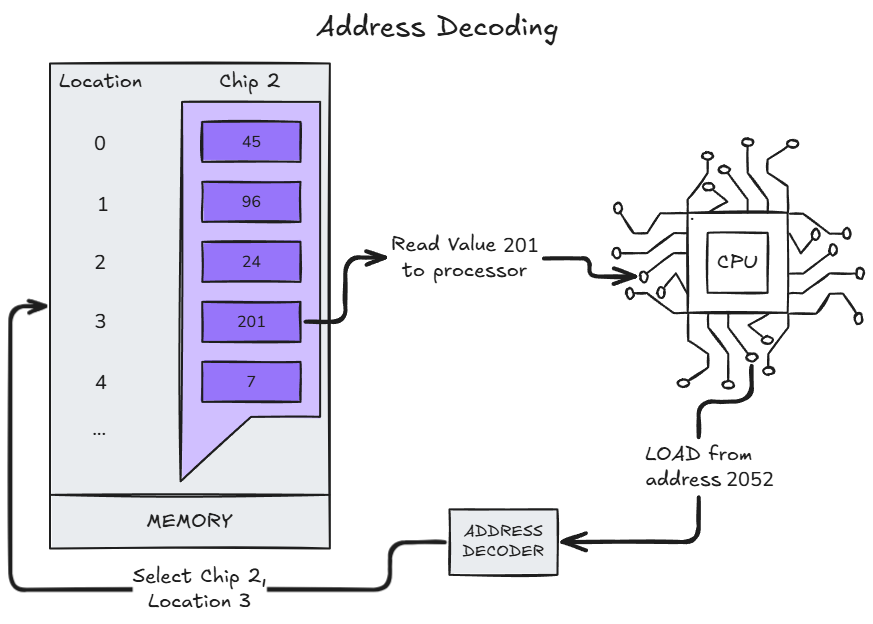

began: 8th October 2024

# SCC.131 Digital Systems

This module of the course is split into 4 components:

| Component             | Taught by                  | Includes                                                                |
| --------------------- | -------------------------- | ----------------------------------------------------------------------- |
| Computer Architecture | Prof. Qiang Ni             | Number Systems, Circuit and Logic, and Computer Architecture Theory/ISA |
| Microbit              | Dr. Ioannis Chatzigerogiou | Debugging Intro, Physical Computing, and Compilation                    |
| ARM Assembly          | Dr. Charalampos Rotsos     | Assembly Programming, Memory, and Interrupts/IO                         |
| Systems Programming   | Dr. Paul Dempster          | Assembly & C, Advanced C, and Network Sockets                           |

The module aims to help me understand digital systems. This includes...

- ...fundamental concepts of hardware & Entire Computer Systems
- ...how hardware and software interact
- ...how to program and debug software at low levels

Assessed with Exams and Coursework:

| Task                       | Week               | Worth         |
| -------------------------- | ------------------ | ------------- |
| "Coursework" (In-lab quiz) | Week 5, 10, 15, 20 | 20% (5% each) |
| Programming Project        | Week 23            | 10%           |
| Exam                       | Summer Term        | 70%           |

---

### Table of Contents

| Week | Lecture                                                                                        | Original Slides                                                                  | Noted |
| ---- | ---------------------------------------------------------------------------------------------- | -------------------------------------------------------------------------------- | ----- |
| 1    | [Lecture 1 - Module Introduction](#lecture-1---module-introduction)                            | [Module Introduction](/SCC.131.slides/a.introSlides.pdf)                         | ✅    |
| 1    | [Lecture 2 - Architecture & Speed](#lecture-2---architecture--speed)                           | [Comp Architecture](/SCC.131.slides/b.compArchitectureIntro.pdf)                 | ✅    |
| 2    | [Lecture 3 - Information Coding](#lecture-3---information-coding)                              | [Information Coding](/SCC.131.slides/c.infoCodingPartOne.pdf)                    | ✅    |
| 2    | [Lecture 4 - Information Coding Part 2](#lecture-4---information-coding-part-2)                | [Information Coding Contd](/SCC.131.slides/d.infoCodingPartTwo.pdf)              | ❌    |
| 3    | [Lecture 5 & 6 - Boolean Logic](#lecture-5--6---boolean-logic)                                 | [Boolean Logic](/SCC.131.slides/e.booleanLogic.pdf)                              | ❌    |
| 4    | [Lecture 7 - Instruction Set Architecture](#lecture-7---instruction-set-architecture)          | [Instruction Set Architecture](/SCC.131.slides/f.instructionSetArchitecture.pdf) | ❌    |
| 4    | [Lecture 8 - Building the ALU](#lecture-8---building-the-alu)                                  | [Building The ALU](/SCC.131.slides/g.buildingTheALU.pdf)                         | ❌    |
| 5    | [Lecture 9 - Building Memory](#lecture-9---building-memory)                                    | [Building Memory](/SCC.131.slides/h.buildingMemory.pdf)                          | 🟧    |
| 5    | [Lecture 10 - Building The Control Unit](#lecture-10---building-the-control-unit)              | [Building The Control Unit](/SCC.131.slides/i.buildingCU.pdf)                    | ❌    |
| 6    | [Lecture 11 - Building the Input/Output System](#lecture-11---building-the-inputoutput-system) | [Buildinf The IO](/SCC.131.slides/j.buildingIO.pdf)                              | ❌    |
| 6    | [Lectute 12 - Weeks 1-6 Recap](#lecture-12---weeks-1-6-recap)                                  | [Weeks 1-6 Recap](/SCC.131.slides/j.recapUpToWeek6.pdf)                          | ✅    |
| 7    | [The Micro:Bit](#the-microbit)                                                                 | [Architecturing The Micro:Bit](/SCC.131.slides/k.microbit.pdf)                   | ✅    |

---

---

## Lecture 1 - Module Introduction & Computer Architecture

Architecture is the science of putting together building materials to produce buildings.

Computer Architecture is the science of putting together hardware to produce computers.

---

---

## Lecture 2 - Architecture & Speed

A computer is an electronic device for storing and processing data, in binary form, according to instructions given to it in a variable program.

### Computer History

- Analytical Engine
  - First computer
  - Partly built by Englishman Charles Babbage in the 19th century
  - A fully program-controlled mechanical computer
  - Consisted of the mill (calculating unit), the store, the reader, and the printer
  - Data was entered onto physical punched cards
  - Ada Lovelace wrote the first algorithm for a computer based on this machine.
- ENIAC
  - Electronic Numerical Integrator And Computer was the first programmable, electronic, general-purpose digital computer
  - Built during WW2 in the USA
  - Programmed via switches and cables
- Manchester SSEM
  - Small-Scale Experimental Machine was the first electronic stored-program computer
  - Built-in the Uni of Manchester
- Cambridge EDSAC
  - Electronic Delay Storage Automatic Calculator
  - Built at Cambridge Uni
  - First practical stored-program computer in regular use
  - Used punched cards to load programs
- IBM Personal Computer
  - Released 1981
  - Led to the era of cheap commodity-based computation

Computer Architecture is rules and methods that describe the functionality, organisation, and implementation of computer systems which can be applied at many levels such as processor, memory, and instruction sets.

### Von Neumman

- Memory that stores, data & instructions together
- A Control Unit (CU) that contains an instruction register and Program Counter (PC)
- Processing unit that contains Arithmetic Logic Unit (ALU) and processor Registers
- Input & Output mechanisms

CPU contains

- ALU + CU and Cache Memory
- Logically the same as the above diagram

### Harvard

Instructions and data are stored in separate memories to overcome the bottleneck of Von Neumman. This allows parallel access to data and instruction so this can be faster.

Modified Harvard:

- Separates instructions and data caches internally but a single main memory is visible to programs.

### Modern Architecture

### Speed Factors & Limitations

Computer speed metrics:

- Clock Rate
  - 3GHz processor makes 3 billion ticks per second
  - instructions take different numbers of ticks so bad
- Millions of Instructions Per Second (MIPS)
  - Better than previous but depends on which instructions are counted (number of instructions)
  - Different Results for programs
- Floating Point Operations Per Second (FLOPS)
  - Better indication of speed where it counts

Density Limitations

- number of transistors per square inch
- Moore's Law

---

---

## Lecture 3 - Information Coding

Computer hardware should be as simple as possible due to cost, performance, and scalability factors. Because of this, we focus on handling small, positive integers. Any other data type is a code/representation that maps to positive integers.

### ASCII

The American Standard Code for Information Interchange is a 7-bit binary (27) code for characters.

In practice, we use numbers such as negatives, fractions, floating-points, etc. But all of these map to small, positive whole numbers held in memory.

### Decimal in Base-10

Representing 1984:

| Thousands (103) | Hundreds ((102)) | Tens ((101)) | Units/Ones (100) |
| :------------------------: | :-------------------------: | :---------------------: | :-------------------------: |
|    1 \* 103     |     9 \* 102     |   8 \* 101   |     4 \* 100     |
|         1 \* 1000          |          9 \* 100           |         8 \* 10         |           4 \* 1            |
|            1000            |             900             |           80            |              4              |

1000 + 900 + 80 + 4 = 1984.

### Multiplication and Division

1984 \* 10 = 19840

Multiplying a number by 10n shifts the number left by n decimal places, feeding in 0's on the right.

Dividing a number by 10n shifts the number right by n decimal places.

### Negative Numbers

There are 3 coding approaches for negative numbers:

- Sign and Magnitude
- Excess N
- Twos Complement

#### Sign and Magnitude

Binary number split into a sign-bit and the magnitude. The sign-bit indicates whether the value is positive or negative. For example. The following decomal numbers are represented in 8bit-binary using Sign and Magnitude:

- +6 = 00000110
- -6 = 10000110

#### Excess N

MSB used to represent an excess. Example:

1. Code the decimal 20 using excess 127:

   - Take the value 20 and add 127 to it: `20 + 127 = 147`.
   - Encode 147 into binary: `147` in binary is `10010011`.
   - This is the excess 127 representation of 20.

2. To convert back:

   - Take the excess 127 binary representation `10010011` and convert it back to decimal: `10010011` in decimal is `147`.
   - Subtract the excess 127: `147 - 127 = 20`.

Another Example:

3. Code the decimal -20 using excess 127:

   - Take the value -20 and add 127 to it: `-20 + 127 = 107`.
   - Encode 107 into binary: `107` in binary is `01101011`.
   - This is the excess 127 representation of -20.

4. To convert back:
   - Take the excess 127 binary representation `01101011` and convert it back to decimal: `01101011` in decimal is `107`.
   - Subtract the excess 127: `107 - 127 = -20`.

To determine excess N value, we use half of the maximum possible value as a buffer. For example, if the max value is 100, the excess is 50; if it's 10,000, the excess is 5,000. This "half-rule" provides a safe margin without setting limits too close to the maximum.

Rule in action: If given the decimal 2,976, the max number is 10,000. 10,000/2 = 5,000. So could expect to encode in Excess 5000.

---

---

## Lecture 4 - Information Coding Part 2

---

---

## Lecture 5 & 6 - Boolean Logic

---

---

## Lecture 7 - Instruction Set Architecture

---

---

## Lecture 8 - Building The ALU

---

---

## Lecture 9 - Building Memory

Memory stores bits. Volatile memory is a type of memory that maintains its data only while there is power. There are 2 types of Volatile Memory:

- Dynamic Memory
  - Used for Main Memory
  - Slower, Cheaper
- Static Memory
  - Used for Registers & Cache
  - Faster, more expensive

Memory is made of locations, each of which holds one unit of data. Each location has an address.

### Address Decoding

An address decoder maps from a linear address to a specific memory location in a specific memory chip.

### Byte Ordering in Multi-Byte words

Different machine architectures may organise multi-byte words differently in memory. There are 2 ways:

- Big-endian
  - Within a multi-byte word, the location with the lowest memory address holds the **most**-significant-byte
- Little-endian
  - Within a multi-byte word, the location with the lowest memory address holds the **least**-significant-byte

### Static Memory

Stored bits are organised into multi-bit storage slots called registers. Networks of logic components are used to build storage for individual data bits.

### Combinatorial Logic

- Combinatorial Logic: Output is a function of its input.
- Sequential Logic: Output is a function of its input AND its current outputs.
  - So the output is fed into the inputs. Feedback loop.

### Sequential Logic & S-R Flip-Flop

The S-R Flip-Flop 'remembers' which of the 2 possible stats it is in.

- Q0 represents the current state
- Q represents the next state.
  - Q depends on the inputs S & R.

EXPLAIN IT HERE

Has several limitations:

- It's got distinct SET and RESET inputs
  - It's better to have one single input that 'sets' the state if 1, and 'resets' the state if 0
- There is no way of telling the flip-flop when it should store input data
  - It's better to have a 'latch' signal for this to work in a practical system with a control unit

---

---

## Lecture 10 - Building The Control Unit

---

---

## Lecture 11 - Building the Input/Output System

The Input/Output system enables I/O devices to connect to the processor.

Input Devices:

- keyboard
- mouse
- trackpad
- camera
- other sensor

Output devices:

- Monitor
- Printer
- Speakers
- Actuators

Input AND Output devices:

- Network Interfaces - ethernet, wifi, bluetooth
- disks
- audio cards
- MIDI devices

I/O Challenges:

1. The Speed-Gap

- I/O devices are mechanical so run massively slower compared to the CPU

2. The Device Diversity

- Diversity of data-access modes
  - read-only, or write-only, or read-and-write
  - Access by the induvidual byte or by the block/by the stream
  - Access randomly (like a disk) or sequentially (like a tape)
- Device-specific Operations
  - change for resolution, set the time, focus
- I/O protocol
  - potential data transfer errors
  - synchronous or asynchronous

Device drivers are software plug-ins inside the operating system.

---

---

## Lecture 12 - Weeks 1-6 Recap

### Architecture

Von Neumann:

Harvard:

- Instructions & data memories are separate
- So can access instructions & data simultaneously
- So probably faster
- So more expensive

### Information Coding

Every data type is a code like ASCII.

Number representations:

- Binary
- Decimal
- Octal
- Hex

Negative number representations

- Excess n
- Sign & Magnitude

Adding & Subtracting numbers:

- 2's complement

Floating Points:

- Range & accuracy
- converting decimal/hex to binary/decimal/hex

#### IEEE 754

LOOK HOW TO DO THIS

### Boolean Logic

For any pair of binary digits (bits) A and B:

INSERT building AND/OR/NOT from NAND/NOR

#### Boolean Algebra

| Law                 | AND form                | OR form                   |
| ------------------- | ----------------------- | ------------------------- |
| Identity 1          | A = A′′                 | A = A′′                   |
| Identity 2          | 1A = A                  | 0 + A = A                 |
| Null                | 0A = 0                  | 1 + A = 1                 |
| Idempotence         | AA = A                  | A + A = A                 |
| Complementarity     | AA′ = 0                 | A + A′ = 1                |
| Commutativity       | AB = BA                 | A + B = B + A             |
| Associativity       | (AB)C = A(BC)           | (A + B) + C = A + (B + C) |
| Distributivity      | A + BC = (A + B)(A + C) | A(B + C) = AB + AC        |
| Absorption          | A(A + B) = A            | A + AB = A                |
| **de Morgan’s law** | (AB)′ = A′ + B′         | (A + B)′ = A′B′           |

Karnaugh Maps

### Fetch Decode Execute Cycle

All the CPU does is repeate the process of fetching the next instruction, decoding it, and executing it.

### Registers

A register is a holding place for data being worked on in the CPU. They are much faster than main memory.

There are general prupose and special registers. Registers used by arithmetic & logic instructions are general purpose.

Special:

- PC (program counter)
- SP (stack pointer)

### ALU

- half adders and full adders work.
- ripple-carry - carry select adders
- the status and the overflow flag
- bit shifting left and right

### Memory

- Dynamic vs Static Memory
- Memory Address Decoding
- Combinatorial vs Sequential Logic
- SR Flip Flip

### The Control Unit

A 'little program' that endlessly executes the FDE cycle.

### Pipelining

Improves performance by exploiting inherent parallelism inside the control unit to speed up the FDE Cycle.

## The Micro:Bit

### Requirements

Micro:bit has 3 core goals:

- Be simple and easy to use
- Be the mosteffective tool for teaching digital skills and creativity
- Inspire a diverse range of students

These goals are turned into requirements:

- Easy for students
- Easy for teachers
- No installation, setup, or internet
- Appeal to a range of ages
- Support a range of languages
- Leverage system developed by different companies
- Resource constrained
- Millions of devices, tens of millions of users

### Demo

Website to build micro:bit programs looks like scratch (click-and-drag block programming). Behind the scenes this is turned into JavaScript/Python. Can change the language so you can write, instead of dragging blocks, in your preffered language.

The microbit compiples all the blocks of code in the website interface into one program.

Program is saved to the micro:bit. Needs power source but the program is stored in non-volatile memory.

### Architecture

A micro:bit contains:

- 25 LED matrix screen
- Light sensor
- User definable buttons
- Touch sensetive logo
- Privacy indicator
- 17 digital I/Os
- 3 analog inputs
- 3 PWM outputs
- 3 touch sensetive pins
- I2C, SPI, UART
- 64MHz ARM Cortex M4
- 128kB RAM, 512kB FLASH
- USB storage/programming/debug
- Microphone
- Magnetic Speaker
- 3 axis magnetmeter
- 3 axis accelerometer
- Temperature sensor
- Bluetooth / 2.4GHz radio

Each hardware component is supportedby a corresponding C/C++ software component.
