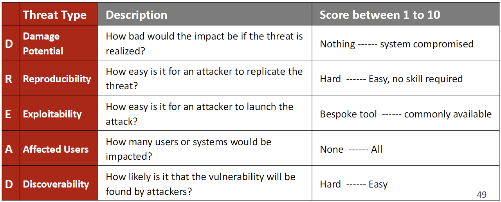

began: 9th October 2024

# SCC.141 Professionalism in Practice

The module aims to help me understand the fundamentals of Professionalism in Practice. This includes the principles of responsible computing, legal, social, ethical, and professional challenges.

| Assessment          | When            | Worth |
| ------------------- | --------------- | ----- |
| Groupwork           | Week 10         | 10%   |
| Groupwork           | Week 20         | 20%   |
| Exam                | Summer Term     | 70%   |

---

### Table of Contents

| Week | My Notes                                                                                                                                                   | Lecture Slides                                                                                    | Noted |
| :--: | ---------------------------------------------------------------------------------------------------------------------------------------------------------- | ------------------------------------------------------------------------------------------------- | :---: |
| 1    | [Lecture 1 - Module Introduction](#lecture-1---module-introduction)                                                                                        | [Introduction](/SCC.141.slides/a.introSlides.pdf)                                                 | ✅    |
| 2    | [Lecture 2 - Systems Development Lifecycle](#lecture-2---systems-development-lifecycle)                                                                    | [Systems Development Lifecycle](/SCC.141.slides/b.systemsDevLifecycle.pdf)                        |  ✅   |
| 3    | [Lecture 3 - Requirements & Requirements Engineering](#lecture-3---requirements--requirements-engineering)                                                 | [Requirements & Requirements Engineering](/SCC.141.slides/c.requirements.pdf)                     |  ✅   |
|  4   | [Lecture 4 - Understandong Users, Usability, & User Experience](#lecture-4---understandong-users-usability--user-experience)                               | [Users, Usability, & User Experience](/SCC.141.slides/d.usersUsabilityUX.pdf)                     |  ✅   |
|  5   | [Lecture 5 - Accesesibility](#lecture-5---accessibility)                                                                                                   | [Accessibility](/SCC.141.slides/e.accessibility.pdf)                                              |  ✅   |
|  6   | [Lecture 6 - Solving Problems](#lecture-6---solving-problems)                                                                                              | [Solving Problems](/SCC.141.slides/f.solvingProblems.pdf)                                         |  ✅   |
|  7   | [Lecture 7 - Intellectual Property, Software Protection, & Limiting Liability](#lecture-7---intellectual-property-software-protection--limiting-liability) | [Intellectual Property, Software Protection, & Limiting Liability](/SCC.141.slides/g.lawShit.pdf) |  ✅   |
|  8   | [Lecture 8 - Ethics](#lecture-8---ethics)                                                                                                                  | [Ethics](/SCC.141.slides/h.lawShitPartTwo.pdf)                                                    |  ✅   |
|  9   | [Lecture 9 - System Failures & Errors](#lecture-9---system-failures--errors)                                                                               | [System Failures & Errors](/SCC.141.slides/i.systemFailuresAndErrors.pdf)                         |  ✅   |
|  10  | [Lecture 10 - System & Human Error, and Recap](#lecture-10---system--human-error-and-recap)                                                                | [System & Human Error, and Recap](/SCC.141.slides/j.semesterRecap.pdf)                            |  ✅   |
|  11  | [Lecture 11 - Security In Systems](#lecture-11---security-in-systems)                                                                                      | [Security In Systems](/SCC.141.slides/k.systemSecurity.pdf)                                       |  ✅   |
|  12  | [Lecture 12 - Privacy](#lecture-12---privacy)                                                                                                              | [Privacy](/SCC.141.slides/l.privacy.pdf)                                                          |  🟧   |
|  13  | [Lecture 13 - Surveillance & Censorship](#lecture-13---surveillance-and-censorship)                                                                        | [Surveillance & Censorship](/SCC.141.slides/m.surveillanceAndCensorship.pdf)                      |  ❌   |
|  14  | [Lecture 14 - Malware, Malevolent Online Practices, & Threat Modelling](#lecture-14---malware-malevolent-online-practices--threat-modelling)               | [Malware](/SCC.141.slides/n.malware.pdf)                                                          |  🟧   |
|  15  | [Lecture 15 - Digital Exlusion & Divide](#lecture-15---digital-exclusion--divide)                                                                          | [Digital Exlusion & Divide](/SCC.141.slides/o.exclusionAndDivide.pdf)                             |  ✅   |
|  16  | [Lecture 16 - Digital Inequalities](#lecture-16---digital-inequalities)                                                                                    | [Digital Inequalities](/SCC.141.slides/p.digitalInequalities.pdf)                                 |  ❌   |
|  17  | [Lecture 17 - Intelligence & AI](#lecture-17---intelligence--ethics)                                                                                       | [Intelligence & Ethics](/SCC.141.slides/q.intelligenceAndEthics.pdf)                              |  ❌   |

> **_NOTE:_** The AI Podcasts used for each lecture are produced from that lecture's slides. The structure of my notes for each lecture may differ to the order of topics discussed in the podcast.

## Lecture 1 - Module Introduction

<audio controls>
  <source src="SCC.141.slides/a.introSlides.mp3" type="audio/mpeg">
  Your browser does not support the audio element.
</audio>

Professional issues are areas of debate about ethical or practical conduct that underpin good professional practice in a field.

The word 'ethics' is derived from the Greek word 'ethos' or 'a way of living'. Ethics is a branch of philosophy that is concerned with the behaviour of individuals in society.

The design, manufacturing, and deployment of technology have ethical issues associated with responsibility, safety, security, risk, and trust.

BCS charter requires the establishment and maintenance of a sound ethical foundation for the use of computers. This is done by laying a code of ethics - standards of behaviour that members follow.

### Professional Conduct

- The Public Interest
  - Comply with regulations and laws that govern acting in the public interest
    - Safeguard public health, protect the environment, and respect the privacy, security, and well-being of others.
  - Respect the rights of third parties, copyright, and intellectual property
  - Conduct professional activities without discrimination on the grounds of:
    - Sex, sexual orientation, marital status, nationality, color, race, ethnic origin, religion, age, disability, or any other condition or requirement
  - Promote equal access to the benefits of IT
    - Ensure that IT systems can be used by disabled people or help to develop IT skills in groups of people who do not have them
- Professional Competence and Integrity
  - Continuous professional development
  - Being familiar with the legislation
- Duty to Relevant Authority
  - Carry out professional duties with due care and diligence in accordance with the relevant authority's requirements.
  - Behave professionally
    - Avoid conflicts of interest
    - Do not disclose confidential information without permission
    - Avoid misrepresentation or withholding of information
- Duty to the Profession
  - Set members' expectations to uphold the reputation and good standing of BCS in particular, and the profession in general
  - Support colleagues and help them to develop their skills
  - Take responsibility for those that we are managing and help guide their development

## Lecture 2 - Systems Development Lifecycle

<audio controls>
  <source src="SCC.141.slides/b.systemsDevLifecycle.mp3" type="audio/mpeg">
  Your browser does not support the audio element.
</audio>

A system is a collection of interrelated parts that form a whole. It serves a purpose and a change in one part can change other parts of the system.

> A system development lifecycle is the process of determining how a system can support business needs, designing the system, building it, and delivering it to users.

### Stages of a Systems Development Lifecycle

- Planning
- Analysis
- Design
- Implementation

#### Planning

I need to understand why a system should be developed and how to create a plan for how it will be developed and delivered.

This involves doing a feasibility analysis - technical, economic, and organisational feasibility.

During economic feasibility:

- Development costs (one-time costs)
- Operational costs (ongoing costs)
- Tangible benefits (e.g. revenue)
- Intangible benefits (predicted benefits that may be harder to quantify)

Outputs of the planning stage:

- Define goals for a new system
- Definition of the project's scope
- Assessment of feasibility
- Initial work plan

#### Analysis

I need to understand **who** will use the system, **what** the system will do, and **where**/**when** it will be used.

Stages of Analysis:

1. Problem Analysis
   - Understand the existing solutions/products/situation
   - Breaking down a whole into parts to understand the functions and inter-relationships
   - May include images that capture everything relevant to the system
     - Good mental tool to understand a scenario
     - Useful for discussing with others
     - Useful for identifying stakeholders
     - Suitable for any domain
2. Determine the requirements and characteristics of the system
   - Identify potential improvements
   - Requirements change high-level objectives into precise statements of what a system should do
3. Gather requirements from stakeholders/users
   - Getting more insight into the requirements for the system by gathering data from users

PACT questions:

- **People**: What are the intended users' characteristics and skills?
  - Language
  - Level of skill and expertise
  - Cognitive characteristics such as attention, perception, and memory
  - Physical characteristics such as physical abilities, and accessibility
  - Emotions such as satisfaction, frustration, things being aesthetically pleasing
  - Infrequent vs. frequent users
- **Activities**: How is the activity currently carried out? Why? What can be improved?
  - Goals, tasks, and actions
  - Infrequent vs. frequent tasks?
  - Well-defined or vague goals
  - Continuous or interrupted?
  - Individual or cooperative?
  - Time requirements (e.g. how fast a response is needed)
  - Error Tolerance
- **Context**: What is the environment of the activity?
  - Physical environment
  - Social environment
  - Organisational context
  - When and where activities happen
- **Technology**: What tools are being used currently? How might new developments be used?
  - Input, data, and commands
  - Output
  - Communications between people, devices, speed, etc
  - Size of screen
  - Networked?

#### Design

> System Design is the determination of the overall system architecture that will satisfy the system's essential requirements

- How will the system operate; deciding how to build it
- Involves design of architecture and interface, development of database and file specifications
- Output: System Specification

User interface design defines how users will interact with the system and what kind of inputs and outputs the system accepts and produces.

- **Navigation Mechanisms**: How the user gives instructions to the system (e.g. buttons)
- **Input Mechanisms**: How the system captures information (e.g. forms)
- **Output Mechanisms**: How the system provides information to the user (e.g. reports)

#### Implementation

- Building the system
- Testing the system
- Construction, installation, and support plan (maintainability)

Testing:

1. Unit Testing: testing of each unit or program module separately
2. Integration Testing: checking that things should work together do so without error
3. Acceptance Testing: does the system meet requirements
4. User Testing: system tested with users

Maintenance:

- Not just about maintaining existing functionality. It can involve building new functionality.

### Models

#### Waterfall

| Pros                                                         | Cons                                        |
| ------------------------------------------------------------ | ------------------------------------------- |
| Requirements identified at the start.                        | Time consuming                              |
| Well suited to systems that have high-security needs.        | Inflexible                                  |
| Clear deliverables                                           | No working software until late stages       |
| Easy to arrange tasks as things progress one phase at a time | Doesn't adjust to changing requirements     |
|                                                              | Difficult to measure progress within stages |
|                                                              | High overheads                              |

#### Rapid Application Development

E.g.:

- Iterative development
- System Prototyping
- Throwaway Prototyping
- Agile
  - Feature oriented
  - Rapid dev and delivery
  - Works in small iterations
  - Deliver in each iteration
  - Review and adapt
  - Make changes

| Pros                                                  | Cons                                            |
| ----------------------------------------------------- | ----------------------------------------------- |
| Cheaper and easier to make changes                    | Can be more challenging to integrate at the end |
| Flexible                                              | Planning can be difficult                       |
| Requirements can change and are adaptive              | Can be harder to manage                         |
| Useful when users struggle to articulate requirements | Less control                                    |
| Get user feedback earlier                             | Can be difficult to scale for large systems     |
| Quicker delivery of working software                  | Less documentation                              |

## Lecture 3 - Requirements & Requirements Engineering

<audio controls>
  <source src="SCC.141.slides/c.requirements.mp3" type="audio/mpeg">
  Your browser does not support the audio element.
</audio>

### What Are Requirements & Why Are They Important?

A requirement is a clear, testable, and measurable statement, expressed in natural language without jargon, that specifies the intended functionalities, characteristics, or constraints of a product. It specifies what the product should do and ensures it meets the desired operational, functional, and accessibility needs.

Requirements are important because:

- Enables 'time to market with the right product':
  - Streamlines development by providing clear direction.
  - Reduces misunderstandings and rework.
  - Prioritizes critical features for faster delivery.
  - Aligns product with market demands to enhance success.
- Central to delivery:
  - Serves as a reference throughout the project lifecycle.
  - Guides design, development, testing, and deployment.
  - Establishes clear acceptance criteria for evaluation.
  - Aligns expectations with outcomes to ensure stakeholder satisfaction.
- Provide a 'navigation chart' for any project:
  - Helps chart a course from concept to completion.
  - Facilitates tracking progress and informed decision-making.
  - Identifies potential risks early in the process.
  - Allows for adaptability while maintaining focus on goals.

Projects can fail when there are issues with the requirements, such as being incomplete, unrealistic, or constantly changing.

### Types of Requirements

- Functional (functions of the product)
- Non-functional (characteristics of the product)
- Business
- User
- System

#### Functional Requirements

- Defines what the product must do and how it will be implemented
- "the product capabilities or things that product must do for its users"
- Processes the product must perform
  - This relates to what the system must do to be able to perform in order to support a user task
- Information the product must provide
  - This relates to what information the product should contain to enable a process

#### Non-functional Requirements

- Defines the qualities and characteristics the product must have
- "the quality attributes, design & implementation constraints, and external interfaces which a product must have"
- Usability, performance, maintainability, security, legal compliance, etc.

There are 3 types of Non-Functional Requirements:

- **Professional**: These specify how the product must behave
- **Organisational**: Formed from organisational policies and procedures
- **External**: Arise from external factors and its development process

Examples of non-functional requirements:

- Performance: "It should take less than 3 seconds for a user to receive confirmation of their order"
- Security: "Users must log in to a password-protected area to see their order history"
- Legal: "Data must be stored in compliance with GDPR"

There is another way that non-functional requirements can be categorised:

- Quality: e.g. maintainability, reliability, performance, usability
- Process: how the development process is going to be carried out
- Constraints: from business or operational context

## Lecture 4 - Understanding Users, Usability, & User Experience

<audio controls>
  <source src="SCC.141.slides/d.usersUsabilityUX.mp3" type="audio/mpeg">
  Your browser does not support the audio element.
</audio>

### Understanding Users

- Computers used by large variety of people (not just techies)
- Problems if products can't be used effectively by intended user groups
- Need to oconsider people's capabilities, limitations, needs, & desires

> "Technology may change rapidly, but people change very slowly. The principles of good design never change." - David A. Norman, (2013). The Design of Everyday Things: Revised and Expanded Edition.

The timeline:

- 1960s: Personal computers grew in popularity, leading to usability concerns
- 1970s: Software engineering shifted its focus towards non-functional requirements like usability and maintainability
- 1980s: The discipline of Human-Computer Interaction (HCI) emerged, concentrating on how people interact with computers

Disciplines of HCI:

- Interaction Design: Intuitive and engaging user interfaces
- Human-Computer Interaction (HIC): Improving how users interact with computers
- User Experience (UX) Design: Enhancing overall user satisfaction and ease of use
- Requirements Engineering: Defining system functions and qualities

We need to consider human abilities and capabilities as well as what they want/need. We must also consider how these might change in users over time. Factors:

- Physiological Aspects: senses, movement, strength, fatigue, etc.
- Cognitive Aspects: attention, memory, learning, cognitive load, etc.
- Affective Aspects: emotional responses

People are complex and unique so we can't predict every need or behaviour, which makes it impossible to design a product for everyone. Users will also struggle to articulate their needs so what they want may differ from what they say.

Techniques for considering users:

- Scenarios
  - Stories that describe how users interact with a system
  - Help designers imagine how users will use the system in various ways
- Personas
  - Fictional characters that represent a typical user
  - Based on real data about users

### Usability

Usability is the degree to which an interactive product enables specified users to achieve specific goals with ease, efficiency, and satisfaction within a defined context of use. It ensures that the product is intuitive to learn, effective in its functionality, and enjoyable from the user's perspective.

#### Nielsen's Usability Characteristics

- Learnability: easy-to-learn system
- Efficiency: efficient system
- Memorability: memorable system
- Errors: low error rate
- Satisfaction: satisfying to use

#### Methods to Evaluate Usability

1. Inspection Methods (Expert Evaluation)

   - Heuristic evaluation: experts check against usability principle
   - Walkthroughs: experts simulate user interaction
   - Standards/Guideline Checklist: review compliance with standards or guidelines

2. Inquiry Methods (User Evaluation)

   - Observations: watch users interact with the syste
   - Interviews/Focus Groups: gather feedback through discussion
   - Questionnaires: collect structured user feedback

3. Testing Methods (User Evaluation)
   - Usability Testing: users complete tasks while being observed to identify issues

#### Nielsen's Usability Heuristics

A heuristic is a practical approach to problem-solving. It relies on guidelines, shortcuts, or rules of thumb to find a solution. It aims for a sufficient solution rather than a perfect one.

1. **Simple & Natural Dialogue**: Easy-to-use and intuitive interfaces
2. **Speak The Users' Language**: Use terms & concepts familiar to the user
3. **Minimise Memory Load**: Users shouldn't need to remember too many rules to use the system
4. **Consistency**: Actions should always have the same effect
5. **Feedback**: The system should always inform users about its actions and their input
6. **Marked Exits**: Make it easy to cancel or undo actions to recover from mistakes
7. **Shortcuts**: Provide shortcuts for experienced users to speed up tasks
8. **Good Error Messages**: Error messages should be clear, helpful, and polite
9. **Prevent Errors**: Design the system to avoid mistakes before they happen
10. **Help & Documentation**: Provide easy-to-find, well-structured help, but keep it simple, as most users avoid reading it

| Pros                                                                                              | Cons                                                                        |
| ------------------------------------------------------------------------------------------------- | --------------------------------------------------------------------------- |
| Quick & inexpensive                                                                               | Requires expertise                                                          |
| Provides fast feedback without the need of large user groups, saving time and money               | Needs trained usability experts to be effective                             |
| Fewer ethical/logistical concerns                                                                 | Hard to find experts                                                        |
| No need to recruit users or worry about privacy and consent, as experts handle the evaluation     | Often identifies minor problems but can overlook larger usability concerns  |

#### Survey Measures for Usability

The System Usability Scale (SUS) is often used after usability evaluations to get quantitative feedback from real users on how they perceive the usability of a system.

#### Usability Testing & Metrics

Usability Testing is often conducted to observe how users interact with the system in real-time. Real users are assigned tasks and their performance is measured. Things such as completion time, number of errors, and success rate.

Usability Metrics are key measurements used to evaluate system usability, focusing on how well and how efficiently users can complete tasks.

- Effectiveness is measured as the percentage of tasks completed. `(completed tasks / total tasks) * 100`.
- Efficiency is measured by the time taken for users to complete a task. Faster task completion is correlated with higher efficiency.

### User Experience

UX refers to the overall experience and feelings a user has when interacting with a system, device, or product, including the context of its use. It recognises that technology is no longer just about improving productivity in the workplace but also about creating a satisfying and seamless experience for users. It focuses on how a system feels to the user. User experience (UX) design is the intentional creation of experiences through technology, focusing on how users feel and interact with a product.

- **Why**: Understand the user's needs, emotions, and motivations behind the activity
- **How**: Design the interaction - how the users achieve their goals
- **What**: Determine what activities the product enables users to perform

### Dark Patterns

Dark Patterns are deceptive UI design features that mislead users into making choices that are not in their best interest. They exploit human weaknesses and behaviours for the benefit of the service provider. Users often end up taking actions they didn't intend.

- The Roach Motel is a situation in which it is easy for a user to enter, but very difficult to exit.
- Forced Continuity is when users are required to provide their credit card information to sign up for a free trial. Once over, they are automatically billed without prior notice.
- Bait and Switch is when users into to complete one action, but an undesirable action occurs instead.
- Privacy Zuckering is the practice of designing confusing jargon and user interfaces that deceive users into sharing more personal information than they intend to.

## Lecture 5 - Accessibility

<audio controls>
  <source src="SCC.141.slides/e.accessibility.mp3" type="audio/mpeg">
  Your browser does not support the audio element.
</audio>

Accessibility is the concept of whether a product or service can be used by everyone.

Digital Accessibility is the design of and building of websites and web apps that disabled people can interact with in a meaningful and equivalent way.

When considering the user experience and designing a product:

- **Who** is using the product?
- **What** are they doing?
- **Where** are they doing it?
- **When** are they doing it?
- **Why** are they doing it?
- **How** are they doing it?

Usability is a part of usefulness which has two key parts:

- **Utility**: Does the system do what users need?
- **Usability**: can users easily use the system's features?

Nielsen's Usability Characteristics:

- **Learnability**: The system should be easy to learn
- **Efficiency**: The system should be efficient to use
- **Memorability**: The system should be easy to remember
- **Errors**: The system should have a low error rate
- **Satisfaction**: The system should be satisfying to use

> "The power of the Web is in its universality. Access by everyone regardless of disability is an essential aspect." - Tim Berners-Lee, W3C Director and inventor of the WWW.

Usability features can benefit those without disabilities as well as those with. For example:

- Small-screen devices
- Older people
- Temporary disabilities
- Situational limitations
- Slow internet connections

Accessibility is also important for Businesses:

- Drive innovation
- Enhances the brand
- Extend the market reach
- Minimise the legal risk

### Web Accessibility Principles

- **Perceivable**: Users must be able to perceive all essential information on the screen, and it must be conveyed to multiple senses
- **Operable**: Users must be able to operate the digital product's interface and it can not require interaction that a user cannot perform
- **Understandable**: Users must be able to understand the information and the operation of the user interface
- **Robust**: Supporting assistive technologies and ensuring that, as users and technology evolve, the product remains accessible.

## Lecture 6 - Solving Problems

<audio controls>
  <source src="SCC.141.slides/f.solvingProblems.mp3" type="audio/mpeg">
  Your browser does not support the audio element.
</audio>

Computer Science is about solving problems, not just programming. So employers expect us to be able to:

- Look at the big picture in planning a solution
- Understand the problem that has been set (and why)
- Understand the environment it is being designed for
- Understand the limitations
- Create a solution that meets all essential criteria

### Design Ethnography

Design Ethnography is the practice of studying people in their natural environment. It is the earliest step of the development lifecycle and informs the entire cycle. It helps us to avoid mistakes and see opportunities for innovation.

It involves

- being embedded in an environment
- observing and documenting
- asking questions (interviewing)
- exploring solutions with users (co-design)
- analysing (reflection, creativity)
- communicating insights to a dev team
- steering the design process

### Question your assumptions

1. Is the environment different from where the device has been previously tested and deployed?
2. Which rules are flexible and open to change in this context?
3. What are the diverse motivations of the people involved or impacted?
4. Are you addressing the right problem, or could there be a more critical one to solve?
5. If you solved a related problem, could it eliminate the need to address this one?

### Participatory Design

#### Risk Mitigation Checklist

Risk Zones:

1. Zone 1: Authority & Discipline
2. Zone 2: Malevolence & Accidental Harm
3. Zone 3: Emotionality & Socialisation
4. Zone 4: Governance & Accounting

### Value-Sensitive Design

Designing a system the 'right' way means making sure it respects and supports human values. For example, people should be able to make choices that help them reach their goals. This includes giving users control over relevant features at the appropriate times. Computer scientists should consider what values the system promotes and supports.

#### Humble AI

The Humbel AI Concept is an AI approach focused on ensuring trustworthy people are not unfairly distrusted, promoting fair, merit-based opportunities.

The challenge is in balancing fairness without increasing false positives (trusting untrustworthy individuals).

1. Principle of Skepticism
   - Goal: Assume AI might be missing critical information for decision-making
   - Approach: Seek additional data, especially for cases near the decision threshold, to reduce errors.
2. Principle of Curiosity
   - Goal: Learn from borderline cases by testing different decisions
   - Approach: Use 'safe exploration' to randomly grant opportunities to people close to the threshold and observe outcomes.
   - Outcome: Refines the decision threshold overtime, helping the AI make more accurate and fair decisions.

## Lecture 7 - Intellectual Property, Software Protection, & Limiting Liability

<audio controls>
  <source src="SCC.141.slides/g.lawShit.mp3" type="audio/mpeg">
  Your browser does not support the audio element.
</audio>

### Intellectual Property

**Intellectual Property** is any unique product of human intellect that has commercial value.

**Property Rights**: People have the natural right to things which they remove/create through labour. We can extend this to Intellectual Property. If you 'steal' intellectual property you 'steal' the revenue derived from use of the use rather than the item.

Intellectual Property is protected:

- Protecting Intellectual Property:
  - You can protect your IP by hiding it
  - but then you do not benefit from it.
- Benefits of granting intellectual property rights to:
  - Encourage the creation of valuable ideas or
  - Encourage trade based on ideas
- Intellectual property rights compromise:
  - Give authors/inventors exclusive rights
  - But only for a finite period

Intellectual Property Rights (IPR) is the name given to legal rights that protect:

- Creative works
- Inventions
- Intangible assets of a business

#### The Rights

- **Copyright**
  - This extends to literary, artistic, and musical works
  - Governed by Copyright, Deisng, & Patents Act 1988 (CDPA)
  - **Copyright Infringement** is the violation of copyright law
- **Patents**
  - A strong form of intellectual property rights and gives the owner the exclusive right of an invention for up to 20 years
  - Protects against independent development of something based on the same idea
  - The application is long and expensive
  - The invention must be new, involve an inventive step, be capable of industrial application, and be fully disclosed
- **Law of confidence**
  - A useful supplement to copyright and patents
  - It protects ideas before they become copyrighted/patented
  - protects information like trade secrets, business know-how, lists of clients and contacts, and ideas not yet expressed in a tangible form
- **Design rights**
  - Protects original designs
- **Trademarks**
  - Sign capable of being represented graphically to distinguish goods/services

#### AI & Intellectual Property:

- Patent law is written assuming a human inventor
- By not granting IPR to AI, companies can not profit from inventions by AI
- If IPR was granted to AI, who would be responsible for it?

#### Piracy

**Piracy** is the act of unfairly trading on a person's creation.
**Digital Piracy** is the act of unfairly trading (downloading) on a person's creation.

- Copyright holder's claim: 1 download == 1 lost sale

Digital Rights Management (DRM) accesses control mechanisms used to restrict medium usage (inhibits usage by multiple parties).

The Digital Economy Act 2017\*\* increases the maximum jail term for internet piracy to 10 years.

### Software Protection

Copying software reduces the purchase of legitimate software. This leads to decreased income for the producers leading to lower production of new software.

**Open Source** Software allows people to run the program for any purpose, study how the program works, adapt it, redistribute it with changes too, improve the program and release improvements.

Software copyright is now covered by the CDPA.

The CDPA covers software, preparatory design materials, and databases. This is important for software as it restricts the copying of the work, distribution of copies, and adaptations of it. Performing a restricted act without permission results in infringement of copyright.

The CDPA has two types of computer-produced work:

- Owner of a copyright is the author of the work unless by the employee in the course of his employment
- The author of computer-generated work is the person by whom the arrangements necessary for the creation of the works are undertaken.

Things to remember:

1. Do not copy non-literal parts of computer software
2. Prepare, date, and keep preparatory materials for development
3. Insert Deliberate Mistakes or redundant code
4. Be aware that copyright extends to the compilation of a program
5. Ensure that employees do not use materials or confidential information from the previous emplyoment
6. Honour confidentiality
7. Give credit if adapting Open Source code

### Limiting Liability

- For products and services:
  - Specify a warranty period
  - Specify 'appropriate use'
  - Specify maximum reasonable liability
  - Get liability insurance
- For me:
  - Ensure I follow my employer's standards and guidelines
  - Ensure thorough and rigorous testing

#### Product Liability

**Consumer Protection Act 1987** (CPA) imposes a liability on the producer of a defective product. CPA applies to computer hardware. For example, if a customer buys a disk containing software, the disk is deemed to be a 'product' and is protected. CPA however does not apply to computer software.

#### Contractual Liability

**Supply of Goods and Services Act 1982** (SGSA)

Contract for the supply of services, where a supplier writes software for a client. It does not apply to software sold without some form of contract (licence agreement).

It also binds the software supplier to provide a service with reasonable care. If the supplier fails, they could be liable for damages. The user is bound to the terms of the licence.

#### Negligence (Personal Liability)

Imposes liability on a person who has acted carelessly under common law. Liability for negligence in software development can be significant in health-system failure, security-system malfunction, and e-commerce system security loopholes.

## Lecture 8 - Ethics

<audio controls>
  <source src="SCC.141.slides/h.lawShitPartTwo.mp3" type="audio/mpeg">
  Your browser does not support the audio element.
</audio>

- Ethics
  - Principles of right and wrong that guide behaviours
  - E.G. avoiding plagiarism
- Legal Frameworks
  - Laws based on ethics to regulate behaviour
  - E.G. Not sharing someone's private information without consent
- Best Practice
  - Going beyond legal requirements to act ethically
  - E.G. Asking for clear permission before collecting personal data
- Standards
  - Formal rules that define and enforce best practices
  - E.G. Following guidelines like GDPR to protect personal data

### Data Protection

Before 2018, 'The Data Protection Act' governed data protection in the UK. It granted rights to 'data subjects', imposed obligations on organisations, and introduced the information commissioner role.

Since 2018, 'The General Data Protection Regulation' (GDPR) replaced the DPA as the main framework for data protection in the UK and EU. It expanded rights for data subjects, tightened obligations for organisations, and strengthened the role of information commissioner.

#### Provisions

1. Consent

   - Data collection requires informed and freely given consent
     - Individuals can withdraw consent at any time

2. Right to be forgotten

   - Individuals can request data deletion

3. Right of access

   - Individuals can access the data held by organisations

4. Breach notification
   - Organisations must notify individuals and regulators of data breaches

#### Personal vs Sensitive Data

Personal Data:

- Relates to all information regarding a person who can be directly or indirectly identified
- Only applies to living people

Sensitive Personal Data

- Includes data about protected attributes
- Requires greater justification for collection
- Must be protected with higher security measures

The difference is that sensitive personal data involves stricter rules and protections due to its potential impact on individuals.

#### Principles of GDPR

1. Lawfulness, Fairness, and Transparency
2. Purpose Limitation
3. Data Minimisation
4. Accuracy
5. Storage Limitation
6. Integrity and Confidentiality
7. Accountability

This means that:

1. Approval from Ethics Review Boards (ERBs):

   - Required for research involving personal data.
     - Participatory Research:
       - Obtain informed consent from participants.
       - Plan and document data handling, use, and retention.
     - Building Systems:
       - Ensure compliance with data handling protocols and lawfulness.
       - Follow specific conditions for using third-party libraries.

2. Document Everything:

   - Keep detailed records to demonstrate compliance with what you planned and stated.

3. Work with Experts:

   - Collaborate with specialists who understand the legal requirements.

4. If Working Alone:
   - You’ll need to familiarise yourself thoroughly with the relevant laws and regulations to ensure compliance.

### Equality

The 'Equality Act 2010' protects against discrimination.

- Direct: Mistreating someone due to a protected characteristics
- Indirect: Policies or practices that disadvantage certain groups

Monitored by the 'Equality and Human Rights Commission' (EHRC).

It is linked to the GDPR by ensuring fairness and lawfulness in data use.

#### Positive Action vs Discrimination

Positive Action is Recommended.

- Take steps to improve representation and inclusion.
- E.G.
  - Helping people overcome disadvantages
  - Meeting specific needs
  - Encouraging underrepresented groups to participate

Positive Discrimination is unlawful.

- Treating one group is less favourable than another
- E.G. Refusing to hire men solely to increase the number of women.

### Governance

When declaring AI systems, several roles work together to ensure the system is functional, compliant, and responsible.

Factsheets are standardised documents that provide details about an AI system's purpose, design, data, and performance, tailored for different stakeholders to ensure transparency and accountability.

#### Standard: Algorithmic Transparency

1. The profession is producing auditable documentation for AI systems, with efforts like the UK's Algorithmic Transparency Standard.
2. Challenges in defining facts that demonstrate compliance with legal concepts like fairness (transparency and accountability)
3. Active research focuses on developing metrics to evaluate AI systems against regulations and best practices.

This means that:

1. Changing expectations and opportunities

   - thorough documentation of a software dev process is essential
   - roles in monitoring and compliance are growing so technical expertise is in demand
   - research opportunities are increasing to develop metrics for evaluating AI systems

2. Government Investment in training auditors
   - new career paths include working for organisations like the ICO or EHRC.

### Regulating AI

2023 AI Summit Key Achievements

- Unprecedented Global Coordination
- AI Expert Panel Established
- Consensus on Regulation
- Government Testing Plans

Critics:

- Criticised as being biased towards big tech.
- no clear agreement on global standards or mechanisms to enforce regulations
- should regulation be top-down (gov-led) or democratic (inclusive and participatory)?
- is it appropriate for the tech industry to shape the very rules that govern their technologies

## Lecture 9 - System Failures & Errors

<audio controls>
  <source src="SCC.141.slides/i.systemFailuresAndErrors.mp3" type="audio/mpeg">
  Your browser does not support the audio element.
</audio>

### System Errors & Failures

Entire system perspective:

#### Caste Study: The Titanic

Catastrophic failure of a large system. Cost money, lives, and organisational reputation. Many mistakes were made throughout the design and development lifecycle.

As a system, the Titanic is a very complex socio-technical system with many safety-critical control features. At the time, it was made of the latest cutting-edge technology such as data communications and engineering technologies. It also had complex management structures and political, and organisation contexts.

#### Case Study: Post Office

> "The most widespread miscarriage of justice in UK history - The BBC

In 1999, new accounting software produced by Fujitsu (Horizon) was installed in Post Offices. Between 2004 and 2014, over 700 post office branch managers received criminal convictions, accused of faulty accounting and theft. However, Horizon was at fault and had falsely suggested cash shortfalls.

- **Technical Components**: The Horizon system was faulty with many bugs. "There were serious issues about the reliability of Horizon".
- **People, Knowledge, & Process**: Post Office staff members complained of bugs in the system but they were not taken seriously. So Horizon concluded that their software was correct and that the staff had stolen money.
- **Organisational Context & Environment**: Over-trust in technology. Lack of respect for workers. Embarrassment that an expensive tech contract was failing. Failed in the legal system

#### Case Study: Boeing 737 Max

In Oct 2018 and Mar 2019, everyone on board died in these 2 Boeing 737 Max crashes.

What happened?:

1. Boeing designers used large engines which had to be repositioned forward and high. This caused unwanted lift and pitch up to a higher angle of attack.
2. To reduce pitch-up and the risk of stall, older software was used to automatically push the nose down.
3. The MCAS system adjusts the angle of the stabiliser. This lifts the tail, hence forcing the nose down. The system is covert, forceful, and persistent.

- **People, Knowledge, & Process, and Organisational Context**: A software solution was chosen for a hardware issue. There seemed to have been little open communication around the risks. Pilots raised concerns but were ignored. Some pilots were not even aware of the new system or how it worked.
- **Environment**: Market forces pushing airline companies to make larger, faster planes - for cheaper.

### Theories & Models to Understand System Failures

Levels of Failure:

- **Regulatory**: lack of info and regulation, under-trained staff
- **Managerial**: safety climate, lines of command and responsibility, quality control
- **Hardware**: design, requirements, and implementation failures
- **Software**: requirements, and specification failures
- **Human**: slips, lapses, mistakes, team factors, human error

Failures in one area can coincide with the failure of a different part. This combination can cause cascading failures of other parts.

Characteristics of a complex system can include:

- **Complex Interactions**: Unfamiliar, unplanned, or unexpected sequences which are not visible or immediately comprehensible.
- **Tightly Coupled**: Time-dependent processes, rigidly ordered processes, very little slack

Swiss Cheese Model:

Limitations:

1. Independence of barriers is assumed, and randomness in whether the holes line up.
2. Layers of defence are not static or constant, and not independent of each other. They can interact, support, or erode one another.
3. It does not explain what the holes are, why they got there, or how the holes line up.

### understanding Dependability

Dependability is the judgement about the user's trust in a system. It reflects the extent of the user's confidence that it will operate as expected and will not 'fail' in normal use.

> "that property of a computer system that reliance can justifiably be placed on the service it delivers" - Mellor

Laprie's Model:

Impairments:

1. **System Failure**: when the system does not deliver the service its users expect.
2. **System Error**: where the behaviour of the system does not conform to its specification
3. **System Fault**: incorrect system state not expected by the designers of the system
4. **Human Error or Mistake**: human behaviour that results in faults being introduced into the system

Laprie's Model's Means:

1. **Fault Avoidance**: preventing the occurrence of faults
2. **Fault Tolerance**: delivering correct service, though faults are present
3. **Fault Removal**: reducing number of severity of faults
4. **Fault Forecasting**: estimating the number of faults, future occurrence, consequences

Laprie's Model: Primary Attributes of Dependability:

1. **Availability**: the ability of the system to deliver services when requested
2. **Reliability**: ability of the system to deliver services as specified
3. **Safety**: the ability of the system to operate without catastrophic failure
4. **Security**: the ability of the system to protect itself against accidental or deliberate intrusion

Laprie's Model: SecondaryAttributes of Dependability:

5. **Timeliness**: the ability of the system to respond in a timely way to user requests
6. **Survivability**: the ability of a system to continue to deliver its services to users in the face of deliberate or accidental attack
7. **Recoverability**: the ability of the system to recover from user or system errors
8. **Maintainability**: the ease of repairing the system after a failure has been discovered or changing the system to include new features

Human errors are difficult to distinguish between safe and erroneous behaviour.

Human error has many consequences, and a common reaction is to blame the user. But system engineers should be asking:

1. How can we design systems that minimise the potential for human error?
2. How can we design systems that detect and correct human error?
3. How can we design systems that tolerate human error?

Humans are inherently flawed so errors are inevitable especially as human behaviour is varied. The general approach to human error is error tolerance rather than error avoidance.

> "It is now widely held among human reliability specialists that the most productive strategy for dealing with active errors is to focus upon controlling their consequences rather than upon striving for their elimination" - reasonable

To plan for errors, we can do several things:

- Increase system visibility by not hiding the complexity behind automated mechanisms
- Take errors into account in operator training like error Scenarios
- Design interfaces with human user behaviour in mind
- Norman: design for errors. Assume errors will occur and plan for error recovery. E.g. make it easy to reverse actions.

Some would argue that system **automation** is the answer to avoiding human error. But automation addresses Skill & Rule-Based Tasks, leaving complex Knowledge-based tasks to humans. It can also hinder understanding, by decreasing system visibility and increasing complexity. Automation shifts the error source from operator/user errors to design errors, which may be hard to detect and fix.

#### Generic Error Modeling System (GEMS)

We can use the **Generic Error Modeling System**. The GEMS model outlines the failure to perform a task/plan correctly, and the failure to apply the correct plan. GEMS defines 3 categories of human performance that can lead to errors:

- **Skills-based performance**: routine, automatic actions requiring little cognitive effort
- **Rules-based performance**: following established rules or procedures
- **Knowledge based performance**: Using knowledge to address unfamiliar situations

3 types of errors can occur from the above human performance categories. **Slips** and **lapses** are both categorized as 'execution failures' related to skills-based performance. Slips occur when the user’s intentions are correct, but their actions are not executed properly, leading to unintended outcomes. Lapses, on the other hand, involve forgetting to perform a necessary action and failing to complete the intended task. **Mistakes** differ from slips and lapses in that they are 'planning failures' associated with rule and knowledge-based performance. In these cases, an inappropriate set of actions is executed due to incorrect reasoning or the selection of an unsuitable rule.

One advantage of GEMS is that it provides a structured framework for designing systems that minimize, detect, correct, and tolerate human error. However, its limitations include a focus solely on non-deliberate errors, such as accidental mistakes, while overlooking deliberate actions like taking shortcuts. Additionally, the model takes a high-level approach that fails to account for the critical influence of contextual factors.

## Lecture 10 - Recap

<audio controls>
  <source src="SCC.141.slides/j.semesterRecap.mp3" type="audio/mpeg">
  Your browser does not support the audio element.
</audio>

> **_NOTE:_** The first part of this lecture is repeated/continued content from the previous lecture so I did not repeat the notes here. Some of the following notes that recap this semester's teachings are copied or derived from previous notes.

Computer Science is about solving problems, not just programming. They have legal and ethical obligations and risk management considerations, and they must consider the end-users. So employers expect us to be able to:

- Look at the big picture in planning a solution
- Understand the problem that has been set (and why)
- Understand the environment it is being designed for
- Understand the limitations
- Create a solution that meets all essential criteria

To effectively address these expectations, it is essential to consider legal and ethical frameworks that influence how solutions are developed and implemented.

- **Ethics** are moral principles, recognised by a given group, of right and wrong that guide behaviours. E.G. avoiding plagiarism
- **Legal Frameworks** are laws based on ethics to regulate behaviour. E.G. Not sharing someone's private information without consent
    - Code of conduct/ethics like 'The BCS code of conduct' and 'ACM code of ethics'.
    - Frameworks like the GDPR, Equality Act, Copyright, Designs and Patents Act
- **Best Practice** is going beyond legal requirements to act ethically
    - E.G. Asking for clear permission before collecting personal data

However, legal and ethical considerations are only part of the broader responsibility—managing risks effectively is another key element of problem-solving in Computer Science.

There is an importance to managing risks. We need to anticipate and minimise unintended consequences and build dependable and error-tolerant systems. Possible unintended consequences could include misuse, malevolent actors, negative effects on well-being, and inadequate protection of privacy and security. Anticipating and minimising risks is a big part of problem-solving. **Dependability** is an important property for many systems and risk management. It is defined as "that property of a computer system such that reliance can justifiably be placed on the service it delivers". There are ways of enhancing dependability through removing faults, being fault-tolerant, etc. Good analysis and planning stages enable better consideration of potential risks. Incomplete requirements are a key cause of project failure, so identifying the right requirements is crucial.

Risk management and dependability, though critical, must be paired with a user-focused approach to ensure solutions are practical and beneficial for their intended audience.

It is vital to consider end-users throughout the system development life cycle because computers are used by a diverse population, each with unique needs, capabilities, and limitations. Systems should prioritize both accessibility and usability to ensure they are effective and inclusive. Digital accessibility involves designing and building websites and applications that allow disabled people to interact with them meaningfully and equivalently. Usability, on the other hand, focuses on enabling users to achieve their goals efficiently and with satisfaction. A usable product is intuitive, functional, and enjoyable. While people are unique and unpredictable, making it impossible to design for every scenario, understanding diverse user needs is essential. However, users may struggle to articulate their requirements, meaning their stated desires may not fully align with their actual needs.

## Lecture 11 - Security in Systems

<audio controls>
  <source src="SCC.141.slides/k.systemSecurity.mp3" type="audio/mpeg">
 Your browser does not support the audio element.
</audio>

### Why System Security Matters

It matters because undermined trust leads to downtime, data loss, and safety risks.

- **Trustworthy** Systems Power Our Lives: We depend on them for daily life
- **Frequent & Costly** Security Breaches: Attacks occur daily, costing time, money, and reputation
- **Complex Systems** Lead To Inevitable Defects: Design flaws or coding bugs are common in large, interconnected systems
- **Natural vs Malicious** Exposures: Some vulnerabilities appear by accident, others are exploited deliberately

For example, robotic security matters because:

- Potential Harassment: hacked robots can be turned into tools for offensive or harmful behaviour
- Safety & Liability: Compromised functionality can cause accidents or damage
- User Trust: Adoption stalls if people fear privacy invasions or physical harm

### The CIA Triad: Foundations of Security

The CIA Triad is a foundational model for understanding security requirements. Organisations use it to shape policies, controls, and strategies that minimise threats.

CIA matters because...

#### Confidentiality

This is when computing resources, data, and information should be accessible only to authorised users. Data confidentiality ensures that information is not disclosed to unauthorised parties. Privacy gives the owner control over what data is collected, how it's stored, and how it's used. This can be accomplished by encryption, access controls, or authentication.

#### Integrity

This is when resources should only be modified or removed by authorised users. Data integrity ensures that data isn't tampered with (accidentally or maliciously). System integrity intends the system to function as intended, free of unauthorised modifications. Small changes can break critical processes or mislead decision-making. Modifications can be malicious or accidental.

#### Availability

This is when resources need to be accessible when needed by authorised users. Poor performance caused by slow or overloaded systems can hurt availability. Single-point-of-failure designs are those which have one failing component that takes down the entire system. Redundancy and backups provide fallback options.

Malicious: Denial-of-service attacks or ransomware.
Accidental: Network outage, hardware crash, misconfiguration.
Environmental: Natural disasters, power failures.

### The Eight Security Design Principles

1. **Economy of Mechanism**: Keep designs as simple and small as possible, reducing the chance of errors.
      - Reuse simple quality components/libraries
      - Less code > fewer paths > fewer bugs > simpler verification
2. **Fail-Safe Defaults**: Deny by default; only grant access if explicitly allowed.
      - A conservative design must be based on arguments about why objects should be accessible, rather than why they should not.
      - Mistakes or overlooked details tend to revert the system to safe behaviour instead of wide-open.
3. **Complete Mediation**: Every request for a resource must be checked for authorisation - no cached shortcuts.
      - Forces a system-wide view of access control which in addition to normal operation includes initialisation, recovery, shutdown, and maintenance.
      - Eliminates "once you're in, you're in forever"
4. **Open Design**: Open design stresses transparency in security.
      - Mechanisms can be public; keys or passwords remain secret
      - Encourages robust, peer-reviewed designs that stand up to public scrutiny
5. **Separation of Privilege**: Divide power so no single entity alone has enough authority to compromise the system.
      - Reduces insider threats and accidental misuse
6. **Least Privilege**: A subject should have the minimal privileges necessary for its task.
      - Limits damage if an account is compromised so attackers can't escape to full control
7. **Least Common Mechanism**: Minimised shared resources/mechanisms used by multiple components.
      - One compromised shared mechanism can become a single point of failure
8. **Psychological Acceptability**: Security must be user-friendly to be adopted.
      - The best security fails if users avoid or bypass it due to complexity.

**Defence In Depth**: Involves multiple layers of security controls to protect assets. If one layer of security fails, the other layers still protect. - Aims to create a secure environment that is resilient to attack and can quickly detect and respond to any security incidents.

### Immutable Laws of Security

These used to be different but were revisited in 2003 due to the rise of ransomware, cloud-based services, Iot, and AI-driven attacks. Furthermore, the push to move fast often outruns security measures.

1. Security success is ruining the attacker’s return on investment (ROI).
2. Not keeping up is falling behind.
3. Productivity always wins.
4. Attackers don’t care.
5. Ruthless prioritization is a survival skill.
6. Cybersecurity is a team sport.
7. Your network isn’t as trustworthy as you think it is.
8. Isolated networks aren’t automatically secure.
9. Encryption alone isn’t a data protection solution.
10. Technology doesn’t solve people and processes problems.

They changed like this:

- Physical vs. Virtual:
    - Then: If an attacker physically touches your machine, game over
    - Now: Attackers might never be physically present—cloud breaches, remote exploits, supply chain intrusions
- Local Admin vs. Team Sport:
    - Then: One admin could make or break the security
    - Now: Security requires cross-team collaboration—DevOps, cloud architects, compliance officers, etc
- Antivirus vs. Ongoing Patch & Monitor:
    - Then: Keeping AV updated was big
    - Now: Ongoing patching, threat intelligence, and real-time monitoring are crucial

## Lecture 12 - Privacy

<audio controls>
  <source src="SCC.141.slides/l.privacy.mp3" type="audio/mpeg">
 Your browser does not support the audio element.
</audio>

Privacy is the right to be let alone, free from interference or intrusion. It's about having control over your personal information and how it's used. This includes things like your thoughts, beliefs, and personal relationships. Privacy is a fundamental human right that allows us to develop and maintain our sense of self.

### Ethical & Philosophical Dimensions of Privacy

Deontological Perspective:

- Privacy as a fundamental right
- Not to be infringed upon, regardless of potential outcomes

Utilitarian Perspective:

- Balancing individual privacy vs societal benefits
- E.G. Public health initiatives using aggregated data to prevent disease outbreaks

Virtue Ethics:

- Privacy as part of human flourishing and dignity
- Protecting privacy shows respect for individual dignity

Feminist Perspective:

- Power imbalances in data collection and usage
- privacy as a tool to protect vulnerable communities

### Privacy Paradox

The privacy paradox is a concept in which:

> "When people disclose personal information in ways that are inconsistent with the high value they claim to play on privacy."

Potential explanations for this:

- **Rational Ignorance**: "too long; didn't read" approach to privacy policies
- **Transparency Paradox**: overload of complicated details causes people to tune out
- **Control Paradox**: we like having control, but we rarely exercise it
- **Disincentivized To Protect Privacy**: "trade convenience for data"

### Cambridge Analytica Scandal

Key players:

- Cambridge Analytica (CA): A political consulting firm specialising in data analytics to influence elections
- Facebook: The social media platform from which vast amounts of user data were improperly harvested
- Aleksandr Kogan: A researcher who developed an app called "This is Your Digital Life", used as a tool for data collection

Data Collection:

- The app presented a personality quiz and collected detailed personal information
- The app accessed data from user's Facebook friends without their consent
- 270,000 users downloaded the app, but data from up to 87,000,000 people were harvested due to the friends-of-users loophole

Unauthorised Use:

- The data was shared with Cambridge Analytica, violating Facebook's platform policies
- Cambridge Analytica used the data to build psychological profiles of users

Election Influence:

### GDPR

|           Arguments for Failure            |                                    Arguments for Success                                     |
| :----------------------------------------: | :------------------------------------------------------------------------------------------: |
|         Privacy Paradox persists           |                         Forces explicit consent, raising awareness                           |
| High burden on the user to manage privacy  |                             Documents the "illusion" of choice                               |
|      Do people truly feel empowered?       | Strengthens the arguments that people don't care about privacy, ironically proving the point |

### The EU Artificial Intelligence Act (EU AI Act)

Addresses risks of unregulated AI applications. Promotes trustworthy AI aligned with ethical principles. It classifies AI systems by risk (unacceptable, high, limited, minimal). Encourages Transparency and accountability.

### Privacy in AI and Robotics

## Lecture 13 - Surveillance And Censorship

<audio controls>
  <source src="SCC.141.slides/m.surveillanceAndCensorship.mp3" type="audio/mpeg">
  Your browser does not support the audio element.
</audio>

## Lecture 14 - Malware, Malevolent Online Practices, & Threat Modelling

<audio controls>
  <source src="SCC.141.slides/n.malware.mp3" type="audio/mpeg">
  Your browser does not support the audio element.
</audio>

### Malware

> "People represent the weakest link in the security chain and are chronically responsible for the failure of security systems" - Bruce Schneier, 200, p. 149

Exploiting of software and information systems often targets the weakest link.

- Human Factors: Social engineering, unintentional errors
- Technology Vulnerabilities: Outdated or insecure apps, & operating system defects
- Exposed Personal Traits: Oversharing on social media

Malicious Software (Malware) is software that causes harm to computer systems, networks, or users. It harms and explorts the computer or network to steal sensetive information like passwords and credit card numbers. It can also disrupt the system's operations and allows attackers to gain unauthroised access to the device.

#### Virus

#### Worms

#### Trojans

#### Ransomware

#### Zombie

#### Botnets

#### DDoS Attack

A DDoS (Distributed Deinal of Service) attack is like a traffic jam on a website. They work by flooding a website/service with an overwhelming number of requests from different devices, making it inaccessible.

#### Malware Access, Effects, & Practitioners

Malware can gain access in many ways:

- Phishing
- Exploiting Vulnerabilities
- Social Engineering
- Malicious Websites/Ads
- Infected Software/Downloads

Malware can have several effects:

- **Data Theft**: Personal, financial, or business data is stolen for malicious use
- **System Damage**: Malware can corrupt or delete files, slow down or crash systems
- **Loss of Privacy**: Sensitive information such as passwords or browsing history may be exposed
- **Financial Loss**: Ransomware and data breaches can lead to direct financial damage
- **Performance Issues**: Malware can reduce system speed or disrupt normal operation
- **Reputation Damage**: Organizations or individuals may suffer from compromised trust and credibility

Practitioners:

- **Cybercriminals**: Individuals or groups who create and distribute malware for financial gain
- **Hacktivists**: People or organizations who use malware as a tool for political or social causes
- **State-Sponsored Actors**: Governments or military organizations that use malware for espionage, sabotage, or warfare
- **Script Kiddies**: Less skilled attackers who use pre-made malware for fun or to gain attention
- **Cybersecurity Researchers**: Ethical hackers who analyze malware to develop protections or solutions (often the counterforce to malicious actors)

### Malevolent Online Practices

Malware is not the only malevolent practice. The rise of social networks & digital communications lead to new malicious practices. These often have a narrowed focus and target on vulnerable groups like the elderly, single men and women, or children.

#### Phishing

Emails containing a convincing hyperlink that appears to be a trustede source but the actual address may be foreign or suspicious. Victims are tricked into entering personal information and by clicking on anything confirms that your email address is active so you'll begin to receive more spam. This is similar to spear-phishing which targets and personalises their attack for specific individuals. So spear-phishing emails may include personal information about you that is used to convince you that it is legit.

#### Social Engineering

Social Engineering is described as 'hacking without code' and is based on a principle of trust. The perpetrator collects data by dumpster-dibing, monitoring social media, and shouldering. When they've collected enough to know about you, they will then try and convince the victim to trust them and ask for money/details.

#### Grooming

This is gaining trust of a victim by being nice over a period of time. Once trust is gained they get the victim to reveal information about themselves which, unknowingly involves them in a crime.

#### Online Stalking

Stalking is obsessively following/watching a person without their knowledge. Lateral Surveillance is viewing someone's online presence without their knowledge. Doxing is publishing private data with malicious intent.

#### Deepfakes & Synthetic Media

AI-generated images, videos, or audio that appear real. They can be used to impersonated executives for fraud, create fake videos for blackmail or manipulation, or spreading misinformation or fake political speeches. This raises challenges in verifying authentic media.

#### Misinformation & Propaganda

Misinformation is the sharing false or misleading information unintentionally. Disinformation is the deliberate spread of false information to manipulate or decieve. There are several techniques such as fake news, doctored images, AI-generated content, Bots & fake accounts, and deepfakes.

This erods trust in the media and institutions. It polarises society and amplifies echo chambers. It influences political outcmoes and public opinion.

### Threat Modelling

Threat Modelling is a technique within the security lifecycle to analyse a system's security and privacy concerns. We do this to recognise potential failures or attacks by identifying design & implementation flaws earlier. This informs decisions throughout development, testing, and deployment.

- Asset Identification
  - Determine what you're trying to protect
  - Identifies: Which assets need protection
- Threat Analysis
  - Identify potential attacks or events that could compromise these assets
  - Identifies: Relevant threats & vulnerabilities
- Vulnerability Analysis
  - Pinpoint the weaknesses in the setup - both technical and organisational
  - Identifies: Risk level for each threat
- Risk Assessment
  - Evaluate the likelihood and impact of each threat
  - Mitigation & contingency priorities
- Risk Communication
  - Share the findings with stakeholders

Natural & Accidental Threats:

- Natural
  - Well-studied (insurance data, actuarial tables)
  - Relatively predictable in terms of frequency so organizations can plan accordingly
- Accidental
  - Come from human error with no malicious intent
  - lost or stolen devices, misconfigurations, or employees clicking on phishing links
  - Hard to track
  - Implement awareness training, strict policies around data handling, and proper incident reporting

A malicious agent can be an induvidual or group that implements a threat. They are influenced by amplifiers (motivators, resources, alliances) or inhibitors (legal risk, limited acces, fear of exposure). They have characteristics:

- Motivation
- Capability
- Catalyst
- Inhibitors
- Amplifiers

#### Threat Modelling Frameworks

STRIDE and DREAD frameowkr threat models are systematic processes that identify and access security risks in a system.

## Lecture 15 - Digital Exclusion & Divide

<audio controls>
  <source src="SCC.141.slides/o.exclusionAndDivide.mp3" type="audio/mpeg">
 Your browser does not support the audio element.
</audio>

### Intro to Digital Exclusion

Digital Exclusion is the inability to fully participate in digital life due to limited **ability**, **access**, or **affordability**. This leads to social, economic, and educational disadvantages.

#### Ability

These skills, literacy, and confidence are needed to engage with digital technologies. It includes:

- Digital Literacy: Navigating software, apps, and online services.
- Physical/Cognitive Factors: Vision, hearing, dexterity, memory, or learning differences.
- Motivation & Confidence: Believing in the value of technology and feeling comfortable experimenting

Potential Solutions:

- Training & Workshops: Personalised instruction or community classes
- Inclusive Design: Larger fonts, voice controls, screen readers, easy navigation
- User-friendly Interfaces: Clear menus, error tolerance, and accessible layouts

#### Access

The ability to obtain and use necessary devices, infrastructure, and reliable internet or mobile connectivity. It includes:

- Infrastructure: Broadband coverage, mobile data networks, public Wi-Fi availability
- Devices: Smartphones, tablets, laptops, wearables, or other hardware
- Availability & Reliability: Stable connection speeds, consistent power supply

Potential Solutions:

- Infrastructure Investment: Expanding broadband to underserved areas
- Community Resources: Public libraries with free computer and internet access
- Device Donations/Refurbishing: Low-cost or donated devices for those in need

#### Affordability

The financial feasibility of purchasing and maintaining devices, paying for internet, and covering ongoing costs. It includes:

- Upfront Costs: Devices, and setup fees
- Ongoing Expenses: Monthly internet or mobile data plans, software subscriptions
- Hidden Costs: Repairs, upgrades, data security, and electricity bills

Potential Solutions:

- Subsidies & Discounts: Government or NGO programs that reduce broadband/device costs
- Flexible Payment Plans: Pay-as-you-go data, budget devices, community-run internet services
- Partnerships & grants: Collaboration with tech companies, local councils, or charities to make tech more affordable

### Intro to Digital Divide

The digital divide refers to inequalities in access to, use of, and benefits from digital technology. It affects different groups based on age, income, geography, education, and disability. It has 3 layers:

- Access Divide: Who has internet, devices, and infrastructure
- Skills Divide: Who knows how to use technology effectively?
- Usage Divide: Who benefits from technology, and who doesn't?

Different generations have different relationships with technology:

- Digital Natives: born into the digital world (Gen Z, Millennials)
- Digital Immigrants: Adopted technology later in life (Gen X, Boomers)
- Digital Pioneers: Early adopters of the internet and computing (Older Millennials, Gen X)
- Generation Alpha: First fully AI-native generation

The silver digital divide is the barrier to the adoption of technologies. The lack of digital skills, trust & security concerns, and complexity of modern interfaces. These can be countermanded by user-friendly tech design, community training programs, and voice assistants & helpers.

The economic digital divide is the idea that tech access is expensive. Low-income communities struggle with affording devices, and high-speed internet, data costs, and school & work digital requirements.

The geographic digital divide is the battle between urban and rural areas. Urban areas have faster internet and more infrastructure. Rural areas have poor broadband access and fewer public Wi-Fi locations.

The educational digital divide is the idea that digital skills are now essential for employment, education, and daily life. Digital skills come with challenges:

- The Homework Gap: Students in low-income areas often lack devices or stable internet
- The Skills Divide: Many adults struggle with digital tools, limiting job opportunities
- AI & Automation Shift: The digital economy demands new skills that aren't evenly taught

The disability digital divide focuses on people with disabilities who face barriers to accessing technology. The lack of screen reader compatibility on many websites. Inaccessible online learning platforms for visually & hearing-impaired. Job applications often require digital skills but lack assistive technology.

The digital privacy divide says that some groups are more vulnerable to online threats. Older adults are more susceptible to phishing & scams. Children & teens have a lack of awareness about data tracking & cyberbullying. Low-literacy users struggle to navigate privacy settings & misinformation.

The gender digital divide focuses on discrepancies in internet/device access, digital skills, and online benefits across gender lines. Women in many regions have lower rates of device ownership and internet usage than men, these averages can differ significantly by region, so we should avoid broad-brush assumptions. Contributing factors such as cultural or social norms, economic barriers, and safety & privacy concerns. This reduced educational and economic opportunities, lower digital literacy, and limited online participation.

Digital exclusion recognises differences in technology use as inequality (injustice). It implies societal or structural responsibility to address barriers. The digital divide recognises differences in technology use as inequality (differences in outcomes). The remedy is often framed as 'equal access'. Any remaining gap is seen as 'merited' or due to personal choice/ability.

- Neoliberalism: The role of the government is to create and and sustain markets only
- New economy: Build and prioritise digital innovation and efficiency
- Access doctrine: Belief that providing basic tech access is enough to 'pull' individuals out of poverty or marginalisation

AI presents challenges & opportunities:

- AI Assistants: Help older adults & low-literacy users navigate tech
- Algorithm Bais: AI tools often reinforce existing digital divides
- Automation & Jobs: AI is changing the skills required in the workforce

Technical solutions for inclusive AI:

- Local-First or Edge AI: reduces reliance on high-speed internet; processes data on-device
- Federated Learning: Models can train on decentralised data sets, improving representation without centralising private info
- Techniques like LIME, SHAP, or integrated gradients help users understand AI decisions
- Bias Detection & Mitigation: Tools (Fairlearn, AI Fairness 360) to measure and reduce algorithmic bias
- Low-resource Language Support: Transfer learning or domain adaptation to handle languages with limited data

## Lecture 16 - Digital Inequalities

<audio controls>
  <source src="SCC.141.slides/p.digitalInequalities.mp3" type="audio/mpeg">
  Your browser does not support the audio element.
</audio>

## Lecture 17 - Intelligence & Ethics

<audio controls>
  <source src="SCC.141.slides/q.intelligenceAndEthics.mp3" type="audio/mpeg">
  Your browser does not support the audio element.
</audio>
