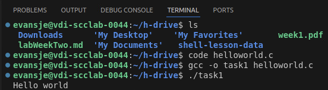
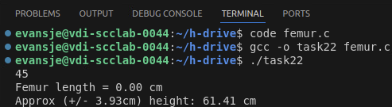
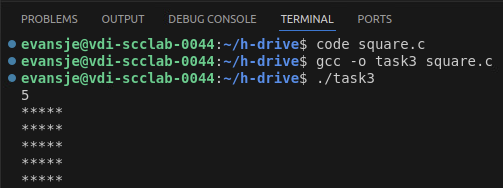

began: 8th October 2024

# Lab Work

| Week | Lecture                                                                                   | Original Handout                                                                           | Date Noted |
| ---- | ----------------------------------------------------------------------------------------- | ------------------------------------------------------------------------------------------ | ---------- |
| 1    | [Week 1 - Learning the UNIX Shell](#week-1---learning-the-unix-shell)                     | [Learning the Unix Shell](/labMaterial/a.weekOneMaterial.pdf)                              | 9/10/2024  |
| 2    | [Week 2 - Writing Code](#week-2---c-sets--number-systems)                                 | [C, Sets, & Number Systems](/labMaterial/b.weekTwoMaterial.pdf)                            | 16/10/2024 |
| 3    | [Week 3 - RPS, Relations, Information Coding](#week-3---rps-relations-information-coding) | [Rock Paper Scissors, Relations, Information Coding](/labMaterial/c.weekThreeMaterial.pdf) | 23/10/2024 |
| 4    | [Week 4 - Arrays, Functions, Boolean Logic ](#week-4---arrays-functions-boolean-logic)    |                                                                                            |            |

## Week 1 - Learning the UNIX Shell

UNIX is an Operating System developed in the 1970s. It is still being developed today, as Linux. It's a stable, multi-user, multi-tasking system for servers, desktops and laptops. Linux is UNIX with a GUI.

The Shell is a powerful extensible command line user interface that is the 'power user' interface for interacting with UNIX and the basis for most system administration on any sensible OS platform.

Linux (Ubuntu) is installed on all the lab machines in SCC's lab.

## Week 2 - C, Sets, & Number Systems

noted : 16th October 2024

### SCC.111 C programs

#### Task 1

Create a derivative of the classic ‘hello world’ program, and get it compiling, fixing any errors on the way. Below is what I did in the terminal:



- `ls` to list stuff in current directory
- `code helloworld.c` opens new file with extension c, in vscode
- `gcc -o task1 helloworld.c` uses the GNU Compiler Collection (GCC) to compile the C source file helloworld.c and produce an executable file named task1

Below is the C program:

```C
#include <stdio.h>

int main() {
    printf("Hello world\n");
}
```

- Remember `#include <stdio.h>`
- Remember `;`

#### Task 2



```C
#include <stdio.h>

int main() {
    float femurLength= 0.0;
    float personHeight = 0.0;

    scanf("%f", &femurLength);
    printf("Femur length = %.2f cm\n", femurLength);
    personHeight = (2.38 * femurLength) + 61.41;
    printf("Approx (+/- 3.93cm) height: %.2f cm\n", personHeight);

    return 0;
}
```

#### Task3



```C
#include <stdio.h>

int main() {
    int length = 0;
    scanf("%i", &length);

    int i = 0;
    int j = 0;
    for (i = 0; i < length; i++) {
        for (j = 0; j < length; j++) {
            printf("*");
        }
        printf("\n");
    }
}
```

### SCC.121 Sets

#### Questions & Answers

1. Determine whether each of the following pairs of sets is equal:

   - {1, 3, 5} and {5, 3, 1}
     - {1, 3, 5} = {5, 3, 1} as order of elements does not matter. Same 3 elements in list so equal.
   - {1, 3, 5} and {5, 1, 6}
     - {1, 3, 5} ≠ {5, 1, 6} as different elements in both sets. 3 and 6.

2. Let A = {1, 2, 3, 4, 5} and B = {0, 3, 6}. Find:

   - A ∩ B
     - A ∩ B = {3}
   - A ∪ B
     - A ∪ B = {0, 1, 2, 3, 4, 5, 6}
   - A – B
     - A – B = {1, 2, 4, 5}
   - B − A
     - B - A = {0, 6}

3. Let A = {0, 2, 4, 6, 8, 10}, B = {0, 1, 2, 3, 4, 5, 6} and C = {4, 5, 6, 7, 8, 9, 10}. Find:

   - A ∩ B ∩ C
     - A ∩ B ∩ C = {4, 6}
   - A ∪ B ∪ C
     - A ∪ B ∪ C = {0, 1, 2, 3, 4, 5, 6, 7, 8, 9, 10}
   - (A ∪ B) ∩ C
     - A ∪ B = {0, 1, 2, 3, 4, 5, 6, 8, 10}
     - (A ∪ B) ∩ C = {4, 5, 6, 8, 10}
   - (A ∩ B) ∪ C
     - A ∩ B = {0, 2, 4, 6}
     - (A ∩ B) ∪ C = {0, 2, 4, 6, 7, 8, 9, 10}

4. If A = {1, 2, 3, a}, B = {1, 2, 3, 4, 5}, C = {a, b} evaluate:

   - A ∪ (B ∩ C)
     - B ∩ C = {} = ∅
     - A ∪ (B ∩ C) = {1, 2, 3, a}
   - (A ∪ B) ∩ C
     - A ∪ B = {1, 2, 3, 4, 5, a}
     - (A ∪ B) ∩ C = {a}
   - C – A
     - C – A = {b}
   - (A – B) – C
     - A – B = {a}
     - (A – B) – C = {b}
   - A – (B – C)
     - B – C = {1, 2, 3, 4, 5}
     - A – (B – C) = {a}
   - (A ∩ C) ∪ B
     - A ∩ C = {a}
     - (A ∩ C) ∪ B = {1, 2, 3, 4, 5, a}
   - A ∩ (C ∪ B)
     - C ∪ B = {1, 2, 3, 4, 5, a, b}
     - A ∩ (C ∪ B) = {1, 2, 3, a}

5. Let A be the set of students who live within one mile of school and B the set of students who walk to
   classes. Describe the students in each of the following sets, in English. - A ∩ B - Intersection of A and B. So this is the set of students that walk to classes and live within one mile of school. - set of studetns who live within one mile of school AND the set of studetns who walk to classes. - A ∪ B - Union of A and B. So this is the set of students that walk to classes or live within one mile of school, or both. - the set of students who live within one mile of school OR the set of students who walk to classes. - A – B - Difference of A and B. So this is the students that live within one mile of school subtracting the students who walk to classes. - the set of students who live within one mile of school AND the set of students who do not walk to classes - B – A - Difference of B and A. So this is the students that walk to school subtracting the students who live within one mile of school. - the set of students who walk to classes AND the set of students who live more than one mile of school

6. Let A = {a, b, c} and B = {y, z}. Find

   - A x B
     - A x B = {<a, y>, <a, z>, <b, y>, <b, z>, <c, y>, <c, z>}
   - B x A
     - B x A = {<y, a>, <y, b>, <y, c>, <z, a>, <z, b>, <z, c>}

7. How many different elements does A x B have if A has m elements and B has n elements?

   - A x B will have m\*n elements.

8. List the members of the following sets

   - {x | x is a positive integer less than 12}
     - {1, 2, 3, 4, 5, 6, 7, 8, 9, 10, 11}
   - {x | x is the square of an integer and x < 100}
     - {1, 4, 9, 16, 25, 36, 49, 64, 81}

9. For each of the following sets, determine if 2 is an element of that set.

   - { x ∈ R | x is an integer greater than 1}
     - Yes. 2 is a real number and 2 is an integer greater than 2. So 2 is an element of that set.
   - {x ∈ R | x is the square of an integer}
     - No. 2 is a real number but 2 is not a square of an integer. So 2 is not an element of that set.

10. Identify 2 sets whose cardinality is 1 and whose intersection’s cardinality is also 1.

    - A = {1} and B = {1}. |A| = 1 and |B| = 1. A ∩ B = {1}. |A ∩ B| = 1

11. Which of the following is not a proper subset of set A if A = {4, 5, 6, x, y, z}?

    - {4, x, y}
      - Is a proper subset. The elements in this set are all in set A, but set A also has other unique elements.
    - {3, 4, 5}
      - Not a proper subset or a subset. There is an element 3 in this set that is not in A at all.
    - {4, 5, 6}
      - Is a proper subset. The elements in this set are all in set A, but set A also has other unique elements.
    - Ø
      - Not a proper subset or a subset. Ø = {}. There is no nested set of {} in set A.

12. Which is a subset of set A? A = {a, {b}, c, {c}, {x, y}}

    - {a, {b}, c}
      - Is a proper subset. The elements in this set are all in set A, but set A also has other unique elements.
    - {a, b, c}
      - Not a proper subset or a subset. There is an element b in this set that is not in A.
    - {c, x, y}
      - Not a proper subset or a subset. There are elements x and y in this set that is not in A.
    - {x, y}
      - Not a proper subset or a subset. There is an element x and y in this set that is not in A. It would be a proper subset if the set in question was {{x, y}}.

13. Which is false?

    - 1, 2 ⊆ 1, 2, 3
      - True
    - 1, 2 ⊆ 2, 3, 4
      - False
    - ∅ ⊆ 1, 2, 3
      - False

14. Let Universal set U = {1, 2, 3, 4, 5, 6, 7, 8, 9, 10}, and its 3 sets: E = {2, 4, 6, 8, 10}, O = {x | x is an
    odd number}, and T = {3}. - Enumerate the elements of set O - {1, 3, 5, 7, 9} - What operation can be applied to set E and U to get set O? - comp(E) = O - Define set E through its elements’ property - E = {x | x is an even number} - Which of the sets above are subsets of set O? - Set T and O - Which of the sets above are proper subsets of set O? - Set T - Which of the sets above are proper supersets of empty set? - All of them

### SCC.131 Number Systems

1. Convert the following unsigned binary numbers to decimal:

   - 00001001
     - 9
   - 00101011
     - 43
   - 01001111
     - 79
   - 01111110
     - 126
   - 10000110
     - 134

2. Convert the following decimal numbers to unsigned 8-bit binary:

   - 22
     - 00010110
   - 19
     - 00010011
   - 84
     - 01010100
   - 120
     - 01111000
   - 93
     - 01011101

3. Add the following pairs of unsigned 8-bit binary numbers. Give your answer in unsigned 8-bit binary.
   - 00000100 + 00000011
     - 00000111
   - 00000110 + 00001101
     - 00010011
   - 00001111 + 00010101
     - 00100100
   - 11101001 + 01011110
     - 101000111 9 bits now? what happens to overflow bit (msb). discard overflow: 01000111
   - 11100000 + 00110000
     - 100010000 9 bits now? what happens to overflow bit (msb). discard overflow: 00010000

## Week 3 - RPS, Relations, Information Coding

### Rock Paper Scissors

Initial working draft:

```C
#include <stdio.h>
#include <stdlib.h>
#include <time.h>

int main() {
    int playerChoice;
    int playerCount = 0;
    int compCount = 0;


    char plays[3][20] = {"Rock", "Paper", "Scissors"};

    srand(time(NULL));

    printf("Enter 1 for Rock, 2 for Paper, or 3 for Scissors. 0 to quit the game\n");
    scanf("%d", &playerChoice);

    int computerChoice = (rand() % 3) + 1;

    while(playerChoice >= 0 && playerChoice <= 3) {
        if(playerChoice == 0) {
            printf("Game over. You played %d games and won %d\n\n", playerCount+compCount, playerCount);
            break;
        }
        if(playerChoice == computerChoice) {
            printf("Player chose: %s\n", plays[playerChoice - 1]);
            printf("Computer chose: %s\n", plays[computerChoice - 1]);
            printf("Both chose same thing. You lose!\n");
            compCount++;
            printf("\n\nEnter 1 for Rock, 2 for Paper, or 3 for Scissors. 0 to quit the game\n");
            scanf("%d", &playerChoice);
            computerChoice = (rand() % 3) + 1;
        } else if(playerChoice == 1 && computerChoice == 2) {
            printf("Player chose: %s\n", plays[playerChoice - 1]);
            printf("Computer chose: %s\n", plays[computerChoice - 1]);
            printf("You lose!\n");
            compCount++;
            printf("\n\nEnter 1 for Rock, 2 for Paper, or 3 for Scissors. 0 to quit the game\n");
            scanf("%d", &playerChoice);
            computerChoice = (rand() % 3) + 1;
        } else if(playerChoice == 2 && computerChoice == 3) {
            printf("Player chose: %s\n", plays[playerChoice - 1]);
            printf("Computer chose: %s\n", plays[computerChoice - 1]);
            printf("You lose!\n");
            compCount++;
            printf("\n\nEnter 1 for Rock, 2 for Paper, or 3 for Scissors. 0 to quit the game\n");
            scanf("%d", &playerChoice);
            computerChoice = (rand() % 3) + 1;
        } else if(playerChoice == 3 && computerChoice == 1) {
            printf("Player chose: %s\n", plays[playerChoice - 1]);
            printf("Computer chose: %s\n", plays[computerChoice - 1]);
            printf("You lose!\n");
            compCount++;
            printf("\n\nEnter 1 for Rock, 2 for Paper, or 3 for Scissors. 0 to quit the game\n");
            scanf("%d", &playerChoice);
            computerChoice = (rand() % 3) + 1;
        } else {
            printf("Player chose: %s\n", plays[playerChoice - 1]);
            printf("Computer chose: %s\n", plays[computerChoice - 1]);
            printf("You win\n");
            playerCount++;
            printf("\n\nEnter 1 for Rock, 2 for Paper, or 3 for Scissors. 0 to quit the game\n");
            scanf("%d", &playerChoice);
            computerChoice = (rand() % 3) + 1;
        }
    }
}
```

Revised Solution:

```C
#include <stdio.h>
#include <stdlib.h>
#include <time.h>

int main() {
int playerChoice;
int playerCount = 0;
int compCount = 0;

    char plays[3][20] = {"Rock", "Paper", "Scissors"};

    srand(time(NULL));

    printf("Enter 1 for Rock, 2 for Paper, or 3 for Scissors. 0 to quit the game\n");
    scanf("%d", &playerChoice);

    int computerChoice = (rand() % 3) + 1;

    while(playerChoice >= 0 && playerChoice <= 3) {
        if(playerChoice <= 0 || playerChoice > 3) {
            printf("Game over. You played %d games and won %d\n\n", playerCount+compCount, playerCount);
            break;
        }
        printf("Player chose: %s\n", plays[playerChoice - 1]);
        printf("Computer chose: %s\n", plays[computerChoice - 1]);
        if(playerChoice == computerChoice) {
            printf("Both chose same thing. You lose!\n");
            compCount++;
            printf("\n\nEnter 1 for Rock, 2 for Paper, or 3 for Scissors. 0 to quit the game\n");
            scanf("%d", &playerChoice);
            computerChoice = (rand() % 3) + 1;
        } else if((playerChoice == 1 && computerChoice == 2) || (playerChoice == 2 && computerChoice == 3) || (playerChoice == 3 && computerChoice == 1)) {
            printf("Player chose: %s\n", plays[playerChoice - 1]);
            printf("Computer chose: %s\n", plays[computerChoice - 1]);
            printf("You lose!\n");
            compCount++;
            printf("\n\nEnter 1 for Rock, 2 for Paper, or 3 for Scissors. 0 to quit the game\n");
            scanf("%d", &playerChoice);
            computerChoice = (rand() % 3) + 1;
        } else {
            printf("Player chose: %s\n", plays[playerChoice - 1]);
            printf("Computer chose: %s\n", plays[computerChoice - 1]);
            printf("You win\n");
            playerCount++;
            printf("\n\nEnter 1 for Rock, 2 for Paper, or 3 for Scissors. 0 to quit the game\n");
            scanf("%d", &playerChoice);
            computerChoice = (rand() % 3) + 1;
        }
    }

}
```

Final Solution:

```C

```

### 121 Relations

1. For the exercises in this part, we have the following relations on `A = {1, 2, 3, 4}`:
   - `R1 = {< 1, 1 >, < 1, 2 >, < 2, 1 >, < 2, 2 >, < 3, 4 >, < 4, 1 >, < 4, 4 >}`
   - `R2 = {< 2, 2 >, < 2, 3 >, < 2, 4 >, < 3, 2 >, < 3, 3 >, < 3, 4 >}`
   - `R3 = {< 1, 1 >, < 1, 2 >, < 1, 4 >, < 2, 1 >, < 2, 2 >, < 3, 3 >, < 4,1 >, < 4, 4 >}`
   - `R4 = {< 2, 1 >, < 3, 1 >, < 3, 2 >, < 4, 1 >, < 4, 2 >, < 4, 3 >}`

## Week 4 - Arrays, Functions, Boolean Logic

### 111 Arrays

```C
#include <stdio.h>

int main() {
    int scores[10] = {0, 0, 0, 0, 0, 0, 0, 0, 0, 0};
    int score = -1;
    int i;
    int count = 0;

    while (count < 10) { // Get 10 scores
        printf("Enter high score (0 to exit): ");
        scanf("%d", &score); // get input
        if (score == 0) {
            break; // exit loop and output the high score table
        } else if (score < 0 || score > 1000) {
            printf("ERROR, score out of bounds. ");
        } else { // if valid, add to the array
            count++;
            for (i = 0; i < 10; i++) {
                if (scores[i] == 0) { // find next avaiable space in array
                    scores[i] = score; // replace value with score
                    break;
            }
        }
        }
    }

    printf("\n*** HIGH SCORE TABLE ***\n");
    for (i = 0; i < 10; i++) {
        printf("%d - %d\n", i+1, scores[i]);
    }
}
```

### 121 Functions

1. Let `A = {a, b, c, d, e}` and `B = {1, 2, 3, 4}` with `f(a) = 2`, `f(b) = 1`, `f(c) = 4`, `f(d) = 1` and `f(e)= 1`.

   - Is f a function? Why?
     - ...
   - What is the domain of this function?
     - ...
   - What is the co-domain?
     - ...
   - What is the range of this function?
     - ...

2. Let the function f(x) = 3x - 3 on the set of real numbers. Find its inverse.

   - ...

3. Let `A = {1, 2, 3}`, and `B = {1, 2, 3, 4}`, and `f : A → B`, `g : A → B` by: `f(1) = 4`, `f(2) = 2`, `f(3) = 1`. `g(1) = 4`, `g(2) = 4`, `g(3) = 1`. Which of these functions is injective? f or g?

   - ...

4. Let `A = {1, 2, 3, 4}`, and `B = {1, 2, 3, 4}` and `f : A → B`, `g : A → B` by: `f(1) = 4`, `f(2) = 2`, `f(3) = 1`, `f(4) = 3`. `g(1) = 4`, `g(2) = 3`, `g(3) = 1`, `g(4) = 1`. Which of these functions is surjective? f or g?

   - ...

5. Let f(x) = 3x + 6 on the set of real numbers.

   - Is f a bijective function?
     - ...
   - If so, what is its inverse?
     - ...

6. Let M and N be relations from A to B, with `A = {a, b, c, d}`, and `B = {s, t, u}`, defined as follows: `M = {<a, t>, <b, s>, <c, s>, <d, u>}`, `N = {<a, s>, <b, t>, <c, s >, <a, u>, <d, u>}`. Which one of the following statements is true?

   - M and N are functions
     - ...
   - M is a function and N is not a function
     - ...
   - M and N are not functions
     - ...
   - none of these
     - ...

7. Let f be a function on the set N of natural numbers, `f: N → N`, defined by `f(x) = 2x + 3`. Is function f:

   - injective
     - ...
   - surjective
     - ...
   - bijective
     - ...
   - none of the above
     - ...

8. Let `f: Z→ Z` be defined by `f(x) = 2x + 1`.

   - What is the domain, codomain, range of f?
     - ...
   - Is f one-to-one (injective)?
     - ...
   - Is f onto (surjective)?
     - ...
   - If f is bijective, what is its inverse?
     - ...

9. Let f1 and f2 be two functions from A to B such that `f1(x) = x^2` and `f2(x) = x – x^2`

   - What is the sum function f1+ f2?
     - ...
   - What is the product function f1x f2?
     - ...

10. Let f and g be two functions from the set of integers to the set of integers, defined by `f(x) = 2x + 3` and `g(x) = 3x + 2`.

    - What is the composition of f and g?
      - ...
    - What is the composition of g and f?
      - ...

11. Let `f(x) = x2 + 1` and `g(x)= x + 2` be two functions from the set of integers to the set of integers. Find the following functions:

    - f + g (x) =
      - ...
    - (f + g) (1) =
      - ...
    - f × g (x) =
      - ...
    - (f × g) (0) =
      - ...
    - f ◦ g (x) =
      - ...
    - (f ◦ g) (1) =
      - ...
    - g ◦ f (x) =
      - ...
    - (g ◦ f) (2) =
      - ...

### 131 Boolean Logic

1. Express the following statements in Boolean algebra:

   - Either A is true or B is true.
     - A OR B
   - A is not true.
     - A'
   - Neither A nor B is true.
     - A' OR B'
   - B is true, but not A.
     - B AND 'A

2. Simplify the following Boolean expressions:

   - A+A’
     - A
   - A+A
     - A
   - A’ + A’A
     - A
   - A’ + AB

3. Use a truth table to evaluate the following expressions. Given: ( A = 0) and (B = 1):

   - A + B
     - 1
   - A’ + B’
     - 1
   - A + A’
     - 1
   - A’B’
     - 0

4. Minimise the following Boolean functions using Boolean algebra:

   - F = AB + A’B + AB’
     - ...
   - F = ABC + AB’C + ABC’ + AB’C’ + A’BC + A’B’C
     - ...

5. Minimise the following Boolean functions using Karnaugh maps:

   - F = AB + A’B + AB’
     - ...
   - F = ABC + AB’C + ABC’ + AB’C’ + A’BC + A’B’C
     - ...
   - F = A’BCD + A’B’CD + A’BC’D + A’B’C’D + ABC’D’ + AB’C’D’ + ABCD’ + AB’CD’
     - ...
