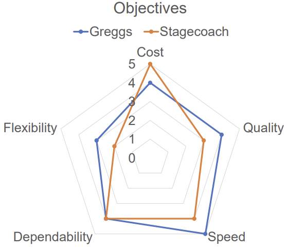

# Introduction to Operations Management Seminars

| Week   | My Notes                | Seminar Resources                                                                                                                  | Noted |
| :----: | ----------------------- | ---------------------------------------------------------------------------------------------------------------------------------- | :---: |
|   1    | [Seminar 1](#seminar-1) | [Task Doc](MSCI.102.seminarDocs/a.operationsAsSystemTASK.pdf), [Task Solutions](MSCI.102.seminarDocs/a.operationsAsSystemPPTX.pdf) |  🟧   |
|   2    | [Seminar 2](#seminar-2) | [Task Doc](MSCI.102.seminarDocs/b.scmTASK.pdf), [Task Readings](MSCI.102.seminarDocs/b.scmREADING.pdf)                             |       |
|   3    | [Seminar 3](#seminar-3) |                                                                                                                                    |       |

## Seminar 1

The aim is to encourage me to think of organisations I encounter as operations systems—as having a particular logic in the way they function, creating the problems characteristic of the operations management discipline.

I am asked to think and make conjectures about two simple, local service operations: the Greggs retail outlet on campus and the Stagecoach bus service in Lancaster. Unlike many manufacturing operations, service operations are often at least partly visible to members of the public, particularly their customers. I can see some of the functions they must perform and some of the problems they encounter. But you are also encouraged to think about what other functions must take place in the operation for the visible functions to be possible.

1. Purpose

   - What is their relative emphasis in each operation on cost, quality, speed, dependability, and flexibility?
   - Which of these are ‘order-winning’, ‘qualifying’ or ‘other’ factors?
   - In what ways is the operation holding the firm back? Making it as good as its competitors? Making it the best in the industry? Redefining industry expectations?

2. Transformation
   - What does each operation transform?
     - Greggs: food ingredients, packaging, hungry customers
     - Stagecoach: customers, fuel
   - What are the main transforming resources?
     - Greggs: staff, simple equipment, premises and infrastructure, basic expertise
     - Stagecoach: vehicles and maintenance resources, drivers and maintenance staff
   - What does it transform its inputs into – as main products and by-products?
     - Greggs: food products, less hungry customers, food waste, packaging waste
     - Stagecoach: customers in different places, pollutants, road damage, vehicle wear and damage
   - Is it a material, information or customer processor – or some combination?
     - Greggs: customer and material processor
     - Stagecoach: customer and material (fuel) processor
   - How would you describe its variety and volume?
     - Greggs: moderate variety & volume so a 'service shop'
     - Stagecoach: In one sense low variety (for a given route) but in another sense high (multiplicity of routes); by intention high volume but very route dependent
   - What type of operation does this variety and volume describe?
     - Greggs: achieving insufficient volume given limits to variety or variety & volume
     - Stagecoach: probably a mass service but this obscures route heterogeneity
   - What are the problems in this type of operation?
     - Greggs: dealing with changing demand profiles - it can't ignore these (it's not a mass service) or satisfy them (it's not a professional service)
     - Stagecoach: operating a fixed schedule and route network irrespective of demand (and therefore revenue)

Characterising an operation is often unsatisfactory - objectives etc can be vague, types of transformation can be ambiguous, nature of the operation e.g. on the variety-volume scale can be unclear.

Inferences we make from this may not be very confident - is there requisite variety? Is there a reasonable trade-off between cost and variety?

But this is a necessary way to understand an operation, its role and its challenges.

## Seminar 2

The task is to compare the firms by the four stages (Design, Manufacturing, Distribution, & Retail) for analysing the supplt network. Watch [this](https://learningonscreen.ac.uk/ondemand/index.php/prog/122D0582?bcast=129265478) video and read the Task Readings Questions:

1. What's the central issue for the case focuses on?
   - Fast Fashion clothes that last no more than 1 season but are 'up-to-minute' at low prices
   - "The retail operations that customers see are only the end part of the supply chains that feed them."
   - Focuses on the supply chain strategies of fast fashion companies (H&M, Zara, Benetton) and how they respond to the demand requests of fash fashion by compressing product development cycles and ensuring speed and flexibility
2. What characterises the firms?
   - H&M: cheap/affordable products by delivering "fashion and quality at the best price" through a lot of outsourcing
   - Zara: Verticle Integration, rapid desing-to-retail cycles, and speed & variety
   - Benetton: Global Standardisation, and durability & flexibility
3. Where is the design done?
   - H&M: Stockholm
   - Zara: Spain
   - Benetton: ???
4. What characterises their manufacturing operations?
   - H&M: dont own any of their own factories. 750 global suppliers. half of production takes place in Europe and the rest in Asia. 21 production offices globally which coordinate the suppliers to control timing and order quantities.
   - Zara: owns 20 spanish factories resoonsible for 50% of production while outsourcing labor-intensive tasks 50%
   - Benetton: mix of owned and subconracted
5. What general strategies in the case promote speed?
   - H&M: finds optimal time to order each item, ourchasing fabrics early and finalising designs later
   - Zara: veticle integration enables rapid production cycles, with designs often produced in small bathces
   - Benetton:
   - Rapid prototyping and feedback loops like Zara's integration of retail data into design
   - Automated warehouses for efficient distribution
   - Agile manufacturing practices,
6. What aspects of their distribution facilitate speed?
   - H&M: Sub-contracted distribution with centralised transit hubs and warehouses. Central transit terminal in Hamburg for efficient routing and allocation of goods.
   - Zara: Automated, centralised warehouses close to production centres
   - Benetton: Automated warehouses, and advanced tracking systems like RFID to streamline inventory management
7. What’s interesting about their retail operations?
   - H&M: Owns all its own stores for brand consistency
   - Zara:
   - Benetton:
8. In what ways might vertical integration detract from/enhance speed?
   - H&M:
   - Zara:
   - Benetton:

CHATGPT answer:

1. **What’s the central issue the case focuses on?**  
   The case examines how fast fashion companies (H&M, Zara, and Benetton) manage their supply chains to address the challenges of fast-changing trends in fashion. It highlights the need for speed, flexibility, and cost-efficiency in responding to customer demands. As noted, “catwalk designs speed their way into high street stores at prices anyone can afford”.

2. **What characterises the firms?**

   - **H&M:** Known for its strategy of outsourcing to around 750 suppliers while focusing on cost and volume. The company emphasises, “efficient distribution systems, and being cost-conscious at every stage”.
   - **Zara:** Focuses on vertical integration and producing in small batches to reduce risk. It integrates feedback from stores into its design and production processes, enabling “catwalk to rack” times as low as 15 days.
   - **Benetton:** Differentiates itself with a focus on higher-quality, durable garments at a higher price point than H&M and Zara. It has moved to standardise global ranges, reducing designs by over 30% to cut production costs.

3. **Where is the design done?**

   - **H&M:** Centralised in Stockholm with over 100 designers supported by 50 pattern makers and 100 buyers.
   - **Zara:** Co-locates teams of designers, market specialists, and buyers in Spain, where they collaborate closely to integrate customer feedback from stores.
   - **Benetton:** Its 300 designers not only create garments but also innovate materials and clothing concepts globally.

4. **What characterises their manufacturing operations?**

   - **H&M:** Outsources all production, leveraging its 21 production offices globally to manage suppliers. The strategy enables flexibility, as H&M explains, “short lead times are not always best… Trendier garments require considerably shorter lead times”.
   - **Zara:** Maintains in-house production for capital-intensive processes like cutting and dyeing, while using subcontractors for labour-intensive tasks like sewing. About 50% of fabric is sourced from its subsidiary, often undyed for late-stage customisation.
   - **Benetton:** Combines centralised operations in Italy with a decentralised network of contractors in regions like North Africa and Asia. It uses “dyeing garments after assembly” to delay colour decisions and adapt to market needs.

5. **What general strategies in the case promote speed?**

   - Zara’s vertically integrated model ensures rapid response, with garments often designed, produced, and distributed in as little as 15 days.
   - H&M and Benetton both use strategies like delaying final production decisions (e.g., colour or quantity) to reduce risks of misaligned supply and demand.
   - Automated warehouses at Zara and Benetton also enhance supply chain efficiency.

6. **What aspects of their distribution facilitate speed?**

   - **H&M:** Uses a central transit terminal in Hamburg to inspect and allocate goods efficiently. Its “Call-Off warehouse” enables replenishment based on sales trends.
   - **Zara:** Operates highly automated warehouses near production centres, enabling rapid distribution. Even with unused capacity, Zara invested in a second automated warehouse for future needs.
   - **Benetton:** Explores innovations like RFID tags for real-time tracking of inventory.

7. **What’s interesting about their retail operations?**

   - **H&M:** Aims to create a “comfortable and inspiring atmosphere” in stores, with full company ownership ensuring brand consistency.
   - **Zara:** Its unique approach sees garments rarely staying in stores for more than two weeks. This high turnover rate encourages frequent customer visits and immediate purchases to avoid missing out.
   - **Benetton:** Transitioned from smaller third-party stores to larger flagship stores that display the full product range, reinforcing its brand image.

8. **In what ways might vertical integration detract from/enhance speed?**
   - **Enhance speed:** Zara’s vertical integration ensures control over processes, allowing faster response times. For example, its integration across the supply chain “allows it to respond to customer demand fast and flexibly while keeping stock to a minimum”.
   - **Detract from speed:** Vertical integration can limit scalability, as expanding production capacity quickly may require significant investment, compared to H&M’s fully outsourced model that can leverage supplier networks on demand.
